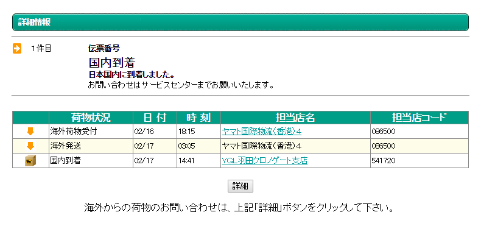
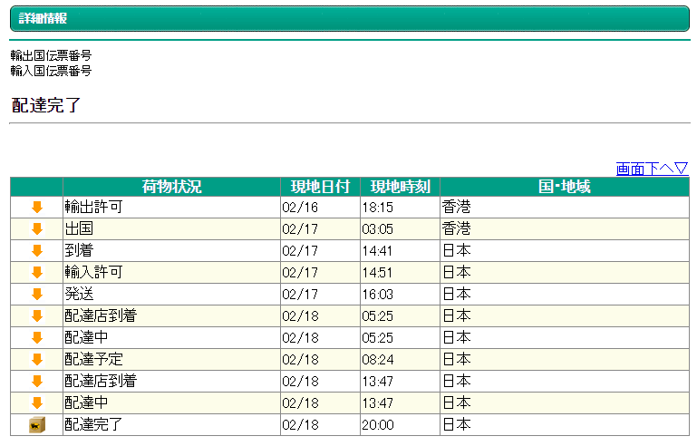

<?# Twitter 568003349666070529 /?>

というわけで14日に注文したLumia 830が無事手元に届きました。  

Amazonから（oneshopmobileはAmazon Paymentsで決済する関係からかそのあとの情報はAmazonから送られてくるみたい）16日に届いていたメールにヤマトのトラッキングコードが記載されていたのでずっとにらめっこしてましたが、国内到着後一向に表記が変わらず。
 

おっかしいなぁと思ったら詳細のほうで国内の動きがでてました。
 

香港から到着まで2日あれば届くんですね。  
たまたま別の買い物をしていてそちらで時間指定をしていたので一緒に届きました。  
その時に関税か何かの分をあらかじめ払っていた分とは別にヤマトの人に渡す必要が。今回は1900円でした。  

というわけで手元に届いたLumia 830。  

<?# Twitter 568004079374348288 /?>

Lumia 820と違って解像度が上がっていたのでタイルも3列置けるようになりました。  
おいおいレイアウトを考えないと。  
それ以外の性能はLumia 820と比べてまだ性能向上の実感はないです。Windows Phoneは高スペックな端末でもそれほど普通に使ってる分には性能差を感じない気がします。  

こうして手元に届いて簡単にセットアップをしたLumia 830ですが

<?# Twitter 568015710833606656 /?>

せっかくなんでWindows 10 Technical Preview for phonesにしてみました。  
続きは次の記事で。