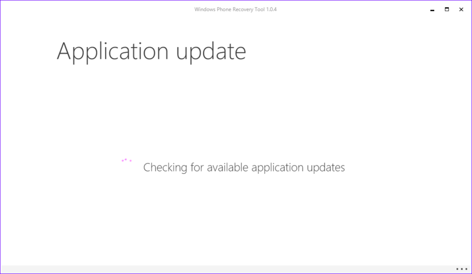

割と安定して使えたもののさすがに常用するのはどうかなということでWindows 10 Technical Preview for phones（以下Win10TPP）をあてたLumia 830をWindows Phone 8.1に戻すことにしました。  

ちゃんとWP8.1に戻す方法がMSから公開されていましたのでとっても簡単でした。

WP8.1に戻すにはWindows Phone Recovery Toolというツールを利用します。  
これはMSの[Windows Phone公式ヘルプサイト](http://www.windowsphone.com/ja-jp/how-to/wp8/phones-and-hardware/recover-my-phone)からダウンロード可能です。  
ところでこのサイトだとWindows Mobile Recovery Toolとなってるんですけどこれは一体（（  
<?# OEmbed "http://www.windowsphone.com/ja-jp/how-to/wp8/phones-and-hardware/recover-my-phone" /?>

ダウンロードしたインストーラを起動すると
 

ちょっと日本語ローカライズがおかしいですがインストールをクリック。  
途中でセットアップウィザードが出てきますので次へボタンを押して進めてください。  
 

インストール後Windows Phone Recovery Toolを起動すると
 

・・・あれ？  
ちょうどサービスのメンテナンス中だったようでエラーが出てしまいました。  

表示されていた日時以降に再度起動したところ  
 
 

ダウンロードしたインストーラがちょっと古かったようで新しいものをダウンロードインストールすることに。  
あらためて新しいインストーラによってインストールが実行されると次の画像のようにWindows Phone端末を接続するように求められます。  
 

端末を接続すると自動的に端末を認識し、以下のように接続した端末の名前が表示されます。
 

表示された画像をクリックすると端末の最新のソフトウェア情報が取得されます。  

Reinstall softwareをクリックすると以下のような表示になります。
 
端末が初期化されるので予めバックアップを取るようにという内容です。各自必要なデータはバックアップしておきます。   
あとはContinueボタンを押下することでサーバーから8.1の最新OSイメージが取得され、8.1に戻ります。  
 
 

この方法で戻せなかった場合は端末がLumiaであれば[Nokia software recovary tool](http://go.microsoft.com/fwlink/?LinkID=525568)を使うと戻せるかもしれません。   

なお、この方法はWindows Phone 8.xの端末の調子が悪い時にも用いることができる（ただし最終手段）なので覚えておくとよいかもしれません。