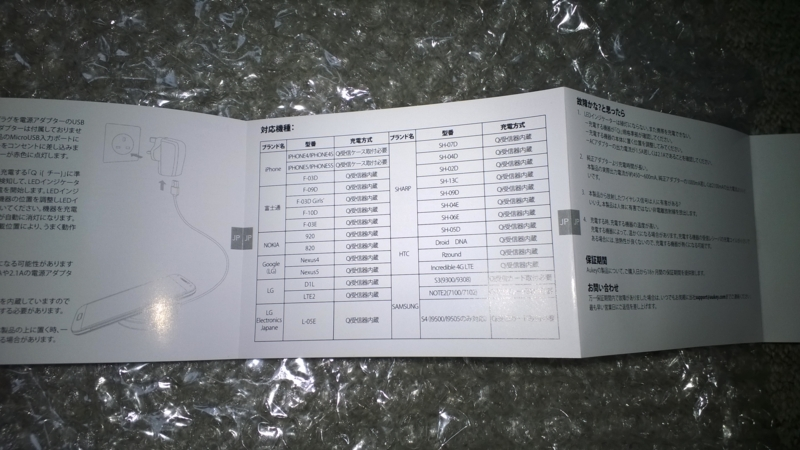
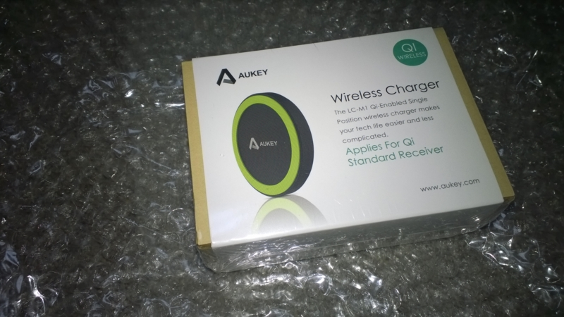
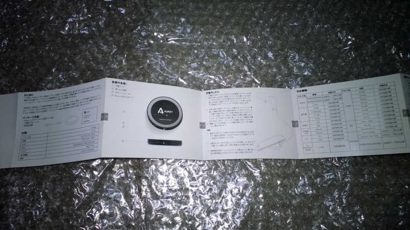
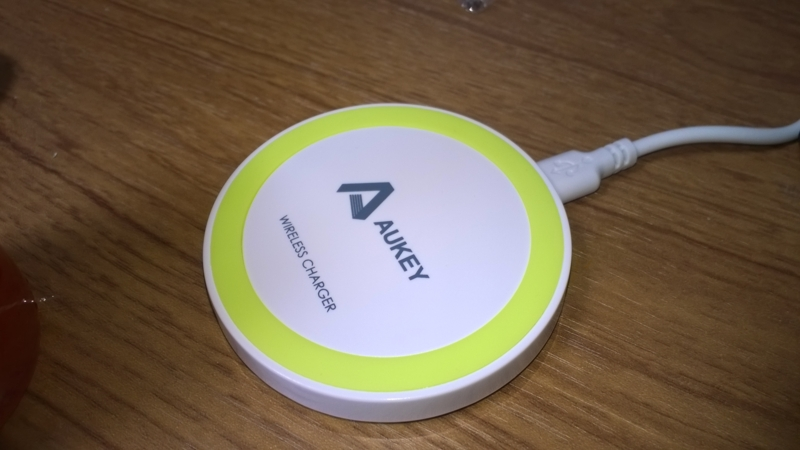
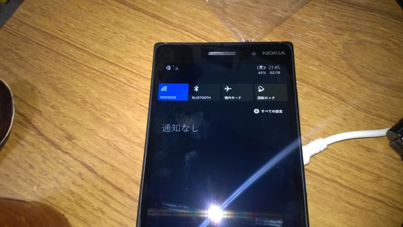

便利ですね。  
Lumia 830を購入したのを機にこれまでUSB接続で充電していたのをやめてQiによるワイヤレス給電を行うことにしてみました。  

あまり高いものを買うのは予算的に無理だったのでAmazonでそこそこ安くそれなりにレビュー数があって評価の高いものをと考えた結果、これにしてみました。  

[asin:B00M8R1750:detail]

購入してから気づきましたが、これNokia製品もちゃんと動作することを確認しているみたい。  
 

箱はこんな感じ。  
 
・・・なんかものすごくAnkerっぽくみえるんですがなんだろこれ。  

説明書は自然な日本語になってました。よくある中華なものとは違っていい感じ。  
 

本体はこんな感じ。  
オリンピックのメダルくらいのサイズ。（実物見たことないけど）  
 

実際に充電したところ。
 

USB給電でいいやと思ってたけど一回これに慣れると楽ちん過ぎてUSB給電とか面倒になりますね。  
