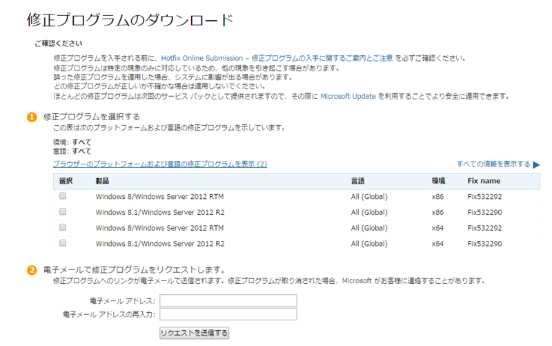
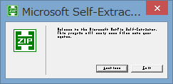
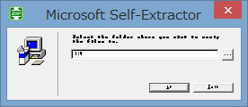
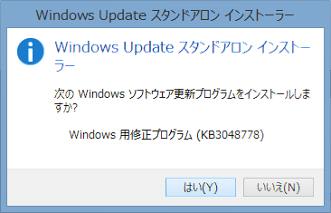
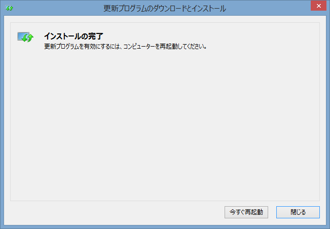

今月の<a class="keyword" href="http://d.hatena.ne.jp/keyword/Windows">Windows</a>修正プログラムをあてたらAeroプレビュー状態にしたときなど、ふとした時に<a class="keyword" href="http://d.hatena.ne.jp/keyword/%A5%A8%A5%AF%A5%B9%A5%D7%A5%ED%A1%BC%A5%E9">エクスプローラ</a>が固まって作業を中断せざるを得ないｱﾚｹﾞな事態になってたんですが、問題の修正パッチが出てました。

<iframe src="//hatenablog-parts.com/embed?url=http%3A%2F%2Fwww.forest.impress.co.jp%2Fdocs%2Fnews%2F20150318_693380.html" title="エクスプローラーの不調を招いていた更新プログラム「KB3033889」の修正版が公開 - 窓の杜" class="embed-card embed-webcard" scrolling="no" frameborder="0" style="display: block; width: 100%; height: 155px; max-width: 500px; margin: 10px 0px;"><a href="http://www.forest.impress.co.jp/docs/news/20150318_693380.html">エクスプローラーの不調を招いていた更新プログラム「KB3033889」の修正版が公開 - 窓の杜</a></iframe><cite class="hatena-citation"><a href="http://www.forest.impress.co.jp/docs/news/20150318_693380.html">www.forest.impress.co.jp</a></cite>

***

問題を引き起こしていたのは「KB3033889」。 
<a class="keyword" href="http://d.hatena.ne.jp/keyword/Microsoft">Microsoft</a> Text Servicesの修正パッチだそうですが、これをあてると日本語<a class="keyword" href="http://d.hatena.ne.jp/keyword/IME">IME</a>環境で上記の問題が起きるんだそうで。 
対象が限定的だったからバグを見つけられなかったんだろうか・・・。

とりあえず以下のページを開いて該当する修正プログラムを選択。 
普通のパッチと違ってウェブサイト上から直接修正プログラムをダウンロードできず、ページから送信したメールアドレスに修正プログラムのURLが書かれたメールが飛んでくる。

<a href="https://support.microsoft.com/hotfix/kbhotfix?kbnum=3048778&amp;kbln=ja">https://support.microsoft.com/hotfix/kbhotfix?kbnum=3048778&amp;kbln=ja</a>

で、ダウンロードした修正プログラムを起動すると 

おい・・・。 
とりあえず左のボタンをクリック。

字が小さすぎて読めないけれど、修正プログラムの本体をどこに展開するかという画面なので、「・・・」のボタンをクリックして展開する場所を指定した後、左のおそらく「OK」と書かれたボタンをクリック。 
展開先フォルダに

<blockquote>
<a class="keyword" href="http://d.hatena.ne.jp/keyword/Windows8">Windows8</a>.1-KB3048778-<a class="keyword" href="http://d.hatena.ne.jp/keyword/x64">x64</a>.msu （<a class="keyword" href="http://d.hatena.ne.jp/keyword/Windows%208.1">Windows 8.1</a> <a class="keyword" href="http://d.hatena.ne.jp/keyword/x64">x64</a>の場合）
</blockquote>

というファイルができるので実行。

インストールが終わればPCを再起動すれば<a class="keyword" href="http://d.hatena.ne.jp/keyword/%A5%A8%A5%AF%A5%B9%A5%D7%A5%ED%A1%BC%A5%E9">エクスプローラ</a>が固まる現象はなくなってるはず。

たぶん<a class="keyword" href="http://d.hatena.ne.jp/keyword/Windows%20Update">Windows Update</a>でも今後展開されるのだろうけど、待ってられない人はインストールしたほうが精神衛生上良いですね。   
なおこんな面倒な公開方法してるってことはまだMSとしては全体配布できないという判断をしてる可能性もあるので自己責任で。

ここ最近<a class="keyword" href="http://d.hatena.ne.jp/keyword/Windows%20Update">Windows Update</a>で降ってくる修正プログラムは何かしらバグってる印象があるけどかといってインストールしないなんて問題外なので悩ましい・・・。

追記 
修正プログラムの展開プログラムは大体こんな風にちっこく表示されるみたい。 
人によってはちゃんと表示されるらしいけど・・・。

