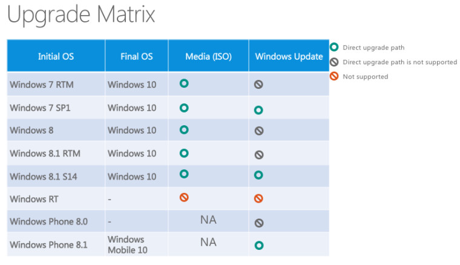

ええまだ確定じゃないんでしょうけどもね。

<iframe src="//hatenablog-parts.com/embed?url=http%3A%2F%2Fwmpoweruser.com%2Fso-its-windows-mobile-10-then%2F" title="So it&#39;s Windows Mobile 10 then?" class="embed-card embed-webcard" scrolling="no" frameborder="0" style="display: block; width: 100%; height: 155px; max-width: 500px; margin: 10px 0px;"><a href="http://wmpoweruser.com/so-its-windows-mobile-10-then/">So it&#39;s Windows Mobile 10 then?</a></iframe>

なんかMSが公開した資料で<a class="keyword" href="http://d.hatena.ne.jp/keyword/Windows">Windows</a> 10へのアップグレードパスについての記載があったそうなんですが、 

<a class="keyword" href="http://d.hatena.ne.jp/keyword/Windows%20Phone%208">Windows Phone 8</a>.1のアップグレードパスの表記が「<a class="keyword" href="http://d.hatena.ne.jp/keyword/Windows%20Mobile">Windows Mobile</a> 10」というなんかすごく昔懐かしい感じの名前になってますね・・・。

これまで何度も何度も繰り返し言ってますけど、ブランド名って一度決めたらそう簡単に変えるもんじゃないと思いますし、ましてや元の鞘に収まるとか外部からしたら迷走してるとしか思えないわけで。 
しかもただでさえ「<a class="keyword" href="http://d.hatena.ne.jp/keyword/Windows">Windows</a>」のブランドを関してしまったせいで<a class="keyword" href="http://d.hatena.ne.jp/keyword/Win32">Win32</a>なプログラムが動くとかいうような見当違いの話がいまだに信じられているなかで、さらに今となっては古臭く、EOLを迎えているようなブランド名にまた戻すなんて狂気の沙汰としか。

<a class="keyword" href="http://d.hatena.ne.jp/keyword/Windows">Windows</a> 10 for phonesでいいじゃないですか。 
正直それもどうかと思ってるけど「<a class="keyword" href="http://d.hatena.ne.jp/keyword/Windows%20Mobile">Windows Mobile</a>」より格段にましです。過去の負債をまたわざわざ担ぐ必要なんてないです。

***