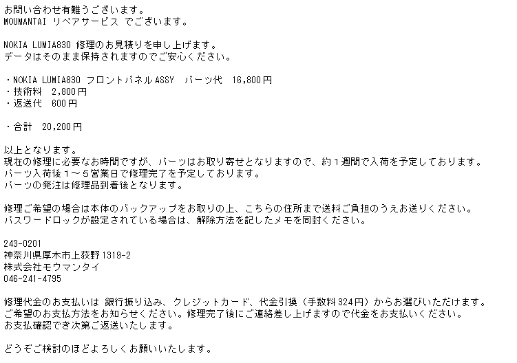

土曜日に悲しみの液晶故障となった<a class="keyword" href="http://d.hatena.ne.jp/keyword/Nokia">Nokia</a> Lumia 830。

フロントパネルの交換で復旧できるのではないかという予想のもとMOUMANTAIに修理の見積もり依頼を出していたのですが、その見積もりが返ってきました。

パーツ代が16800円、技術料2800円、返送代600円〆て20200円。 
思ってたより技術料お安い・・・。 
自分で分解して完全にぶっ壊すよりプロに頼んだほうが間違いないのでこのままMOUMANTAIさんにお願いしよう・・・。

追記

<iframe src="https://hatenablog-parts.com/embed?url=https%3A%2F%2Fblog.hitsujin.jp%2Fentry%2F2015%2F06%2F17%2F235056" title="修理に出したLumia 830が2か月経っても帰ってこない話 - Pandora Pocket" class="embed-card embed-blogcard" scrolling="no" frameborder="0" style="display: block; width: 100%; height: 190px; max-width: 500px; margin: 10px 0px;"></iframe>

***