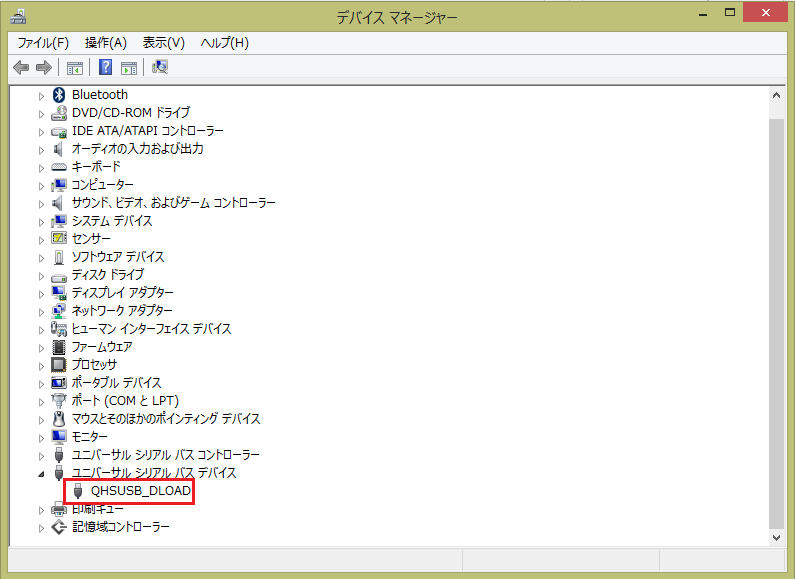

先日<a class="keyword" href="http://d.hatena.ne.jp/keyword/Windows">Windows</a> 10 Mobile TPをあてたLumia 820。

10TP堪能したしメイン端末だから8.1に戻そうと<a class="keyword" href="http://d.hatena.ne.jp/keyword/Windows">Windows</a> Phone Recovery Toolでリカバリーを実施中、フラッシュモードに切り替わってROMに書き込まれている最中突然切断、Toolも失敗と表示され、その後うんともすんとも言わなくなってしまいました・・・。

PCに接続しなおすと接続音はするものの、Lumiaとして認識されず

のようにQHSUSB_DLOADとして認識されてしまうだけ。 
Lumia Software Recovery Toolも利用してみたものの認識してくれず、頼みの綱の<a class="keyword" href="http://d.hatena.ne.jp/keyword/Nokia">Nokia</a> Care Suite（よいこは使っちゃダメな<a class="keyword" href="http://d.hatena.ne.jp/keyword/%A5%C4%A1%BC%A5%EB">ツール</a>//）でもVolume-+Powerによるリカバリーモードに移行できないため書き込みできず完全に詰み状態。

海外でもどうやらそこそこの数の人が同様の問題で死屍累々状態となっているようで、つい先ほども

<blockquote class="twitter-tweet" lang="HASH(0x84aecd8)">
冗談は夢の中でしてくれ <a href="http://t.co/WxvpIXJU0f">pic.twitter.com/WxvpIXJU0f</a>
&mdash; 綾野ちい✨アヤノフ (@ChiiAyano) <a href="https://twitter.com/ChiiAyano/status/589314573754208256">April 18, 2015</a></blockquote>

と文鎮仲間(白目）が誕生するなど非常に残念な事態・・・。 
<a href="http://answers.microsoft.com/en-us/insider/forum/insider_wintp-insider_repair/lumia-520521devices-unusable-after-using-windows/c5d072d5-c26e-4a02-907d-fde2ca5e34c7">Lumia 520で問題が発生してそれのフィックス版Recovery Toolが公開されているようですが</a>、綾野氏の端末は925、私のは820とほかの端末でも現象が発生してしまうようで。

現状この状態になった場合復旧手段は修理に出すか<a class="keyword" href="http://d.hatena.ne.jp/keyword/JTAG">JTAG</a>接続してフラッシュするくらいしかないようで。

ということで手元に<a class="keyword" href="http://d.hatena.ne.jp/keyword/Windows">Windows</a> Phone端末がなくなるという非常事態になってしまったのでLumia 636をぽちりたいと思います。。

追記
無事復活させられました！！！

<iframe src="http://blog.thty.net/embed/2015/05/19/210256" title="Lumia 820、文鎮からの復活 - Pandora Pocket" class="embed-card embed-blogcard" scrolling="no" frameborder="0" style="display: block; width: 100%; height: 190px; max-width: 500px; margin: 10px 0px;"><a href="http://blog.thty.net/entry/2015/05/19/210256">Lumia 820、文鎮からの復活 - Pandora Pocket</a></iframe><cite class="hatena-citation"><a href="http://blog.thty.net/entry/2015/05/19/210256">blog.thty.net</a></cite>

***