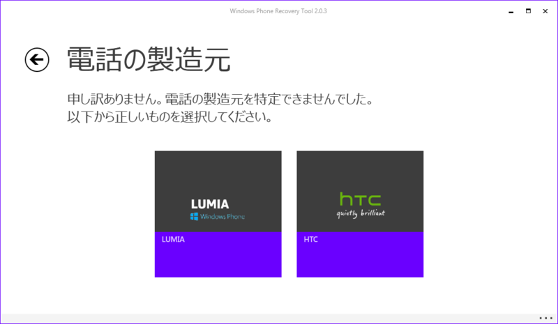

<iframe src="http://blog.thty.net/embed/2015/04/18/154931" title="Lumia 820をリカバリーしたら文鎮になった件について - Pandora Pocket" class="embed-card embed-blogcard" scrolling="no" frameborder="0" style="display: block; width: 100%; height: 190px; max-width: 500px; margin: 10px 0px;"><a href="http://blog.thty.net/entry/2015/04/18/154931">Lumia 820をリカバリーしたら文鎮になった件について - Pandora Pocket</a></iframe>

リカバリー中になぜか切断されてしまったせいでうんともすんとも言わない文鎮と化したLumia 820。

その前に壊れてしまったLumia 830（いまだに修理業者から帰ってこない・・・）はハードウェア的な故障でしたけど、こちらはソフトウェア的な問題なので、頑張れば復活できるといろいろ調べたり聞いたりしてきた結果、ついに復活させることができたので備忘録。

***

今回復活させるにあたって参考にしたのはxda-developersの記事。  
<a href="http://forum.xda-developers.com/windows-phone-8/development/help-programmer-unbrick-jtag-t3082592">Finally... unbrick your Lumia device QHSUSB_… | Windows Phone 8 Development and Hacking | XDA Forums</a>

文鎮と化したLumia 820は、内部的には<a class="keyword" href="http://d.hatena.ne.jp/keyword/%A5%D6%A1%BC%A5%C8%A5%ED%A1%BC%A5%C0">ブートローダ</a>が吹っ飛んでいる状態らしい。 
<a class="keyword" href="http://d.hatena.ne.jp/keyword/%A5%D6%A1%BC%A5%C8%A5%ED%A1%BC%A5%C0">ブートローダ</a>が吹っ飛んでいるとリカバリー<a class="keyword" href="http://d.hatena.ne.jp/keyword/%A5%C4%A1%BC%A5%EB">ツール</a>なども端末を認識してくれないので、その<a class="keyword" href="http://d.hatena.ne.jp/keyword/%A5%D6%A1%BC%A5%C8%A5%ED%A1%BC%A5%C0">ブートローダ</a>を書き込む必要があると。

で、必要なのが

<ul>
<li><a href="http://go.microsoft.com/fwlink/?LinkID=525569">Windows Phone Recovery Tool</a></li>
<li>自身の端末にあった<a class="keyword" href="http://d.hatena.ne.jp/keyword/%A5%D5%A5%A1%A1%BC%A5%E0%A5%A6%A5%A7%A5%A2">ファームウェア</a>（NaviFirmというソフトウェアを使えばｺﾞﾆｮｺﾞﾆｮ）</li>
<li><a href="http://server1.infinity-best.com/download/index-1.php?dir=software/Drivers/&amp;file=X2_FlashDriver_Emergency_XP.rar">ドライバ</a>（USB接続して通信させるためのドライバ？）</li>
</ul>

まずは上記のドライバをインストール。 
解凍するといくつかファイルがあるので、そのうちの<a class="keyword" href="http://d.hatena.ne.jp/keyword/inf">inf</a>ファイルを右クリックしてインストール。 
これをいれないとthor2で端末を認識してくれない。

さて、端末にあった<a class="keyword" href="http://d.hatena.ne.jp/keyword/%A5%D5%A5%A1%A1%BC%A5%E0%A5%A6%A5%A7%A5%A2">ファームウェア</a>を見つけるのが一番面倒・・・。 
私のLumia 820はグローバル版で、内部的にはRM-825と呼ばれている模様。さらにマレーシアで売られていた端末であることを覚えていたのでProduct Codeをいろいろ探し回ったりしたところ、「05○R0○8」だと判明。 
これに対応する<a class="keyword" href="http://d.hatena.ne.jp/keyword/%A5%D5%A5%A1%A1%BC%A5%E0%A5%A6%A5%A7%A5%A2">ファームウェア</a>をゲットしました。

<a class="keyword" href="http://d.hatena.ne.jp/keyword/%A5%D5%A5%A1%A1%BC%A5%E0%A5%A6%A5%A7%A5%A2">ファームウェア</a>をゲットしたら、<a class="keyword" href="http://d.hatena.ne.jp/keyword/%A5%D5%A5%A1%A1%BC%A5%E0%A5%A6%A5%A7%A5%A2">ファームウェア</a>のffuファイルから必要なファイルを取り出します。 
まず管理者権限で<a class="keyword" href="http://d.hatena.ne.jp/keyword/%A5%B3%A5%DE%A5%F3%A5%C9%A5%D7%A5%ED%A5%F3%A5%D7%A5%C8">コマンドプロンプト</a>を起動したら、<a class="keyword" href="http://d.hatena.ne.jp/keyword/Windows">Windows</a> Phone Recovery Toolのフォルダに移動します。

<blockquote>
cd C:\Program Files (<a class="keyword" href="http://d.hatena.ne.jp/keyword/x86">x86</a>)\<a class="keyword" href="http://d.hatena.ne.jp/keyword/Microsoft">Microsoft</a> Care Suite\<a class="keyword" href="http://d.hatena.ne.jp/keyword/Windows">Windows</a> Phone Recovery Tool
</blockquote>

ファイルを抜き出すコマンドは

<blockquote>
thor2 -mode ffureader -ffufile "C:\rm-914\XXX.ffu" -dump_gpt -filedir C:\dump
</blockquote>

これでC:\dumpにgpt0.binというファイルができているので、msimage.mbnとリネーム。

そのあとbinファイルをhexファイルにしてどうこうってありますけど、よくわからないので同じように文鎮を作り出してしまっていた先人による試行錯誤の結果をありがたく貰い受けましょう。 
CorrectedHexFiles.zipというファイルをDLして解凍すると、いろいろな名前のファイルがあります。

この中で自分の端末にあったhexファイルを選びます。 
先ほどbinファイルを抜き出したときに表示された羅列の中で

<blockquote>
RKH of SBL1: DB73418E5840941CE7BD35949085B8F74628D511F19285A092ED3B600A64CC29
RKH of <a class="keyword" href="http://d.hatena.ne.jp/keyword/UEFI">UEFI</a>: DB73418E5840941CE7BD35949085B8F74628D511F19285A092ED3B600A64CC29
</blockquote>

みたいなものがあるはず。これの途中までがファイル名になってます。 
私の820の場合は

<blockquote>
DB73418E5840941CE7BD35949085B8F74628D511.hex
</blockquote>

でした。

利用するファイルが定まったら端末をPCに接続して

<blockquote>
thor2 -mode emergency -hexfile 利用するhexファイルのパス -mbnfile msimage.mbn -orig_gpt
</blockquote>

を実行。 
ファイルが間違っていたりするとエラーになりますのでいろいろ試しましょう。

私の場合、ここまでやった結果、Unknown <a class="keyword" href="http://d.hatena.ne.jp/keyword/Error">Error</a>とエラーが表示されてしまったのですが、一度ケーブルを引っこ抜いてPCに接続したところ

<blockquote class="twitter-tweet" lang="HASH(0x8c4ebf0)">
うおおおおおおお <a href="http://t.co/U2LelBl29m">pic.twitter.com/U2LelBl29m</a>
&mdash; Ovis (@Pandora_Ovis) <a href="https://twitter.com/Pandora_Ovis/status/600346281496547328">May 18, 2015</a></blockquote>

こんな感じで赤い画面に！文鎮から復活しました！！

xda-developersではこの後vplファイルを焼き焼きしたりしてましたが、私はそちらを試さず<a class="keyword" href="http://d.hatena.ne.jp/keyword/Windows">Windows</a> Phone Recovery Toolを実行してROMを書き込みました。 
<a class="keyword" href="http://d.hatena.ne.jp/keyword/Windows">Windows</a> Phone Recovery Toolを起動しても端末を自動認識してくれませんが、電話が検出されませんでしたボタンを押下したうえで

この画面でLUMIAを選択したところ、端末の機種名は出てこないものの、利用できる<a class="keyword" href="http://d.hatena.ne.jp/keyword/%A5%D5%A5%A1%A1%BC%A5%E0%A5%A6%A5%A7%A5%A2">ファームウェア</a>が表示されました。 
そのまま指示に従うことでこんな感じに。

<blockquote class="twitter-tweet" lang="HASH(0x8c4ebf0)">
<a class="keyword" href="http://d.hatena.ne.jp/keyword/Windows">Windows</a> Phone Recovery Toolが認識してくれた <a href="http://t.co/QGPFMzoXmN">pic.twitter.com/QGPFMzoXmN</a>
&mdash; Ovis (@Pandora_Ovis) <a href="https://twitter.com/Pandora_Ovis/status/600346880837492736">May 18, 2015</a></blockquote>

<blockquote class="twitter-tweet" lang="HASH(0x8c4ebf0)">
無事文鎮から復旧したLumia 820です。ご確認ください。 <a href="http://t.co/yEtfdIFwbO">pic.twitter.com/yEtfdIFwbO</a>
&mdash; Ovis (@Pandora_Ovis) <a href="https://twitter.com/Pandora_Ovis/status/600622941982756864">May 19, 2015</a></blockquote>

こうして無事Lumia 820は復活を遂げることができたのでした。

なおここに書いてる内容はあくまで私が試した結果うまくいっただけで、ほかの端末でもうまくいくとは限りませんし自己責任で。

追記

<blockquote class="twitter-tweet" lang="HASH(0x8c4ebf0)">
ま、基本的に入手してるのは特定キャリアじゃないのであればグローバルモデル。箱にCVと書いてあれば確定、HKとかMYとかが仕向け先、あとは色と合わせて一覧からプロダクトコードをさがすという地道な作業？
&mdash; ぶりちゃん (崩壊) (@brichan_fiana) <a href="https://twitter.com/brichan_fiana/status/600634320026341377">May 19, 2015</a></blockquote>

追記の追記

同じようにLumia 925を文鎮化させてしまっていた@ChiiAyanoもこの方法で復活できたのですが、バッテリーが枯渇していたせいですぐにROM焼きをすることができなかった模様。 
文鎮化するとケーブルを接続してもバッテリー充電がされないようなので注意。

