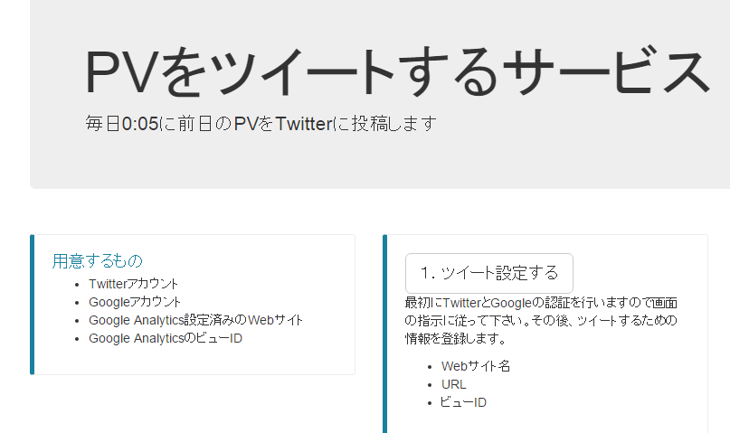
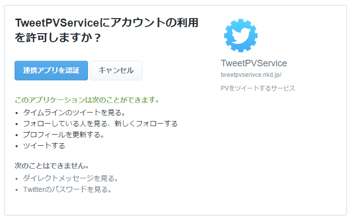
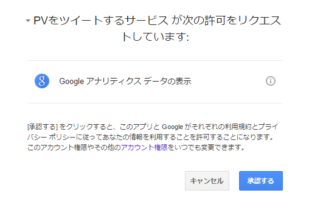
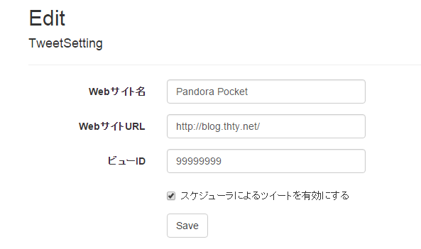
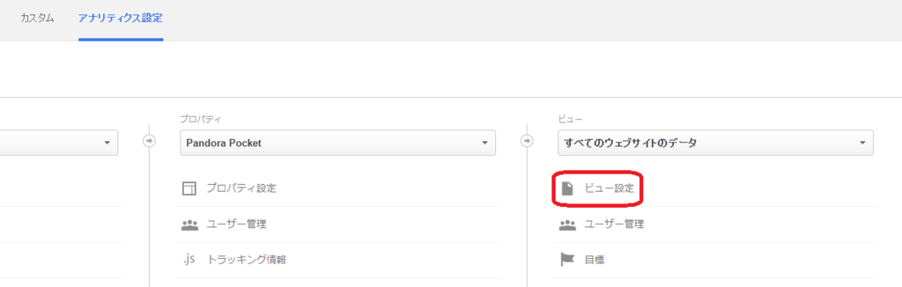
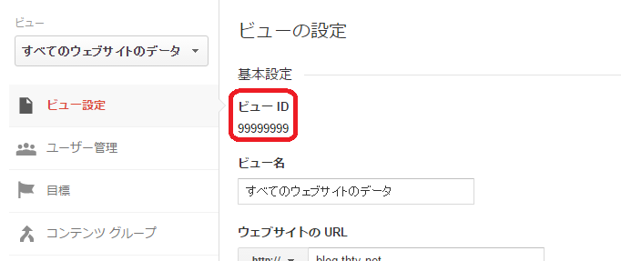

以前手作業でつぶやいていた一日のPVなんですが、面倒くさくなってやめてました(ｵｲ

先ほど<a class="keyword" href="http://d.hatena.ne.jp/keyword/Twitter">Twitter</a>眺めていたら酢酸先生(<a href="http://blog.hatena.ne.jp/ch3cooh393/">id:ch3cooh393</a>)とかずあきさん(<a href="http://blog.hatena.ne.jp/kazuakix/">id:kazuakix</a>)がなかじさん(<a href="http://blog.hatena.ne.jp/nakaji999/">id:nakaji999</a>)作の「<a href="http://tweetpvservice.nkd.jp">PVをツイートするサービス</a>」を利用しようとしていたので便乗で私も設定してみました。

<blockquote class="twitter-tweet" lang="ja">
PVをツイートするサービス使ってる人少ないので布教した
&mdash; CH3COOH(さくさん) (@ch3cooh) <a href="https://twitter.com/ch3cooh/status/649249292650045440">2015, 9月 30</a></blockquote>

***

1.「<a href="http://tweetpvservice.nkd.jp/">PVをツイートするサービス</a>」の「ツイート設定する」ボタンをクリック

2.<a class="keyword" href="http://d.hatena.ne.jp/keyword/Twitter">Twitter</a>の認証ページに飛ぶので認証ボタンをぽちっ

3.<a class="keyword" href="http://d.hatena.ne.jp/keyword/Google%20Analytics">Google Analytics</a>の認証ページに飛ぶのでこちらも認証ボタンをぽちっ

4.サービスの設定画面に飛ぶのでサイト名、URL、ビューIDを入力

このビューIDはGoogleAnalyticsの設定からビュー設定を開くと書いてある。 

これで毎日0時5分に勝手にツイートされるらしい。 
便利だ。

ところで<a class="keyword" href="http://d.hatena.ne.jp/keyword/%C3%F8%BA%EE%B8%A2">著作権</a>表示が

<blockquote class="twitter-tweet" lang="ja">
PVをツイーするサービス <a href="http://t.co/jmFd22yG62">pic.twitter.com/jmFd22yG62</a>
&mdash; Ovis (@Pandora_Ovis) <a href="https://twitter.com/Pandora_Ovis/status/649247107614834688">2015, 9月 30</a></blockquote>

になってるのはいいんだろうか（

