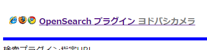
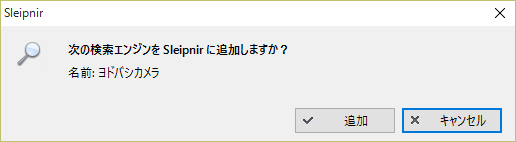
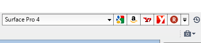

インターネットを使い始めたころはともかく、最近は何か調べようと思ったらわざわざYahoo!やGoogleなどの検索サイトを開いて検索欄に入力してなんてことをしなくとも、ブラウザの検索バーで入力して検索してますよね。  

んで、最近のブラウザってOpenSearchという規格で簡単に検索エンジンを追加できるらしいんですね。  

私が使ってるブラウザはSleipnirなんですが、Sleipnirだと

[http://www.fenrir-inc.com/jp/web/searches/:embed]

というサイトを用意してくれているので(OpenSearch対応ブラウザならSleipnir以外でも使える）、ここから追加したい検索エンジンを選べばすぐに使えるわけですが、載ってないところもあるわけでして。  
最近ヨドバシカメラで買い物をすることが増えてきたので検索バーにヨドバシカメラを追加したかったのですが上のページにはない。  

以前、OpenSearchのデータを作成するサービスサイトをブクマしてた気がしたので探したところ今もありました。

[http://ready.to/search/jp/:embed]

ヨドバシカメラの場合、「検索ワードの前: Url-template(prefix) 」の欄に  
> http://www.yodobashi.com/ec/category/index.html?cate=&word=  

「検索ワードの後: Url-template(suffix) 」の欄に  
> &ginput=  

を入力して「検索プラグインを生成」ボタンを押せば生成されます。  
ヨドバシカメラの場合は入力変換のところは変更しなくてもいいですが、ほかのサイトでUTF-8以外のURLエンコードを使ってる場合は変更が必要。  

後はリンクをタップして  
   
ブラウザに追加すれば  
   

やあ便利だ。  
 