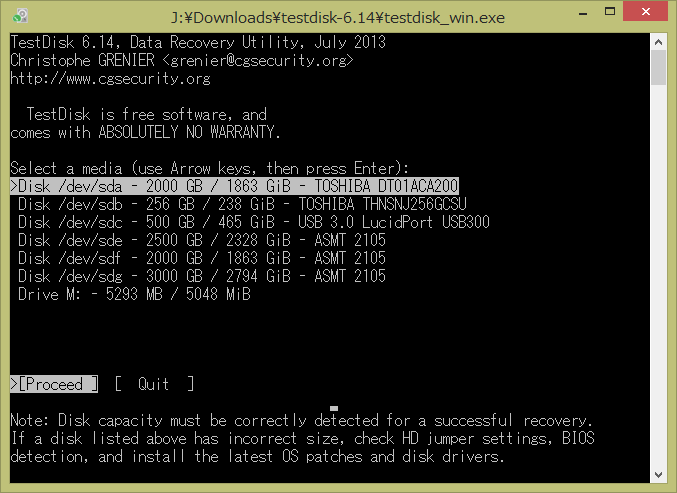

4月ごろに書いておいて下書き状態で残ってたのを掘り起こし・・・。

自宅で利用している録画サーバーはESXi上の<a class="keyword" href="http://d.hatena.ne.jp/keyword/VM">VM</a>で動いてまして、録画ファイルを保存するためにHDDを<a class="keyword" href="http://d.hatena.ne.jp/keyword/RDM">RDM</a>で接続しています。 
ここ最近その<a class="keyword" href="http://d.hatena.ne.jp/keyword/VM">VM</a>が不調でフリーズしがちだったので、そろそろ<a class="keyword" href="http://d.hatena.ne.jp/keyword/Windows%207">Windows 7</a>な録画<a class="keyword" href="http://d.hatena.ne.jp/keyword/VM">VM</a>を廃止して、<a class="keyword" href="http://d.hatena.ne.jp/keyword/Windows%208">Windows 8</a>で環境を作り直そうと画策したのですが、新たに<a class="keyword" href="http://d.hatena.ne.jp/keyword/VM">VM</a>を作ってそちらから<a class="keyword" href="http://d.hatena.ne.jp/keyword/RDM">RDM</a>接続したHDDに接続したところ、

こんな風にまだフォーマットしていないHDDとして認識されてしまい、中に入っていたデータが読み込めなくなる事態が発生・・・。

これまで録画していた番組や音楽ファイルが入っていたのでこれが消えたら大惨事。 
とりあえず事態をまとめると

<ul>
<li>3TBのHDDと4TBのHDDで現象発生</li>
<li>2TBのHDDでは現象発生せず</li>
<li>行った操作は<a class="keyword" href="http://d.hatena.ne.jp/keyword/RDM">RDM</a>接続をするために作成したファイルを<a class="keyword" href="http://d.hatena.ne.jp/keyword/VM">VM</a>に紐づかせただけ</li>
</ul>

そもそもESXiでの<a class="keyword" href="http://d.hatena.ne.jp/keyword/RDM">RDM</a>接続は、2TB以上では<a class="keyword" href="http://d.hatena.ne.jp/keyword/Windows">Windows</a>がうまく認識してくれず、GPartedでフォーマットする必要があったなど若干リスキーなことをしていたので、<a class="keyword" href="http://d.hatena.ne.jp/keyword/VM">VM</a>を切り替えたことでまた何か踏み抜いた模様。 
<a href="https://communities.vmware.com/message/2487522">こちらの記事</a>によるとESXi 6.0で問題が解消している模様とのことだったので6.0にアップグレードしてみたのですが結果は変わらず。

ほかの<a class="keyword" href="http://d.hatena.ne.jp/keyword/Windows">Windows</a>機に直接接続してもやはりNTFSフォーマットされたドライブとして認識してくれず困り果てていたのですが、ふと思い返してみると<a class="keyword" href="http://d.hatena.ne.jp/keyword/RDM">RDM</a>接続なら直接ファイルをHDDに保存しているわけで、ファイルが消えるような処理は何もしていない。 
となるともしかしたら<a class="keyword" href="http://d.hatena.ne.jp/keyword/%A5%D1%A1%BC%A5%C6%A5%A3%A5%B7%A5%E7%A5%F3">パーティション</a>テーブルが壊れて認識できなくなっただけなんじゃないかという気がしてきました。

で、<a class="keyword" href="http://d.hatena.ne.jp/keyword/%A5%D1%A1%BC%A5%C6%A5%A3%A5%B7%A5%E7%A5%F3">パーティション</a>テーブルが壊れたときに使われる<a class="keyword" href="http://d.hatena.ne.jp/keyword/%A5%C4%A1%BC%A5%EB">ツール</a>として有名どころを探したところ「TestDisk」というソフトを発見。

<iframe src="//hatenablog-parts.com/embed?url=http%3A%2F%2Fwww.cgsecurity.org%2Fwiki%2FTestDisk" title="TestDisk - Partition Recovery and File Undelete" class="embed-card embed-webcard" scrolling="no" frameborder="0" style="display: block; width: 100%; height: 155px; max-width: 500px; margin: 10px 0px;"></iframe><cite class="hatena-citation"><a href="http://www.cgsecurity.org/wiki/TestDisk">www.cgsecurity.org</a></cite>

<h5>TestDiskを起動</h5>

TestDiskを起動するとこの画面になるのでログファイルの作成方法を選択。 

<h5>HDDの選択</h5>

中身が見えなくなってしまったHDDを選択。 

<h5><a class="keyword" href="http://d.hatena.ne.jp/keyword/%A5%D1%A1%BC%A5%C6%A5%A3%A5%B7%A5%E7%A5%F3">パーティション</a>テーブルの選択</h5>

私は確か<a class="keyword" href="http://d.hatena.ne.jp/keyword/EFI">EFI</a> GPTを選んだと思うんですが(うろ覚え)、たぶん<a class="keyword" href="http://d.hatena.ne.jp/keyword/Intel">Intel</a>選んでおけばよさそう。 

<h5><a class="keyword" href="http://d.hatena.ne.jp/keyword/%A5%D1%A1%BC%A5%C6%A5%A3%A5%B7%A5%E7%A5%F3">パーティション</a>チェック</h5>

選択したHDDの中身をチェック。 

<h5>検索</h5>

Quick Searchを選択。 
 
検索中。。。 

<h5><a class="keyword" href="http://d.hatena.ne.jp/keyword/%A5%D1%A1%BC%A5%C6%A5%A3%A5%B7%A5%E7%A5%F3">パーティション</a>情報</h5>

検索した結果情報が取得できた！ファイルリストが確認できるようになってます。 
 

<h5><a class="keyword" href="http://d.hatena.ne.jp/keyword/%A5%D1%A1%BC%A5%C6%A5%A3%A5%B7%A5%E7%A5%F3">パーティション</a>情報書き込み</h5>

Enterを押すと以下の画面になるので、Writeを選択。 
 
本当にいいんか？と聞かれるのでYを押してEnter。 

書き込みが終わったらPCを再起動。 

<h5>復活！</h5>

というわけで無事大切なファイルたちを救い出すことができました。 
私の場合はMFTか何かが壊れただけでファイルそのものは無事だったわけですが、さらに重症であったときもこのソフトは役に立つみたいです。

<a href="http://akanoren.blog136.fc2.com/blog-entry-118.html">&#x5F92;&#x7136;&#x8D64;&#x306E;&#x308C;&#x3093; RAW&#x30D1;&#x30FC;&#x30C6;&#x30A3;&#x30FC;&#x30B7;&#x30E7;&#x30F3;&#x3068;&#x306A;&#x3063;&#x305F;3TB&#x306E;HDD&#x304B;&#x3089;testdisk&#x3067;&#x30C7;&#x30FC;&#x30BF;&#x62BD;&#x51FA; &#x9577;&#x6587;</a>

***