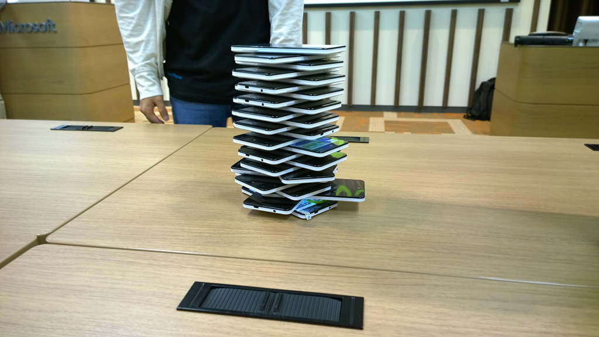

<iframe src="//hatenablog-parts.com/embed?url=http%3A%2F%2Fwww.adventar.org%2Fcalendars%2F975" title="Windows Phone / Windows 10 Mobile Advent Calendar 2015 - Adventar" class="embed-card embed-webcard" scrolling="no" frameborder="0" style="display: block; width: 100%; height: 155px; max-width: 500px; margin: 10px 0px;"></iframe>

<a class="keyword" href="http://d.hatena.ne.jp/keyword/Windows">Windows</a> Phone / <a class="keyword" href="http://d.hatena.ne.jp/keyword/Windows">Windows</a> 10 Mobile Advent Calendar 2015の2日目の記事です。

***

2015年ももうあと少しでおしまいですね。

昨年の<a class="keyword" href="http://d.hatena.ne.jp/keyword/Windows">Windows</a> Phone Advent Calendarで私はこんな記事を書いていました。

<iframe src="http://blog.thty.net/embed/2014/12/07/023116" title="2014年、羊はWindows Phoneの夢を見るか? - Pandora Pocket" class="embed-card embed-blogcard" scrolling="no" frameborder="0" style="display: block; width: 100%; height: 190px; max-width: 500px; margin: 10px 0px;"></iframe>

2014年は海外では様々な端末が発売されたものの、日本ではFZ-E1(通称鈍器)という<a class="keyword" href="http://d.hatena.ne.jp/keyword/Windows">Windows</a> Phoneに近い<a class="keyword" href="http://d.hatena.ne.jp/keyword/Windows">Windows</a> Phoneではない端末が発売された以外何も進展のない年でした。

それがどうでしょう。今年はマウスコンピュータ社製の<a class="keyword" href="http://d.hatena.ne.jp/keyword/Windows">Windows</a> Phone端末、MADOSMAが発売されたと思ったら最終的に7社もの企業が<a class="keyword" href="http://d.hatena.ne.jp/keyword/Windows">Windows</a> Phoneないしは<a class="keyword" href="http://d.hatena.ne.jp/keyword/Windows">Windows</a> 10 Mobileを搭載した端末を発売すると発表するなど、長かった氷河期を抜けたかのように大きな転換を迎えました。

そんな2015年を大雑把に振り返ってみましょう。

<h4>1月～3月</h4>

<h5>1月</h5>

1月は<a class="keyword" href="http://d.hatena.ne.jp/keyword/Windows">Windows</a> 10 Mobileが発表された月でしたね。 
<iframe src="//hatenablog-parts.com/embed?url=http%3A%2F%2Fgigazine.net%2Fnews%2F20150113-windows10-for-mobile%2F" title="近日開催のWindows 10イベントで新Windows Phoneに関する発表の期待が高まる" class="embed-card embed-webcard" scrolling="no" frameborder="0" style="display: block; width: 100%; height: 155px; max-width: 500px; margin: 10px 0px;"></iframe>
1月21日に行われた「<a class="keyword" href="http://d.hatena.ne.jp/keyword/Windows">Windows</a> 10: The Next Chapter」イベントで「<a class="keyword" href="http://d.hatena.ne.jp/keyword/Windows">Windows</a> 10 Mobile」の情報が公開されました。 
<a class="keyword" href="http://d.hatena.ne.jp/keyword/Windows">Windows</a> 10でパソコン向けOSと<a class="keyword" href="http://d.hatena.ne.jp/keyword/%A5%B9%A5%DE%A1%BC%A5%C8%A5%D5%A5%A9%A5%F3">スマートフォン</a>向けOSが一つになるという話はあったものの、具体的な情報が何も出ていなかった頃でしたが、このイベントで2月に既存のLumia端末向けにInsider Preview版の次世代<a class="keyword" href="http://d.hatena.ne.jp/keyword/Windows">Windows</a> Phone OSをインストールすることができると発表されました。 
このイベントの発表内容はオデさんがまとめられています。 
<a href="https://od10z.wordpress.com/2015/01/25/121%e3%81%aewindows10%e3%82%a4%e3%83%99%e3%83%b3%e3%83%88%e3%81%ae%e4%bf%ba%e7%9a%84%e3%81%be%e3%81%a8%e3%82%81/">1/21&#x306E;Windows10&#x30A4;&#x30D9;&#x30F3;&#x30C8;&#x306E;&#x4FFA;&#x7684;&#x307E;&#x3068;&#x3081; | &#x751F;&#x3051;&#x308B;&#x5C4D;</a>

<h5>2月</h5>

1月のイベントから3週間ほど経過した2月13日、初めてのInsider Previewが公開されました。 
<iframe width="480" height="270" src="https://www.youtube.com/embed/ckzhX1O6Lto?feature=oembed" frameborder="0" allowfullscreen></iframe>
スタート画面の背景の変更について賛否両論で盛り上がった記憶があります。最終的には選べるようになりましたね。

2月23日。 
日本の<a class="keyword" href="http://d.hatena.ne.jp/keyword/Windows">Windows</a> Phone史における一つの転換点がやってきました。 
<iframe src="//hatenablog-parts.com/embed?url=http%3A%2F%2Fwww.mouse-jp.co.jp%2Fcompany%2Fnews%2F2015%2Fnews_20150223_01.html" title="ニュースリリース：マウスコンピューター、Windows Phone ベースのデバイス開発契約を締結し、開発着手のお知らせ" class="embed-card embed-webcard" scrolling="no" frameborder="0" style="display: block; width: 100%; height: 155px; max-width: 500px; margin: 10px 0px;"></iframe>
この数年間待ちに待ち続けた、<a class="keyword" href="http://d.hatena.ne.jp/keyword/Windows">Windows</a> Phone端末がついに発表されたのでした。 
<iframe src="http://blog.thty.net/embed/2015/02/23/233716" title="Windows Phone「ベース」？ - Pandora Pocket" class="embed-card embed-blogcard" scrolling="no" frameborder="0" style="display: block; width: 100%; height: 190px; max-width: 500px; margin: 10px 0px;"></iframe>
発表段階では「<a class="keyword" href="http://d.hatena.ne.jp/keyword/Windows">Windows</a> Phoneベース」だったので、FZ-E1みたいな<a class="keyword" href="http://d.hatena.ne.jp/keyword/Windows">Windows</a> Phoneのようで<a class="keyword" href="http://d.hatena.ne.jp/keyword/Windows">Windows</a> Phoneでない端末なのかなと思いましたが、<a class="keyword" href="http://d.hatena.ne.jp/keyword/Windows">Windows</a> Phoneジャーナリストのつやてざ氏から間違いなく<a class="keyword" href="http://d.hatena.ne.jp/keyword/Windows">Windows</a> Phone OSを搭載した端末であるという情報があり狂喜乱舞したのを覚えています。

また、2月27日にはfreetelからも<a class="keyword" href="http://d.hatena.ne.jp/keyword/Windows">Windows</a> Phone端末を発売すると発表が。 
<iframe src="//hatenablog-parts.com/embed?url=http%3A%2F%2Fwww.itmedia.co.jp%2Fmobile%2Farticles%2F1502%2F27%2Fnews101.html" title="freetel、SIMロックフリーのWindows Phoneを2015年夏までに国内発売" class="embed-card embed-webcard" scrolling="no" frameborder="0" style="display: block; width: 100%; height: 155px; max-width: 500px; margin: 10px 0px;"></iframe>
昨年までまったく音沙汰がなかったのにこの短期間に夢見ていた話が沸いて降ってきたわけでもうてんやわんやでした。

<h5>3月</h5>

Insider Previewの対象機種が増えたくらいしかあまりネタはなかったかな・・・？ 
私個人はせっかく買ったLumia 830が1カ月程度で破損し、大変つらい状況にありました・・・。 
<iframe src="http://blog.thty.net/embed/2015/03/22/004132" title="Lumia 830がお釈迦になりまして - Pandora Pocket" class="embed-card embed-blogcard" scrolling="no" frameborder="0" style="display: block; width: 100%; height: 190px; max-width: 500px; margin: 10px 0px;"></iframe>

<h4>4月～6月</h4>

<h5>4月</h5>

1か月ぶりに新しいInsider Previewが公開されました。 
このときに確認できて思わずガッツポーズをとったのはマップの状況。 
<a href="https://od10z.wordpress.com/2015/04/12/windows10-for-phones-%e3%81%a7%e3%81%ae%e5%9c%b0%e5%9b%b3/">Windows10 for phones &#x3067;&#x306E;&#x5730;&#x56F3; | &#x751F;&#x3051;&#x308B;&#x5C4D;</a>
<a class="keyword" href="http://d.hatena.ne.jp/keyword/Windows%20Phone%208">Windows Phone 8</a>.xではHere Mapだったために日本国内では<a class="keyword" href="http://d.hatena.ne.jp/keyword/%C7%F2%C3%CF%BF%DE">白地図</a>のような使えない地図しか見られませんでしたが、このInsider Previewによって10 Mobileでは日本国内ならばbingマップが表示されることが確認できました。 
ある意味で来て当たり前のことで一喜一憂してたわけですね（

<h5>5月</h5>

<iframe src="http://blog.thty.net/embed/2015/05/13/233530" title="おでコン、始まります！ - Pandora Pocket" class="embed-card embed-blogcard" scrolling="no" frameborder="0" style="display: block; width: 100%; height: 190px; max-width: 500px; margin: 10px 0px;"></iframe>
日本で<a class="keyword" href="http://d.hatena.ne.jp/keyword/Windows">Windows</a> Phone端末が発売されることを記念して、オデさんが企画したアプリコンテストの発表がありました。 
私も審査員兼協賛として参加させていただきましたが、個人でコンテストを企画するオデさんやっぱり頭おかしい。(ほめ言葉）

5月20日にはマウスコンピュータの<a class="keyword" href="http://d.hatena.ne.jp/keyword/Windows">Windows</a> Phone端末のブランド名が正式に発表されました。 
<iframe src="//hatenablog-parts.com/embed?url=http%3A%2F%2Fpc.watch.impress.co.jp%2Fdocs%2Fnews%2F20150520_702812.html" title="マウス、開発中Windows Phoneの仕様を公開 〜ブランド名は「MADOSMA」に決定 - PC Watch" class="embed-card embed-webcard" scrolling="no" frameborder="0" style="display: block; width: 100%; height: 155px; max-width: 500px; margin: 10px 0px;"></iframe>
5月30日に東京で行われた「めとべや」という勉強会で発売前のMADOSMAの実機を触れる機会がありましたが、サクサク動く出来の良さに早く発売してほしい・・・！！！と強く思ったものです。

25日に<a class="keyword" href="http://d.hatena.ne.jp/keyword/Windows">Windows</a> Phone<a class="keyword" href="http://d.hatena.ne.jp/keyword/%A5%AF%A5%E9%A5%B9%A5%BF">クラスタ</a>をにぎわせたネタが
<iframe src="//hatenablog-parts.com/embed?url=http%3A%2F%2Fpc.watch.impress.co.jp%2Fdocs%2Fnews%2F20150525_703602.html" title="日本マイクロソフト、独自に「Lumia 830」の技適を取得し、社内利用へ  - PC Watch" class="embed-card embed-webcard" scrolling="no" frameborder="0" style="display: block; width: 100%; height: 155px; max-width: 500px; margin: 10px 0px;"></iframe>
すわ日本でもLumiaを売る布石か！？って思ったものですが残念ながら社員が使うためだけだったようで。 
日本で売ってもいいと思うんですけどね。

<h5>6月</h5>

2日、MADOSMAの発売日が発表されました。 
<iframe src="//hatenablog-parts.com/embed?url=http%3A%2F%2Fwww.mouse-jp.co.jp%2Fcompany%2Fnews%2F2015%2Fnews_20150602_01.html" title="ニュースリリース：マウスコンピューター、スマートフォンを予約販売開始" class="embed-card embed-webcard" scrolling="no" frameborder="0" style="display: block; width: 100%; height: 155px; max-width: 500px; margin: 10px 0px;"></iframe>

6月18日。 
<a class="keyword" href="http://d.hatena.ne.jp/keyword/Windows">Windows</a> Phone<a class="keyword" href="http://d.hatena.ne.jp/keyword/%A5%AF%A5%E9%A5%B9%A5%BF">クラスタ</a>が待ちに待った日でした。 
とうとう国内で合法的に<a class="keyword" href="http://d.hatena.ne.jp/keyword/Windows">Windows</a> Phoneを利用できる日がやってきたのでした。 
私も当日に受け取ったのですが東京では当日ゲットした人々が集まって喜びを分かち合っていたようで。 

(画像は<a href="https://od10z.wordpress.com/2015/06/20/madosma%e3%81%a8%e3%81%84%e3%81%86%e5%90%8d%e3%81%ae%e8%bc%9d%e3%81%8d/">オデさんのブログから</a>)

22日にはfreetelの端末も発表されます。 
<a href="http://simpedia.jp/sim/articles/news/simpedia/004608/:embed:">http://simpedia.jp/sim/articles/news/simpedia/004608/:embed:</a>
まさかの2機種。 
エントリーおよびミドルレンジ向けと、市場を広げるうえで大事な位置を占めるものです。 
IS12Tは初めての機種だというのに馬鹿みたいに高くてつぶれましたが、KATANA 01は予価19800円とMADOSMAより安く手に取りやすいお値段。素晴らしい。

<h4>7月～9月</h4>

<h5>7月</h5>

MSの音声アシスタント「Cortana」の日本語版が<a class="keyword" href="http://d.hatena.ne.jp/keyword/Windows">Windows</a> 10に搭載される予定であることが発表されました。 
<iframe src="//hatenablog-parts.com/embed?url=http%3A%2F%2Fblogs.windows.com%2Fwindowsexperience%2F2015%2F07%2F20%2Fcortana-brings-cultural-savviness-to-new-markets%2F" title="Cortana brings Cultural Savviness to New Markets" class="embed-card embed-webcard" scrolling="no" frameborder="0" style="display: block; width: 100%; height: 155px; max-width: 500px; margin: 10px 0px;"></iframe>
この段階では<a class="keyword" href="http://d.hatena.ne.jp/keyword/Windows">Windows</a> 10 Mobileにどのタイミングで搭載されるかは発表されませんでしたが、10月のInsider Previewで日の目を見ることになります。

<h5>8月</h5>

あまり目立ったネタはなし。。

<h5>9月</h5>

<iframe src="//hatenablog-parts.com/embed?url=http%3A%2F%2Fwww.dospara.co.jp%2F5press%2F2015%2F0902b" title="今年後半にリリース予定のWindows 10 Mobileを標準搭載したスマートフォンの開発を発表｜ドスパラ公式通販サイト" class="embed-card embed-webcard" scrolling="no" frameborder="0" style="display: block; width: 100%; height: 155px; max-width: 500px; margin: 10px 0px;"></iframe><cite class="hatena-citation"><a href="http://www.dospara.co.jp/5press/2015/0902b">www.dospara.co.jp</a></cite>
国内三社目の<a class="keyword" href="http://d.hatena.ne.jp/keyword/Windows">Windows</a> 10 Mobile搭載端末発表。 
ほえー、まさか今年こんなに出てくるとはなぁと思っていたら・・・。

<h4>10月～12月</h4>

<h5>10月</h5>

<iframe src="//hatenablog-parts.com/embed?url=http%3A%2F%2Fascii.jp%2Felem%2F000%2F001%2F065%2F1065228%2F" title="Windows 10搭載デバイスが勢揃い - 日本MS、パートナー各社製品をアピール" class="embed-card embed-webcard" scrolling="no" frameborder="0" style="display: block; width: 100%; height: 155px; max-width: 500px; margin: 10px 0px;"></iframe>
・トリニティ 
・<a class="keyword" href="http://d.hatena.ne.jp/keyword/Acer">Acer</a> 
・<a class="keyword" href="http://d.hatena.ne.jp/keyword/VAIO">VAIO</a> 
まさか既存の3社だけではなく新規に3社も<a class="keyword" href="http://d.hatena.ne.jp/keyword/Windows">Windows</a> 10 Mobile搭載端末の発表があるとは・・・。 
去年の自分が聞いても絶対信じないです。

<h5>11月</h5>

<iframe src="//hatenablog-parts.com/embed?url=http%3A%2F%2Fwww.mouse-jp.co.jp%2Fcompany%2Fnews%2F2015%2Fnews_20151109_01.html" title="ニュースリリース：マウスコンピューター、Windows 10 Mobile 対応スマートフォン 「MADOSMA Q501A」を発表" class="embed-card embed-webcard" scrolling="no" frameborder="0" style="display: block; width: 100%; height: 155px; max-width: 500px; margin: 10px 0px;"></iframe>
ついに<a class="keyword" href="http://d.hatena.ne.jp/keyword/Windows">Windows</a> 10 Mobileが世に放たれます。 
海外では<a class="keyword" href="http://d.hatena.ne.jp/keyword/Windows">Windows</a> 10 MobileがプリインストールされたLumia 950/950XLが発売されましたが、国内でもすでにWP8端末を発売しているマウスコンピュータがW10Mを搭載したタイプのMADOSMAの発売を発表するなど盛り上がってきます。 
一体いつどのメーカーが<a class="keyword" href="http://d.hatena.ne.jp/keyword/Windows">Windows</a> 10 Mobileを搭載した端末を発売するかで盛り上がっておりましたが、トリニティが11月30日に発表を行うとリリースを公開します。 
<iframe src="//hatenablog-parts.com/embed?url=http%3A%2F%2Fnuans.jp%2Fnews%2Farchives%2F15" title="NuAns「NEO」発表会のお知らせ｜プレスリリース｜NEWS｜[NuAns] ニュアンス | 便利さと共に、温もりのある暮らしを" class="embed-card embed-webcard" scrolling="no" frameborder="0" style="display: block; width: 100%; height: 155px; max-width: 500px; margin: 10px 0px;"></iframe>
じゃあトリニティが一番かと思ったら 
<blockquote class="twitter-tweet" lang="ja">
明日11月21日より<a class="keyword" href="http://d.hatena.ne.jp/keyword/%A5%C9%A5%B9%A5%D1%A5%E9">ドスパラ</a>本店にてWindows10モバイルの展示が開始されます！！気になっている方はぜひ<a class="keyword" href="http://d.hatena.ne.jp/keyword/%A5%C9%A5%B9%A5%D1%A5%E9">ドスパラ</a>本店へ！！&#10;<a href="https://t.co/NwcsQUrAH7">https://t.co/NwcsQUrAH7</a>　<a href="https://twitter.com/hashtag/%E3%83%89%E3%82%B9%E3%83%91%E3%83%A9?src=hash">#ドスパラ</a> <a href="https://t.co/FsCZEkYpnA">pic.twitter.com/FsCZEkYpnA</a>
&mdash; <a class="keyword" href="http://d.hatena.ne.jp/keyword/%A5%C9%A5%B9%A5%D1%A5%E9">ドスパラ</a>【公式】 (@dospara_web) <a href="https://twitter.com/dospara_web/status/667640636296687617">2015, 11月 20</a></blockquote>
かと思えば
<a href="http://blg.freetel.jp/news/9307.html?_ga=1.225023193.2131259565.1447763900">&#x65E5;&#x672C;&#x6700;&#x901F;&#x767A;&#x58F2;&#xFF01;Windows 10 Mobile&#x5BFE;&#x5FDC;&#x30B9;&#x30DE;&#x30DB;&#x300E;KATANA 01&#x300F;&#x3092;11&#x6708;25&#x65E5;&#x306B;&#x5148;&#x884C;&#x8CA9;&#x58F2;&#x958B;&#x59CB;&#x3002;&#x8CA9;&#x58F2;&#x4FA1;&#x683C;&#x306F;LTE&#x3067;&#x9A5A;&#x304D;&#x306E;12,800&#x5186;&#xFF08;&#x7A0E;&#x5225;&#xFF09; | freetel</a>
と具体的な発売日を明示してfreetelが発売日競争でトップに立ちます。しかも最初は19800円という話だったKATANA 01が実発売価格12800円とさらにお安くなります。

この大混戦の中、ここで隠し玉が登場。 
<iframe src="//hatenablog-parts.com/embed?url=http%3A%2F%2Fwww.yamada-denki.jp%2Fservice%2Feveryphone%2F" title="EveryPhone | スマートフォンでWindowsを実現" class="embed-card embed-webcard" scrolling="no" frameborder="0" style="display: block; width: 100%; height: 155px; max-width: 500px; margin: 10px 0px;"></iframe>
10月のイベントでも全く話に上がってなかったのに、突如発表されたEveryPhone。まさか<a class="keyword" href="http://d.hatena.ne.jp/keyword/%A5%E4%A5%DE%A5%C0%C5%C5%B5%A1">ヤマダ電機</a>が出してくるとは思ってもみませんでした。 
EveryPhoneは28日に発売となり、国内初W10M端末はEveryPhoneとなります。

が、最も早くW10Mを利用できるようになったのは我らがMADOSMA。 
<iframe src="//hatenablog-parts.com/embed?url=http%3A%2F%2Fwww.mouse-jp.co.jp%2Fcompany%2Fnews%2F2015%2Fnews_20151127_01.html" title="ニュースリリース：マウスコンピューター、Windows 10 Mobile対応スマートフォン 「MADOSMA Q501A」を予約販売開始" class="embed-card embed-webcard" scrolling="no" frameborder="0" style="display: block; width: 100%; height: 155px; max-width: 500px; margin: 10px 0px;"></iframe><cite class="hatena-citation"><a href="http://www.mouse-jp.co.jp/company/news/2015/news_20151127_01.html">www.mouse-jp.co.jp</a></cite>
OTAアップグレードではなく、店頭でのアップグレードサービスを実施することによりEveryPhoneより一日早くW10Mを触れることができました。

<h5>12月</h5>

マウスコンピュータ、フリーテル、<a class="keyword" href="http://d.hatena.ne.jp/keyword/%A5%E4%A5%DE%A5%C0%C5%C5%B5%A1">ヤマダ電機</a>、トリニティが端末を発売し、残りの<a class="keyword" href="http://d.hatena.ne.jp/keyword/Acer">Acer</a>と<a class="keyword" href="http://d.hatena.ne.jp/keyword/VAIO">VAIO</a>が音沙汰がない状態。 
2015年中になにがしかの発表があるのでしょうか。気になります。

<h4>終わりに</h4>

昨年の記事では〆として

<blockquote>
2015年、吉報が春風に乗ってやってくることを祈ってます。
</blockquote>

と書き、とうとう吉報が舞い込んできました。 
もちろんまだまだ<a class="keyword" href="http://d.hatena.ne.jp/keyword/Windows">Windows</a> Phoneは日本での認知が低く、非常にニッチな一部の市場に流れているだけという問題があるわけですが、せっかく長らく待ち望んだものが手に入ったわけですし、来年もこの流れを維持してさらに大きな波が生まれるようファンとしては下支えをしていきたいものです。

