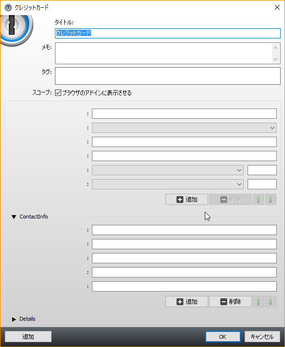

### 2018/06/18追記  
1Password 7 で正式に日本語対応したのでもうこの記事はお払い箱ですね。  

#### 元記事

RoboFormから1Passwordに乗り換えたわけですが、RoboFormと違って1Passwordは日本語化されていない。  
まぁ英語で困るのは設定くらいなんですができれば日本語化しておきたいところ。  

1Password自体は多言語対応しており、以下の言語が利用可能となっています。  

* English
* Catalan
* Czech
* Danish
* Dutch
* French
* German
* Italian
* Polish
* Portuguese (Brazilian)
* Spanish
* Swedish

また、下記のサイトでランゲージファイルの翻訳が行われています。  

<?# EmbedLink "https://crowdin.com/project/1password-for-windows-desktop" /?>

日本語は現在翻訳が完了しているものの、各翻訳に対する投票率が悪いため正しい翻訳として認められず結果的にランゲージファイルがプログラムに同梱されていない現状のようです。  

というわけで1Passwordを日本語で使いたい！って方は上記サイトで投票を行ってランゲージファイルがリリースされるよう行動をとりましょう！！

私はそれまで待ってられなかったので自分でランゲージファイルを作ってみました。  

1PasswordのランゲージファイルはPortable Object Formatという形式のものを機械的に読みやすく変換したMOファイル(くわしくは[こちらのサイト](https://crowdin.com/project/1password-for-windows-desktop)が詳しいです。WordPressなんかではおなじみらしい。)になります。  

~~default.mo~~

このファイルを下記のフォルダに配置してメニューバーからJapaneseを選んで再起動すると日本語化されます。  

> C:\Program Files (x86)\1Password 4\Locale\ja\LC_MESSAGES

このファイルの欠点なんですが、下記の画像を見るとわかるように一部のフィールド名がすっぽり欠けてしまいます。  

 

どうも一部の項目はプログラム内でべた書きしてるみたいでランゲージファイル上に対応するものがないみたいです。  

このページで公開したランゲージファイルは個人的に作っただけでサポートはしませんし、問題があれば公開をやめます。  
なのでこんな中途半端なものではなく公式で対応してもらうべくぜひ投票をして正式に日本語対応してもらえるよう働きかけてください。  