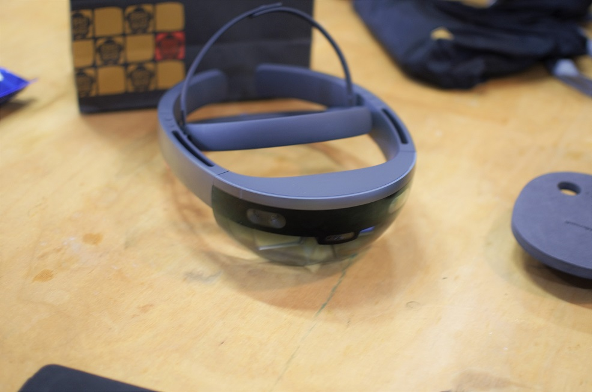
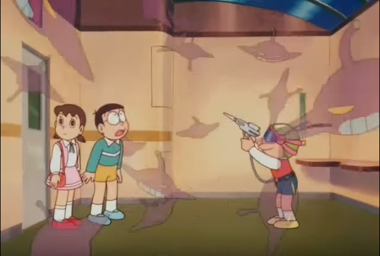
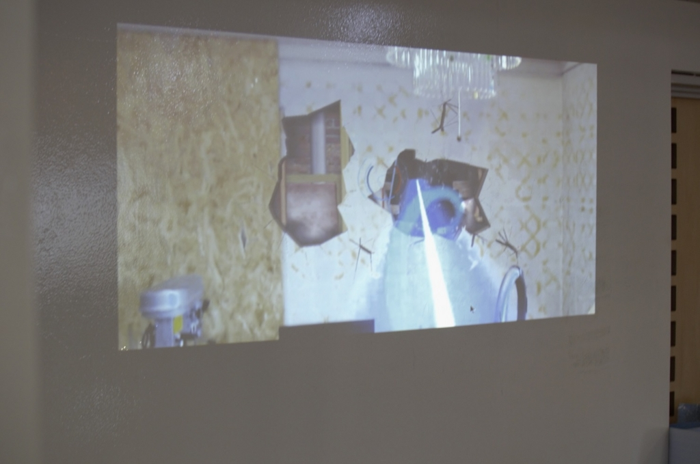

未来を見ることができました。  

 

<?# EmbedLink "http://blog.hitsujin.jp/entry/2016/05/08/012240" /?>

はるばる大阪からみつばたんにお越しいただいて名古屋でHoloLensをおさわりする会が開催されました。  

<?# EmbedLink "http://silkyfeel.jp/" /?>

会場は[Maker Lab Nagoya](http://makerlab.jp/)さん。  

まずHoloLensについて。  
HoloLensはMicrosoftが作ったMRなデバイスです。  
MRとはMixed Reality(複合現実)の略で、現実の中に情報をオーバーレイするものみたいです。  
単にオーバーレイするだけならARと同じなんですが、より現実と密着というかかみ合わせて投影しているのがMRの特徴のようです。(まだちゃんとわかってない）  
ARやVRとの違いについてはみつばたんのつぶやきを見ていただくとわかりやすいです。  

<?# Twitter 734997155543277568 /?>

実際にHoloLensを使うにあたりどうやって操作をするのかみつばたんからお教えいただいたのですが、実際に使ってみると目の前に集中しちゃって指の動かし方がわからなくなりみつばたんから「ひつじへたやな～」と突っ込まれる始末・・・。  

指の動かし方をちゃんと視認してクリック、右クリック、ドラッグをちゃんと行えるのはすごいのですが私みたいなどんくさい奴は専用のマウス的な何かが欲しい感じでしたorz  

ちなみに重量は600g程度。  
常時装着しているなら重いかもしれませんが、この大きさで4～6時間動かせるバッテリーとCPUGPUなどを搭載して単独で利用できるデバイスということを考えると大変コンパクトです。  

私は人体模型を表示するアプリを実際に体験したのですが、本当に目の前に存在しているかのようなホログラムが視点を変えると追従している様に大感激（VRとかそういうデバイス初体験です）  

ほかの方がやられていたインベーダーゲーム的なものをプロジェクター越しに見ていたのですが、VRのような没入型のものとは違って現実にSFの要素が持ち込まれたかのような不思議な情景にテンションMAX！  
   

大長編ドラえもん「のび太の銀河超特急」でスネ夫がやってたインベーダーゲームを幼いころやってみたい！と思っていたのですが、現実にやってきたものはそれを上回るものでした。  

 

写真をうまく撮れなかったのでわかりにくいですが、こちらの攻撃が敵に当たらず壁に当たった場合写真のとおり壁に穴が開くんです。ちゃんと壁であることをHoloLensが認識し、自動的にそういうテクスチャを当てているわけで完全に仮想的世界と現実の世界が入り混じってるわけですよ。これで興奮しなくて何に興奮するんですか（錯乱）  

昨年のBUILDでHoloLensが発表された時の感動がまざまざとよみがえってくるおさわり会でした。  

正直HoloLensの機能をフルに使うアプリを作るのは相当大変でしょうけども、これまでにない夢を感じる素敵なデバイスですから今からUnityなどを勉強して一般発売に備えておくといいんじゃないかなと思います。  

