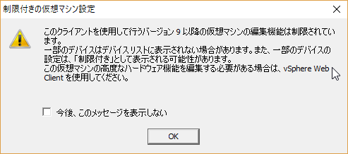
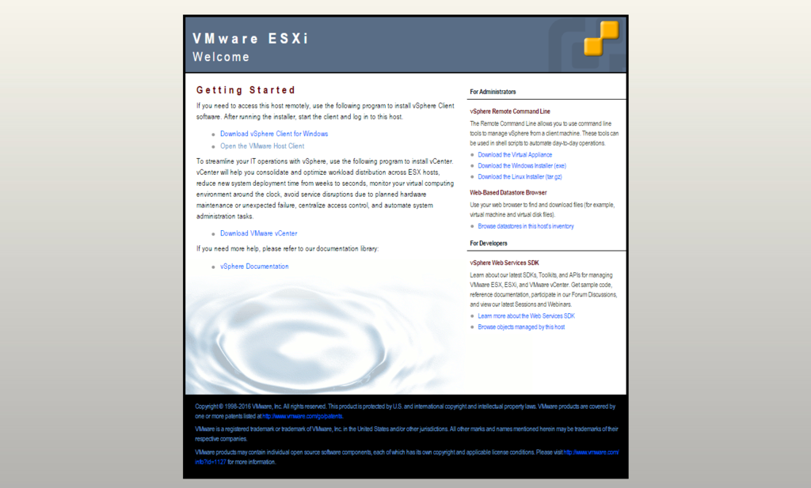
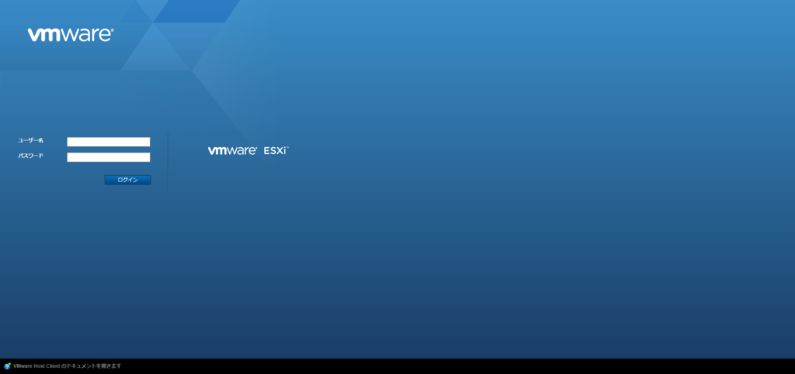
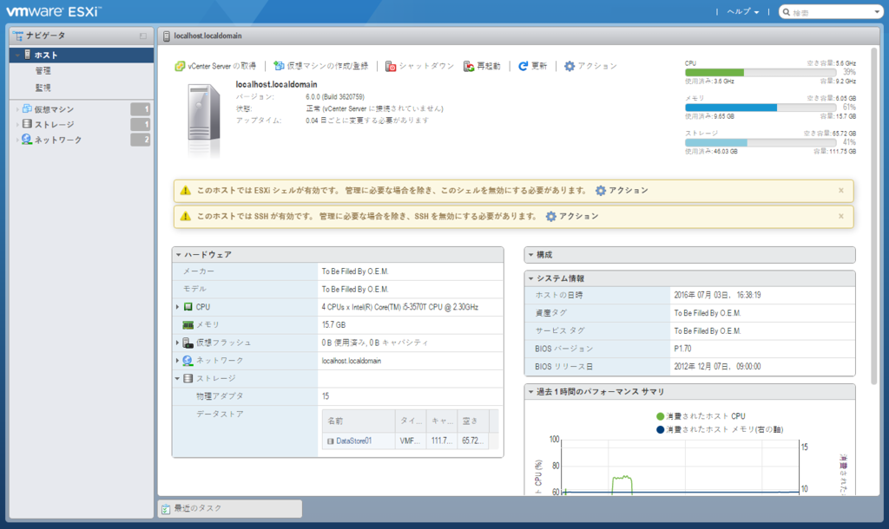
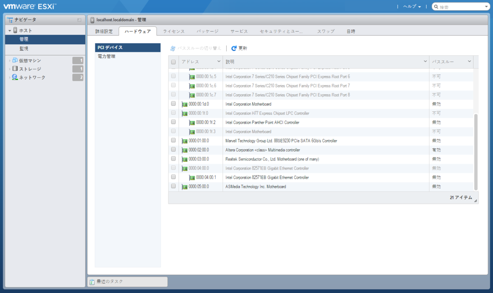
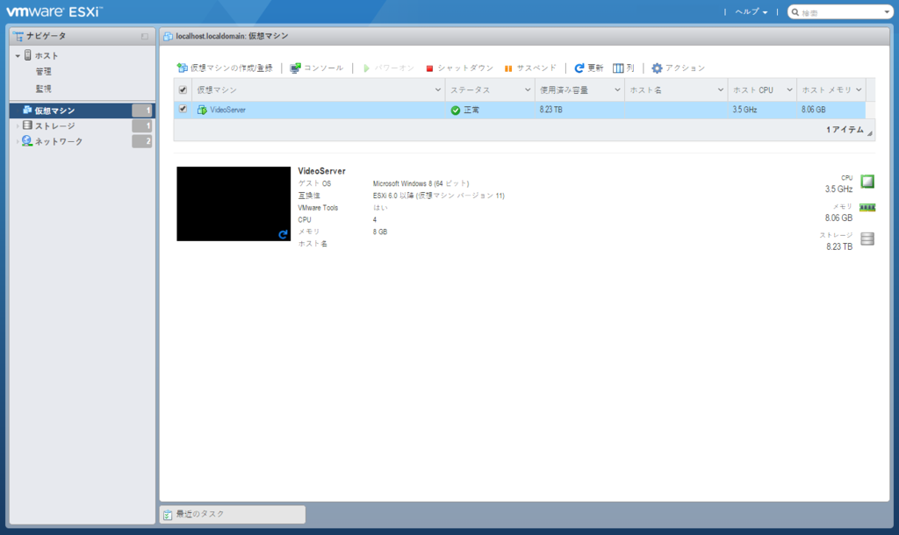
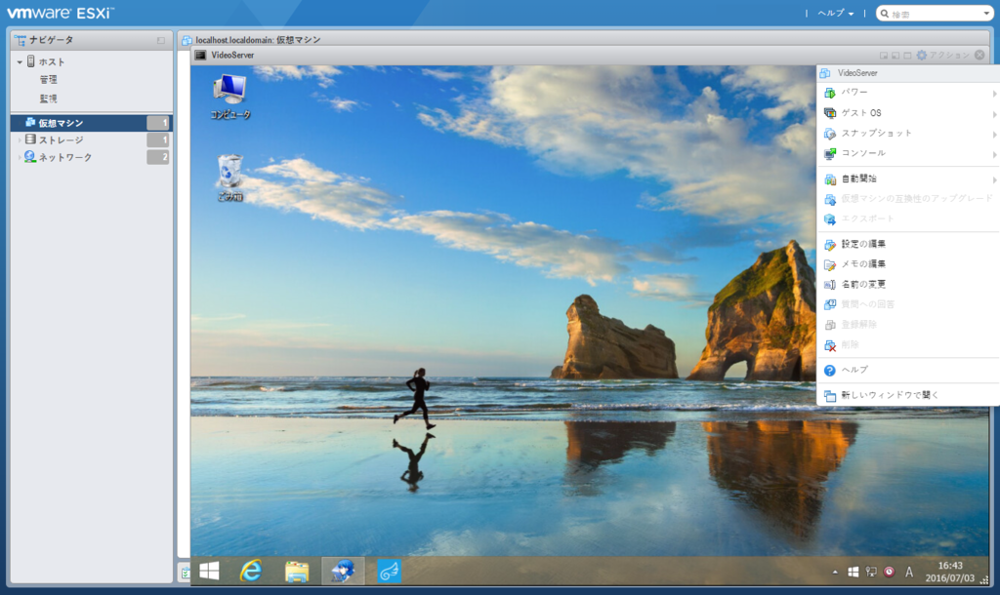
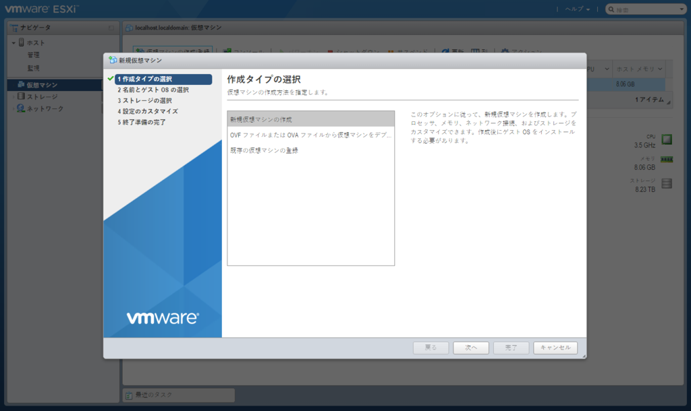

<a class="keyword" href="http://d.hatena.ne.jp/keyword/VMware">VMware</a> ESXiはこれまで<a class="keyword" href="http://d.hatena.ne.jp/keyword/VMware">VMware</a> vSphere Clientを使うのが一般的でしたが、5.1のころからもうvSphere Clientでは最新の環境に対応しないからね！とお達しがあり、実際最新の<a class="keyword" href="http://d.hatena.ne.jp/keyword/%B2%BE%C1%DB%A5%DE%A5%B7%A5%F3">仮想マシン</a>に対応してくれず、かといって移行先のWeb Clientは有償ライセンスがないといけないという残念な状況でした。

が、今回取り上げる<a class="keyword" href="http://d.hatena.ne.jp/keyword/VMware">VMware</a> Host Clientがすべてを解決してくれます。(たぶん)
最近まで日本語に対応していないほか機能が弱くvSphere Clientの代替にはなかなかなりえない感じでしたが、最新のバージョンでは日本語対応したほか<a class="keyword" href="http://d.hatena.ne.jp/keyword/%B2%BE%C1%DB%A5%DE%A5%B7%A5%F3">仮想マシン</a>をウェブ上でいじることができるなど十分代替となりえるところまで来ています。

これまではEmbedded Host Client と呼ばれており、<a class="keyword" href="http://d.hatena.ne.jp/keyword/VMware">VMware</a>のサイトからファイルをダウンロードしてESXiにインストールする作業が必要でしたが、ESXi 6.0 Update2から標準搭載となりました。

<a href="http://infratraining.blogspot.jp/2016/03/embedded-host-client-vsphere6.html">&#x30A4;&#x30F3;&#x30D5;&#x30E9;SE&#x4FEE;&#x884C;&#x65E5;&#x8A8C;: Embedded Host Client &#x3064;&#x3044;&#x306B;&#x3001;vSphere6 Update2&#x3067;&#x3001;&#x300C;VMware Host Client&#x300D;&#x3068;&#x3057;&#x3066;&#x6B63;&#x5F0F;&#x30EA;&#x30EA;&#x30FC;&#x30B9;&#xFF01;</a>

というわけでESXiサーバーのESXiをUpdate2に更新して実際に使ってみました。

Update2にアップデートしている場合、ESXiマシンの<a class="keyword" href="http://d.hatena.ne.jp/keyword/IP%A5%A2%A5%C9%A5%EC%A5%B9">IPアドレス</a>をブラウザに入力して表示されるサイトに<a class="keyword" href="http://d.hatena.ne.jp/keyword/VMware">VMware</a> Host Clientへのリンクがあります。

または

<blockquote>
<a href="http://ESXi">http://ESXi</a>マシンの<a class="keyword" href="http://d.hatena.ne.jp/keyword/IP%A5%A2%A5%C9%A5%EC%A5%B9">IPアドレス</a>/ui/
</blockquote>

で<a class="keyword" href="http://d.hatena.ne.jp/keyword/VMware">VMware</a> Host Clientを開けます。

vSphere Clientよりサクサク動いて好印象です。

ハードウェアの設定等も一通りvSphere Clientと同等のことを行えます。 

<a class="keyword" href="http://d.hatena.ne.jp/keyword/%B2%BE%C1%DB%A5%DE%A5%B7%A5%F3">仮想マシン</a>についてはマシンのステータス、パワーオン、シャットダウン、設定変更が行えるほか、コンソールを開くことができます。

<a class="keyword" href="http://d.hatena.ne.jp/keyword/%B2%BE%C1%DB%A5%DE%A5%B7%A5%F3">仮想マシン</a>の作成画面。 

<a class="keyword" href="http://d.hatena.ne.jp/keyword/%B2%BE%C1%DB%A5%DE%A5%B7%A5%F3">仮想マシン</a>自体は問題なく作れたものの、どうやってISOイメージからインストールするやら。 
vSphere Clientでは直接ISOイメージをマウントできましたけど、Host Clientの場合は一度データストアにアップロードしてからやればいいのかな・・・？

***