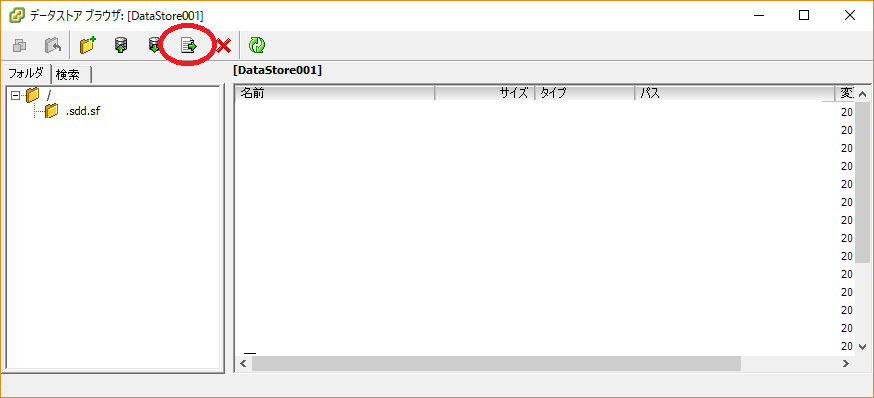

はまったというほどはまってないですが（どっちだ）  

VMが動いているSSDは金欠の時に買ったため120GBとほかのVMを入れるには容量不足だったので新しくSSDを買ってきました。  

[asin:B01EAXSB3K:detail]

大須の九十九で11000円ほど。安くなったものです。  

ESXiのVMデータの移動は簡単です。  
移動先のSSDをデータストアに登録してから「データストアの参照」でデータストアを開いて「このデータストアから、vCenterにアクセスできる別の場所にファイルを移動」アイコンをクリック。  
確認ダイアログが出るのではいをクリック、移動先を選択して移動ボタンをクリックするだけで移動できます。 
(インベントリから一度削除してもう一度登録しなおす必要はありますが)

 

が、今回その作業を行ったところエラーが発生してしまいました。  
よく見てみたところRDMのファイルのコピーができていないようです。  

仕方がないのでRDMのファイル以外を選択して移動させ、RDMファイルだけ改めて作ることにしました。  

作り方は以前と同じ。 

[http://blog.hitsujin.jp/entry/2014/06/08/161357:embed]

以前と同じ名前で作ればわざわざデバイスの追加をしなおさなくても問題なく認識されました。  

