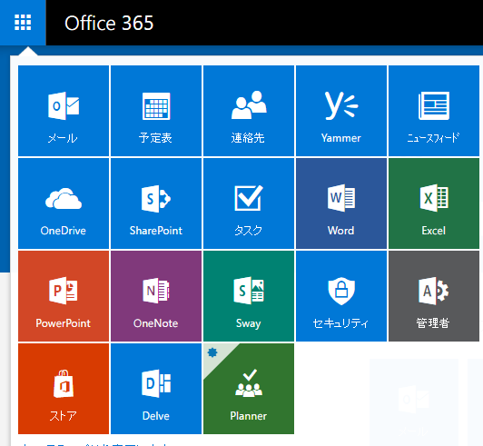
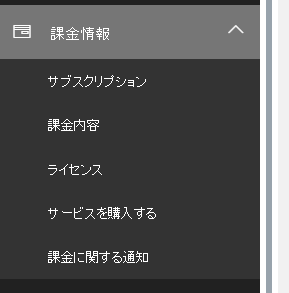
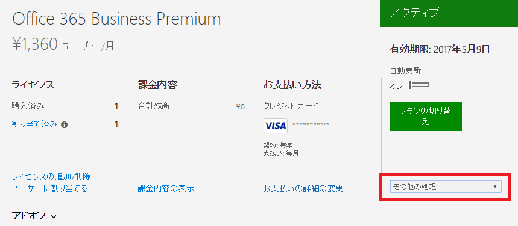
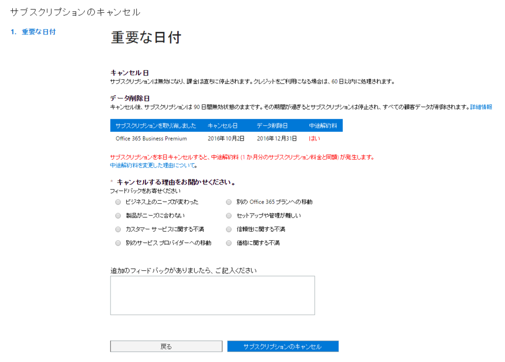
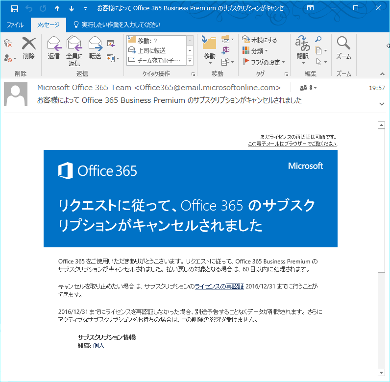

契約したものの使っていなかった(なぜ契約したし)Office 365 Business Premiumを解約しました。  

解約方法はこちらを参照してます。   

<?# EmbedLink "https://support.office.com/ja-jp/article/%e4%b8%80%e8%88%ac%e6%b3%95%e4%ba%ba%e5%90%91%e3%81%91-Office-365-%e3%82%b5%e3%83%96%e3%82%b9%e3%82%af%e3%83%aa%e3%83%97%e3%82%b7%e3%83%a7%e3%83%b3%e3%82%92%e3%82%ad%e3%83%a3%e3%83%b3%e3%82%bb%e3%83%ab%e3%81%99%e3%82%8b-b1bc0bef-4608-4601-813a-cdd9f746709a?CorrelationId=1d6f1807-6a45-41bd-9c59-91432c2c1d58&ui=ja-JP&rs=ja-JP&ad=JP" /?>

##### 管理センターにログイン  
まずは[管理センター](https://portal.office.com)にログインします。  

ログインIDは何も変えてなければadmin@〇〇.onmicrosoft.comのはず。  

##### 管理ページに移動  
   
左上のメニューをクリックして一覧を開き、管理者のタイルをクリック。  

##### 課金情報を開く  
   
左メニューの課金情報からサブスクリプションを選択。  

##### 解約を選択  
   
画面中央やや右のセレクトボックスからサブスクリプションの解約を選択。  

##### 解約理由  
   
適当に解約理由を記載。  

##### 解約完了
   

これで解約おしまい。  
サブスクリプションのキャンセルを行ってもある程度の期間はキャンセルの取り消しも可能らしいです。  

 

