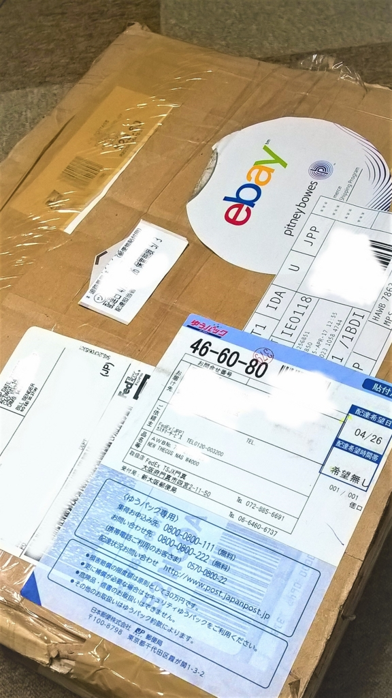
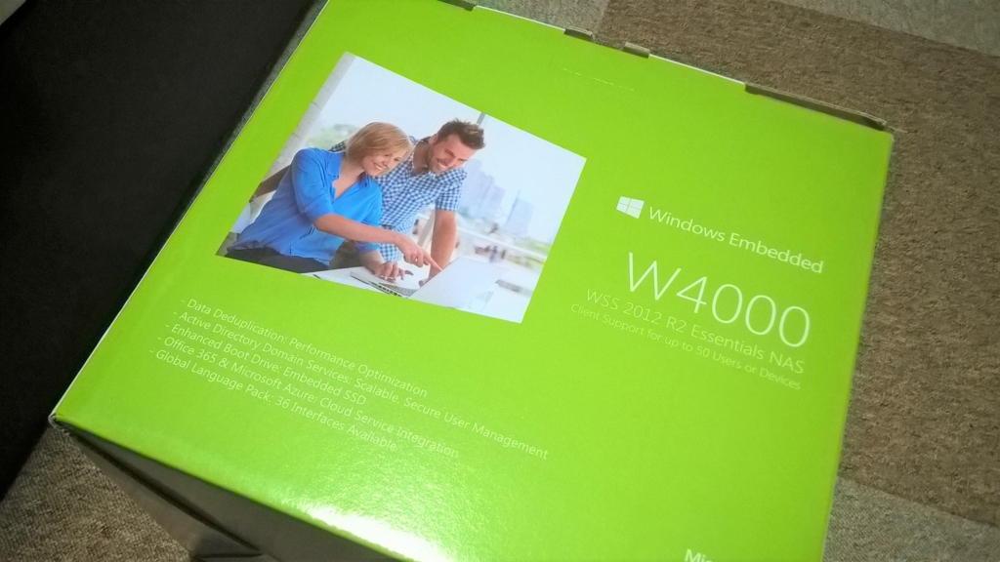
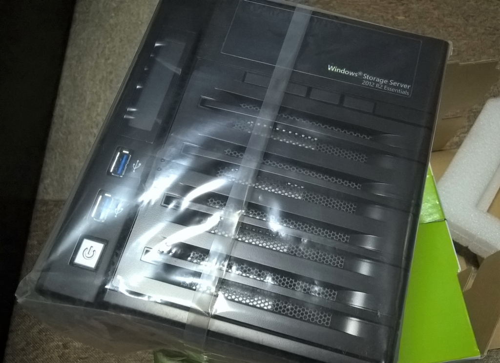

この記事を見て、何も考えずにぽちりました。  

<?# EmbedLink "https://satsumahomeserver.com/blog/255487" /?>

私が購入したのはThecus W4000で、34361円でした。関税（5932円でした）を含めても40293円。  
NTT Xストアでも税込み価格71388円なので3万円ほど安く買えた感じ。  
購入してから2週間くらいで米国から届きました。  

海外から届くわけなので心配していたのですが、案の定外箱はぼこぼこですね。  

 

でも中箱は傷もなく良好でした。  
 

中身。Windows Storage Server 2012 R2 Essentialsです。  
 

さて、買ったはいいものの、すでにReadyNASがあるので使い道が特にないという←なんで買った  

一通りセットアップして、NAS兼VPNサーバーにでもしようかしら。  
（届いたのはGWなのにまだセットアップしてないので、後で追記する予定（未定）