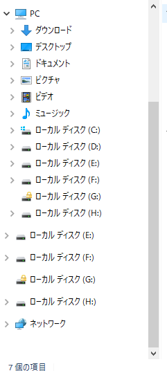
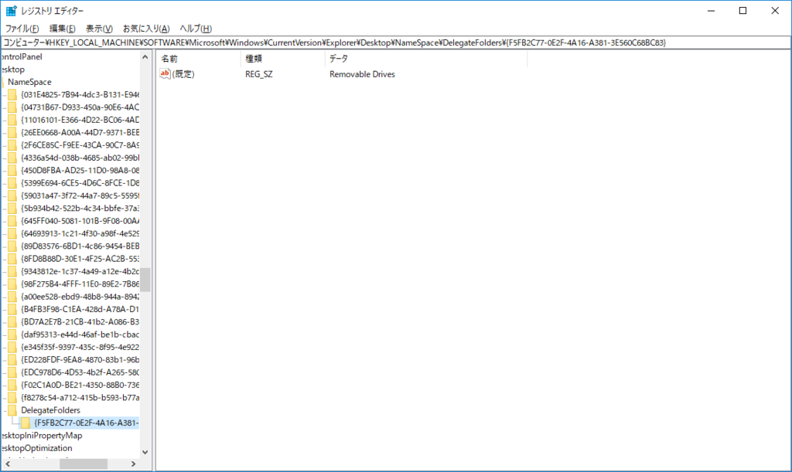
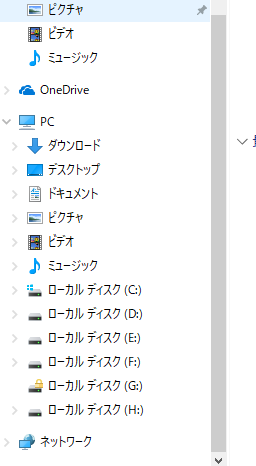

前々から気になっていたけど直していなかったやつ。

<a class="keyword" href="http://d.hatena.ne.jp/keyword/Windows%208">Windows 8</a>からなのか10になってからなのかは記憶にないですが、<a class="keyword" href="http://d.hatena.ne.jp/keyword/%A5%A8%A5%AF%A5%B9%A5%D7%A5%ED%A1%BC%A5%E9">エクスプローラ</a>の左ツリーに、外付けHDDが重複表示されるようになりました。 
こんな感じで。 

てっきり不具合なのかと思ってましたけど、これだけ長いこと放置されてるってことは仕様なんでしょうかね、これ。。

これは<a class="keyword" href="http://d.hatena.ne.jp/keyword/%A5%EC%A5%B8%A5%B9%A5%C8%A5%EA">レジストリ</a>をいじることで解消できます。

<iframe src="//hatenablog-parts.com/embed?url=http%3A%2F%2Faoytsk.blog.jp%2Farchives%2F313462.html" title="Windows10のエクスプローラーで外付けドライブが重複表示される : プログ" class="embed-card embed-webcard" scrolling="no" frameborder="0" style="display: block; width: 100%; height: 155px; max-width: 500px; margin: 10px 0px;"></iframe>

<blockquote>
[HKEY_LOCAL_MACHINE\SOFTWARE \<a class="keyword" href="http://d.hatena.ne.jp/keyword/Microsoft">Microsoft</a>\<a class="keyword" href="http://d.hatena.ne.jp/keyword/Windows">Windows</a>\CurrentVersion\Explorer\Desktop\NameSpace \DelegateFolders{F5FB2C77-0E2F-4A16-A381-3E560C68BC83}]
</blockquote>

これを削除することで<a class="keyword" href="http://d.hatena.ne.jp/keyword/%A5%A8%A5%AF%A5%B9%A5%D7%A5%ED%A1%BC%A5%E9">エクスプローラ</a>のPCツリーの下に外付けHDDが出てこなくなります。 
上のサイトだと、二つの<a class="keyword" href="http://d.hatena.ne.jp/keyword/%A5%EC%A5%B8%A5%B9%A5%C8%A5%EA">レジストリ</a>が明記されてますが、WOW6432Nodeのほうは削除しなくてもよさそう。（たぶん64bitPCで64bit<a class="keyword" href="http://d.hatena.ne.jp/keyword/%A5%A8%A5%AF%A5%B9%A5%D7%A5%ED%A1%BC%A5%E9">エクスプローラ</a>を使う場合？）

すっきり。

***