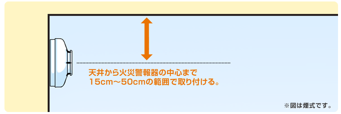

引っ越し先に火災報知器が設置されていないことに気づいたので新たに買うことにしました。  

火災報知器の設置は法律で義務付けられています。設置していなくても罰則はないですが、命を守るものなので設置するべきですね。  

#### 設置場所

設置する箇所として、寝室(子供部屋のように普段から就寝に用いるのであれば設置が必要で、来客が就寝するような普段から就寝に用いない部屋は対象外）、寝室がある階の階段に設置することが法律として義務付けられ、それ以外の部屋については各都道府県及び市区町村の条例によります。  
私の住んでいる名古屋市の場合、台所も設置義務があります。  

[https://www.secom.co.jp/jukeiki/place.html:title]

設置する部屋自体は上記の通りですが、実際に設置する場所自体も重要。  
台所は普段から煙や水蒸気がでる場所なので、ガスコンロのすぐ近くに設置したら毎回反応してしまいかねないですね。  
今住んでいるアパートの台所はちゃんと設置されてますが、コンロから割と近い位置に設置されているからかたまに誤反応します・・・。  

セコムのサイトにあった図によると、検知方式によって違いがあるようなので注意が必要。  
 

サイトを見ていて初めて知ったんですが、天井でなくても壁に設置してもいいんですね。  
 

#### 検知方式
火災報知器の検知方式は煙検知式と熱検知式があり、基本的には煙式を設置するそうです。  
煙は火災が発生した初期からでるので、早期発見ができるからと。なるほど。  
熱式は台所のように湯気や煙がでるため、誤検知が多い場所で利用するもの。  

[https://www.secom.co.jp/jukeiki/select.html:title]

とはいえ台所でも早期発見のために煙式をお勧めしているようで、[こちらのサイト](https://www.secom.co.jp/jukeiki/select.html)によると、名古屋市では煙検知式しか認めてないらしいです。・・・って名古屋市のサイトを見たら  
> 台所が狭く、どの場所も煙又は蒸気が滞留するときは、熱式の住宅用火災警報器を選んでください。  
とあるので、現在は許可されているのかも。  

[http://www.city.nagoya.jp/kurashi/category/20-3-4-8-0-0-0-0-0-0.html:embed]

また、購入時は下記のマークがあるかどうかをチェックしておくこと。ないものが売ってることはないでしょうけども。  
 

NSマークは日本消防検定協会が認めたマークで、その下のマークは国家検定によるもの。発売時期によってNSマークしかないものもあるそうですが、平成31年3月31日までは許可されているそうで、性能は同等らしい。  

[asin:B01GCA9Y4O:detail]

[asin:B01GCAA08S:detail]

