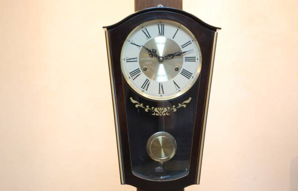
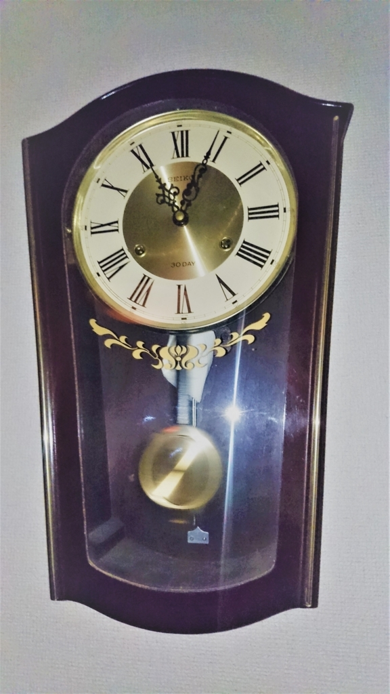

幼いころから時計が好きです。  
デジタル時計じゃなくてアナログ、できれば機械式のゼンマイ時計。  

小学校の頃はよく校長室に遊びに行っては(今思えばおかしい）、校長室に飾ってあった動かないホールクロックを眺め、はたまた無理やり動かそうと機械の中に手を突っ込もうとした（！？）ことがありありと思い出されます。  

閑話休題。  
今は1Kの賃貸アパートに住んでいるので、時計は枕元の目覚まし時計とPCに表示されている時計で事足りているんですが、今回一軒家に越すことになり、それだけじゃ時計が足りなくなりました。  
というわけで時計を購入することにしたんですが、どうせなら小さいころから大好きだった柱時計を手に入れたいという思いが強くなりまして。  

ゼンマイ時計じゃなくて単なる振り子時計であれば、  

[asin:B0011Y0VE4:detail]

[asin:B001P9HNOQ:detail]

みたいなものが売ってるわけですが、こういうのって振り子は単なる飾りなのでつまらない。  

ヤフオクを見るとアンティーク時計として千円台からたくさん出てるんですね。  

[https://auctions.yahoo.co.jp/search/search?auccat=&alocale=0jp&acc=jp&x=0&y=0&fixed=0&p=%C3%EC%BB%FE%B7%D7+%A5%BC%A5%F3%A5%DE%A5%A4:embed]

時間のずれが激しかったり、ゼンマイを巻いてもすぐ止まってしまうような、あまりに古くて手入れのされていないようなものは除外して、結局こんな時計を落札しました。  

 
（画像はヤフオクから）  

普通の柱時計とはちょっとデザインが違うんですが、状態もよさそうで、文字盤が鉄板というのもいい感じ(紙製の文字盤って大体経年劣化でボロボロになってるので・・・）
一回巻いたら30日動き続けるのも良きかな。    

3000円からのスタートだったので3000円でとりあえず入札したらそのまま落札できてしまいました。  

届いた現物を見ると、写真ではわからなかった傷もあったりはしたものの、製造されてからの月日を考えれば十分美品といったところ。  

 

実際にねじを巻いてみたところ、カチコチと振り子の揺れる大変耳心地の良い音が部屋に響きます。  

1時間放置してみた限りでは時間のずれは発生しておらず、この分ならこのまま利用していて毎日時刻を訂正しないといけないなんてことはなさそう。  

定時および半刻になるとボーンボーンとこれまた素敵な音色が聞こえるのも大変素敵なんですが、今はまだ賃貸アパートに置いてあるので近所迷惑になりそう。  

というわけで今は時打用のゼンマイが伸びきるまでは棒リン(ハンマーでたたかれることで音が鳴る部品)をキッチンペーパーでくるんで、ハンマーが当たっても音が鳴らないようにしてます。  
上にあげたAmazonで売っている最近の柱時計なんかは時間帯によって鳴らさないということができますが、さすがにこの時代のはないですね。  

ところで一般的なゼンマイ式時計は、左側が時打ち用ゼンマイ、右側が針を動かすためのゼンマイになっていて、時打ち用ゼンマイを巻くときは時計回り、時計用ゼンマイは反時計回りに巻くんだそうで。  
知らんかった・・・。  

[http://furudokei.exblog.jp/11616768/:embed]

