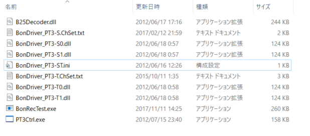
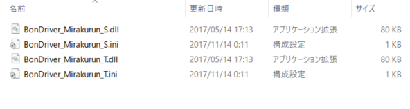
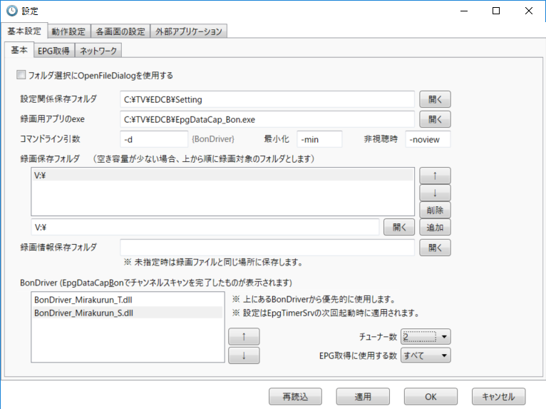
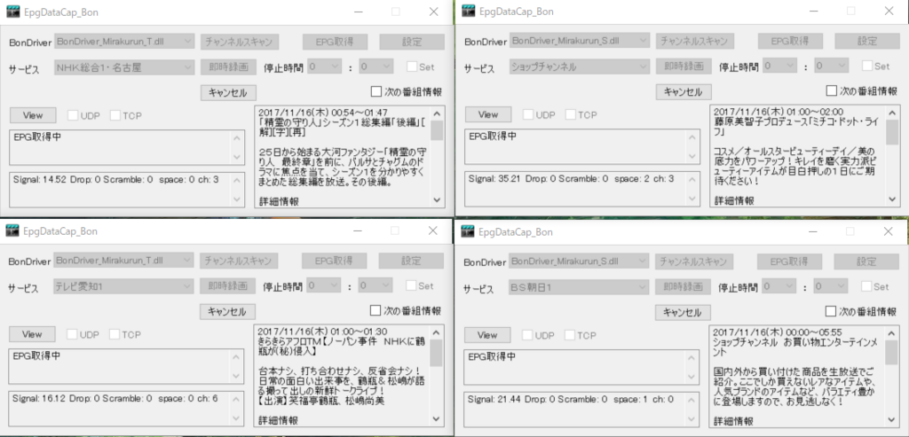
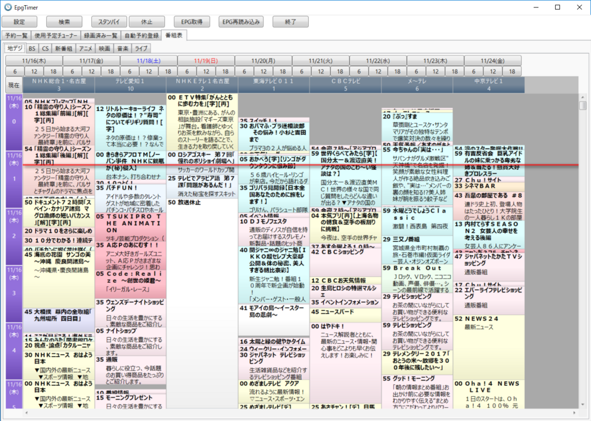

#### 2018/12追記
PT3からPLEX製チューナーに乗り換えました。(壊れたわけではないんですが、今後の保守を踏まえて）  
PLEX製チューナーに切り替えたことに伴う変更は下記の記事でまとめています。  

#### 以降元記事

ずいぶんと前に、PT3+VirtualPT+EDCB+TVTestでテレビの録画&視聴環境を整えたんですが、安定していたのでずっとそのままのバージョンで運用してきました。  

気づけばWindowsDTV界隈は活気がなくなりLinux界隈が優勢になってますね。  
ただまぁLinuxでわざわざ構築するのも面倒だし、かといって公開中止となったVirtualPTや、更新が完全に止まっているSpinelを利用するのもちょっと・・・。  

とはいえずっとこの状態を放置しておくのもなんだかなぁと思っていたので、引っ越しを機に録画環境を再構築することにしました。  

今の流行でいえばMirakurun+Chinachuが鉄板かと思いますが、実際にDockerでChinachuをインストールして試した感じだと、デザイン面ではChinachuのほうが好きなのですが、番組検索などでまだまだ痒い所に手が届かず、EDCBに劣る感じが否めないため、Chinachuの採用をあきらめました。ChinachuのためだけにVagrantを使うのもなんだか面倒ですし。  

というわけで表題の通り、Mirakurun+EDCB+TVTestで環境を構築します。  
最初はMirakurunじゃなくてBonDriverProxyEx使えばいい気もしたのだけど、開発が活発なほうを選択しました。  

#### 前準備  
今回の録画&視聴環境で必要なものは下記のとおりです。  

* PT3(TVチューナー)

<?# AmazonAffiliate B00857CQAM /?>
これがなくちゃ始まりませんね。販売終了してしまってｱﾎみたいな金額で転売されているので、今から手に入れるのは無理ぽい。  
まだ販売しているこの系列のチューナーはPLEXのチューナーくらいでしょうか。  
<?# AmazonAffiliate B06Y6MG4J2 /?>
内部的にはUSB接続と変わらないので、それなら貴重なPCIExpressスロットを消費するのではなく、USB単体で稼働するPX-W3U4でいいかもしれない。  
<?# AmazonAffiliate B01MR4SLB6 /?>

* ドライバ・SDK  
[アースソフトのサイト](https://earthsoft.jp/PT3/download_SHA-2.html)から下記のファイルをDLしておきましょう。  
・PT3-Driver-400+.exe  
・PT3-SDK-400+.exe  
FPGA 回路バージョンが0x04でないか、そもそもバージョン不明という場合はPT3-Update-400+.exeをDLしてアップグレードしておきましょう。  

すでに上記チューナーが取り付けられ、ドライバ、SDKやMicrosoft Visual C++ 2015 Redistrebutableなどのライブラリがインストールされている前提で話を薦めます。  
なお、必要ソフト類はC:\TVに保存する前提で書いています。  

#### Mirakurunのセットアップ  
Mirakurunは地デジ・衛星放送のチューナーをLAN内で共有するためのチューナーサーバーです。  
TypeScriptで書かれてNode.jsで動き、RESTfulなAPIが提供されているそうな。すげえ。（←よくわかってない  

とりあえずNode.jsがないと動かないので公式サイトからDLしてインストールしましょう。  
この時[MirakurunのReadme.md](https://github.com/Chinachu/Mirakurun/blob/master/README.md)を確認し、要求バージョンにあったものをインストールしてください。  
この記事を書いた段階だと>=6.5.0 <7.0.0 or >=8.0.0 <9.0.0 となってました。まぁ8.xいれておけばたぶん大丈夫かと。    
[https://nodejs.org/ja/:title]

さくっとインストールしたらPowerShellかコマンドプロンプトを管理者権限で起動したうえで下記のコマンドを実行します。  

> npm install @kanreisa/winser -g  
> npm install mirakurun -g --production  

これでMirakurunインストール完了。なんてらくちんな・・・。  
ところで今気づいたんですが、Mirakurun作ってる方ってMicrosoft Azure MVPの方だったんですね。  

さて、インストールが終わったらMirakurunの設定を行います。  

%USERPROFILE%\.Mirakurun にMirakurunの設定ファイルが転がっています。  

* channels.yml  
チャンネル設定ファイルです。  
これをちゃんと設定しておかないと視聴できません。  
どうもWindowsとLinuxでは値が異なるらしく、巷に転がっているファイルをそのまま流用しても映らないです。  
地デジに関してはMirakurunのチャンネルスキャンがあるんですが、私の家の環境ではチャンネルが取得できませんでした。  
ちなみにスキャンをしたいなら下記のコマンドを実行してください。（要curl実行環境。Windows 10だったらWSL使いましょう。)
> curl -X PUT "http://localhost:40772/api/config/channels/scan"  
13chからチャンネルスキャンがかかるんですが、私の環境だと0にNHK教育が来てます。  
これに気づくのが遅くて半日つぶしてしまった・・・。  

私の家における設定は下記の通り。  
なお、[こちら](https://gist.github.com/ys3669/55940b0df9d202675c967e2b5ac46c38)と[こちら](https://gist.github.com/yanoshi/91730a2bbd249ef513a3e736965a878d#file-channels-yml)をめっちゃ~~パクリ~~参考にさせていただきました。  
特に前者はBS/CSまわりほぼそのまま使わせてもらっておりますです。情報を公開してくださり本当に感謝してます。  
[https://gist.github.com/Ovis/351e36bdd99f64f0421dac1e59f6ba2c:embed]

* server.yml  
Mirakurunが稼働するサーバーの設定ですが、今回はすべて一つのマシンで動かすので全く変更なし。  

* tunners.yml  
Mirakurunとチューナーを紐づけるための設定です。  
後述するBonRecTestのパスなどは環境に合わせて設定してください。  

[https://gist.github.com/Ovis/d2b55bfd1ff724981b442ff9e346e759:embed]

ここまで終わったらいったんMirakurunの設定はおしまい。  

#### BonRecTestのセットアップ  
BonDriverとMirakurunの間に入って、BonDriverから取得した情報を標準出力に吐いてくれる素敵な子です。  

[https://github.com/rndomhack/BonRecTest:embed]
GitHubにビルドされたファイルがあるのでありがたくいただきます。  
この子が復号処理もしてくれるんですが(なのでTVTestやEDCBでスクランブル解除する必要なし)、単独では無理なのでB25Decoder.dllを拾ってきて同じフォルダに入れておいてください。  

あとBonDriverもダウンロードしましょう。  
今回私はPT3なので、BonDriver_PT3-STを使います。  
[https://github.com/epgdatacapbon/BonDriver_PT3-ST:embed]
解凍してRonRecTestと同じフォルダに入れたら、チューナー分コピーして名前を変えておきます。  
衛星アンテナに電力供給が必要なら、BonDriver_PT3-ST.iniのUseLNBを1にしておいてください。  
ここまで終わったらこんな感じに。  
 
あ、当然ではありますが、アーキテクチャそろえてくださいね。  

ここまで設定したらサービスとして登録されているMirakurunを再起動してください。  

ちゃんと設定などが問題なくできているなら下記のコマンド(チャンネルとかは環境に合わせてください)を実行すると録画ができるはずです。  
> BonRecTest.exe --decoder B25Decoder.dll --driver BonDriver_PT3-T0.dll --log --output D:\rec.ts --channel 0

うまくできてないならMirakurunのログを見ると解決するかもしれません。  
> %USERPROFILE%\AppData\Local\Mirakurun
にログが吐かれています。  
大体ファイアーウォールです。  
40772ポートをはじかないようにしておきましょう。（←やらかした

#### TVTestのセットアップ  
次は視聴環境を整えます。  

[https://github.com/DBCTRADO/TVTest/tree/develop:embed]

今でもバージョンアップされてるのにびっくり。  
私はビルドしましたが、適当に転がってるやつを使っても問題ないです。これでスクランブル解除しないですから。  

TVTestとMirakurunを連携させるためにBonDriver_Mirakurunを使います。  
[https://github.com/Chinachu/BonDriver_Mirakurun:embed]  
こちらもビルド済みファイルがあるのでありがたく頂戴して、解凍したBonDriver_Mirakurun.dllとiniをTVTestフォルダにぶち込みます。  
BonDriver_Mirakurun.iniを開いて、SERVER_HOST（ポート番号を変えているならSERVER_PORTも）をマシンのIPアドレスに設定します。  
あとはTVTestを起動してチャンネルスキャンしてやってください。  
たぶんこれで映るはず。  

#### EDCBのセットアップ
最後。録画環境のセットアップです。  
ずっと本家を使っていたんですが、派生版が結構出ていたんですね。  
今回はtkntrec版を利用させてもらいます。こちらはバイナリが公開されてないです。  
Visual Studio 2017 Communityをインストール(確かWindows SDKもオプション指定で一緒にインストールされる）してビルドしましょう。  
[https://github.com/tkntrec/EDCB:embed]

ビルドできたら同じフォルダ内に「BonDriver」フォルダを作成し、BonDriver_MirakurunのDLLとiniファイルをぶち込みます。  
この時、地デジと衛星でDLLを分けておきます。   
 

ここまで終わったらEpgDataCap_Bon.exeを立ち上げます。  
BonDriver_Mirakurunがリストに表示されていることを確認し、下のテキストボックスに「チャンネル情報の読み込みに失敗しました」以外のエラーメッセージが出ていないことを確認したらチャンネルスキャンボタンを押してスキャンを行います。  
ここで別のエラーメッセージが出てたらMirakurunが立ち上がってないかiniで指定したSERVER_HOSTとかの設定が間違ってる疑惑。あとアーキテクチャを間違えないように。  

チャンネルスキャンが終わったら一度EpgDataCap_Bon.exeを終了し、Settingフォルダを開きます。  
BonDriver_Mirakurun_S(BonDriver_Mirakurun).ChSet4.txtというファイルができているはずなので、それをコピーペーストして、できたファイルを「BonDriver_Mirakurun_T(BonDriver_Mirakurun).ChSet4.txt」に書き換えておきます。  
書き換えたらそれぞれのファイルを開いて、「_S」のファイルは衛星放送、「_T」のファイルは地デジのテレビ局の情報だけを残して他は削除します。ついでにデータ放送や有料局など必要ないものを削除しておくといいかも。  

書き換えが終わったらEpgTimer.exeを立ち上げて設定画面を開きます。   
基本設定タブの画面下部にあるBonDriverのチューナー数をそれぞれ2に合わせます（地デジ、衛星それぞれ2チューナーついている場合）。  
 
それ以外の設定はお好みで。  
設定が終わったらOKボタンで設定画面を閉じて、一度EpgTimer.exeを終了させてからもう一度立ち上げなおします。  

立ち上げたらERP取得ボタンを押下してEPG情報の受信処理を行います。  
これが長い・・・。  

 

受信が終わればこんな感じに。  
 
これで視聴環境も録画環境も整いました。  

#### 終わりに
ちょっと設定に躓いた部分はありましたが、最初に環境を構築した時と比べて情報も豊富で環境構築しやすかったです。  
この構成ならChinachuが将来的にEDCB並みに予約の自由度が高くなった時にすぐ構築できるのでいいですね。  

#### 参考にさせていただいたサイト

[http://yanoshi.hatenablog.jp/entry/2017/07/10/022843:embed]
[http://nyanshiba.hatenablog.com/entry/2017/04/24/225916:embed]
[https://qiita.com/h-mineta/items/28dddff08d5a52dedffb:embed]
[http://dtvrock.hatenablog.com/entry/2017/03/26/152209:embed]
[http://y-s.hatenablog.jp/entry/2017/09/26/185907:embed]

#### 追記(2018/2/3)
BonDriver_Mirakurun.iniのSERVER_HOSTには、DHCPで振られたIPアドレスは絶対使わないように。  
マシン再起動やLANケーブル抜き差しでIPアドレスが変わったことに気づかないままにしていたせいで録画が全くできなかったorz  

