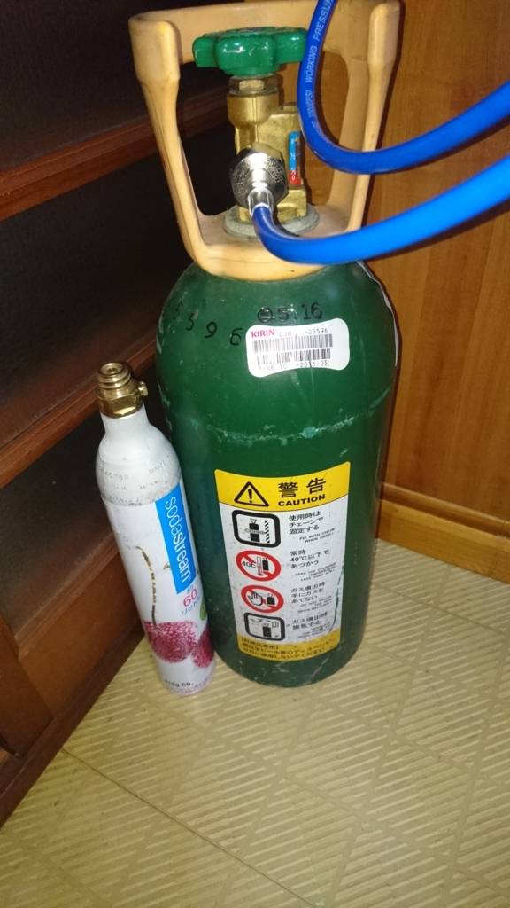
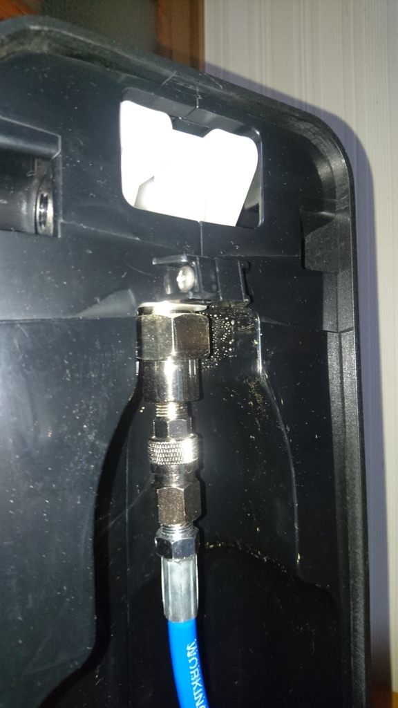
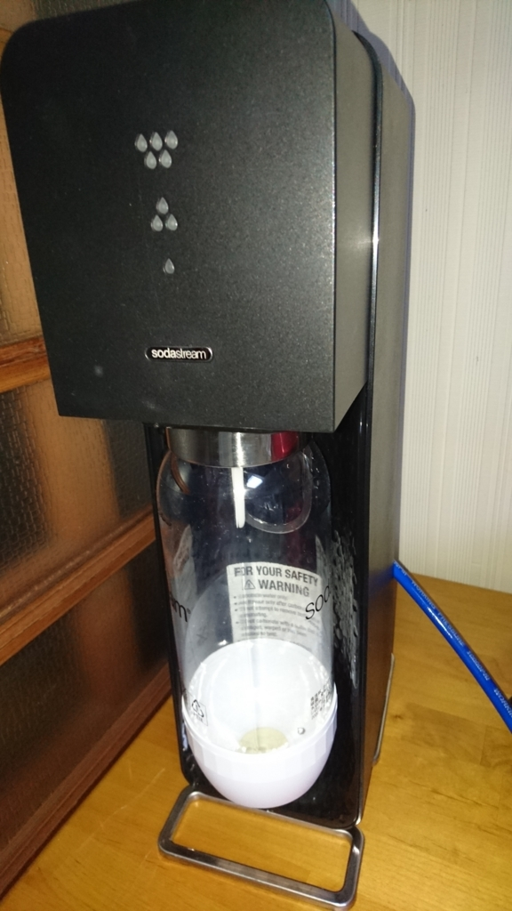

普段から炭酸水をよく飲んでいるひつじです。  

サイダーなどの糖分が入った市販品のではなく、水に炭酸を付加した炭酸水にポッカレモンなどを少量加えたものを飲むのがお気に入り。  

引っ越してくるまではAmazonでレモンフレーバーの炭酸水をケース買いして飲んでました。  

<?# AmazonAffiliate B00N2J5IS0 /?>

一本当たり100円くらいで、一日一本程度消費してたんですが、注文してから到着まで一週間くらいかかるために、うっかり在庫を切らすとその間飲めない。 
また、空のペットボトルが大量にでてくるのもそれなりに邪魔です。  

そんなわけでソーダストリームを購入しました。  

<?# AmazonAffiliate B01KVAZNVE /?>
水さえあればいつでも好きな時に、押し込むだけで簡単に自分好みの炭酸の強さで炭酸水が作れるのは良いものです。  
が、これ割とコストパフォーマンスが低い。  
1本のガスシリンダーで60Lの炭酸水が作れるらしいんですが、実際のところロス分があったり、強炭酸を作ろうとすると作れる炭酸水の量は少なくなります。  
換算すると1L当たり40～60円くらいでしょうか。  

ガスシリンダーが空になったら販売店に持っていくかネットで注文して交換してもらう必要があるのも面倒くさい。  

さて、前置きが長すぎましたが、行きついた先はソーダストリームにミドボンを連結するというものでした。  

ミドボンといってピンとくる人はアクアリウムやってるか飲食店でバイトなどの経験がある人でしょうか。  

これです。  

<?# AmazonAffiliate B00BWGZZNS /?>

炭酸ボンベのことです。  
ボンベの色が緑であることから「緑のボンベ」→「ミドリボンベ」→「ミドボン」なんだそうで。  
ボンバーマンみたい。  

基本的にはビールサーバーで使うものですが、アクアリウムで水草の光合成用に使ってる人もいるようです。  
これ、酒屋さんに行くと一本当たり7500円ほどでレンタルできます。(できない酒屋さんもあるので注意）  
え・・・お高い・・・と思いますが、実際には5000円がボンベの保証費用として取られているだけなので、ボンベを返却すれば戻ってきます。実質2500円です。  

ソーダストリームのボンベは1本2100円。ミドボンは2500円。  
ソーダストリームのボンベの炭酸量は410gなのに対して、ミドボンの炭酸量はなんと5kg（10kgボンベもあります）もあります。  

 

ミドボン1つでソーダストリームのボンベ12本分。1本2100円なので25200円ですよ。ミドボンの費用対効果高い。  

ミドボンとレギュレーターやらなんやらを接続して、ペットボトルに直接炭酸を吹き込んで炭酸水を作るという情報がネット上に多くありますが、あの方法だとペットボトルのキャップを加工するのが割と面倒かつ、ペットボトルが劣化したときに破裂する可能性があるなど非常に危険なのがネック。  

[https://jitenshatoryokou.com/make-sparkling-water-20156.html:embed]

ミドボンとソーダストリームの組み合わせで調べると、ソーダストリームのボンベにミドボンで再充填する方法が出てきますが、これ結構危険らしいんですよね。  

[https://jitenshatoryokou.com/midobom-sodastream-charge-21915.html:embed]

で、我が家で採用したのはミドボンとソーダストリームを直接接続する方法。  
これだとボンベに再充填する必要もなく、ソーダストリーム専用のボトルを使うのでペットボトルより安全。  

通な人なら自作するんでしょうけども、手先が不器用な私がそういうのを作るのは無理！ってことでヤフオクで落札しました。  
「ソーダストリーム ミドボン 直結」で検索すれば大体7000円位からあります。

[https://auctions.yahoo.co.jp/search/search?auccat=&tab_ex=commerce&ei=utf-8&aq=-1&oq=&sc_i=&exflg=1&p=ソーダストリーム+ミドボン+直結&x=0&y=0&fixed=0:embed]

あと、最近はAmazonでも出てるみたいですね。高いのでお勧めしませんが・・・。    

<?# AmazonAffiliate B0728LGY6B /?>

 

ケーブルをそれぞれミドボンとソーダストリームに接続して、水を入れたソーダストリームのボトルをソーダストリームにセットしたらレバー部分を下に押し下げつつミドボンのバルブを緩めればどんどん炭酸がボトルに注入されていきます。  
 

私は10000円のキットを落札したので、ソーダストリーム本体(中古購入)10000円+直結キット10000円+ミドボン7500円の計27500円がかかったわけですが、月に炭酸水のペットボトルを2400円分消費していたことを考えると、雑換算で大体1年あれば元がとれそうです。  
ミドボンとホースの接続が甘いと炭酸ガスが漏れますし、きちんと正しく扱わないと危険ではありますが、ちゃんと気を付けさえすれば自己責任の範囲内で炭酸水がいつでも手軽に作れます。場所は取りますが・・・。  
炭酸水大好きな方は大いに検討する余地があると思います。お勧めです。  