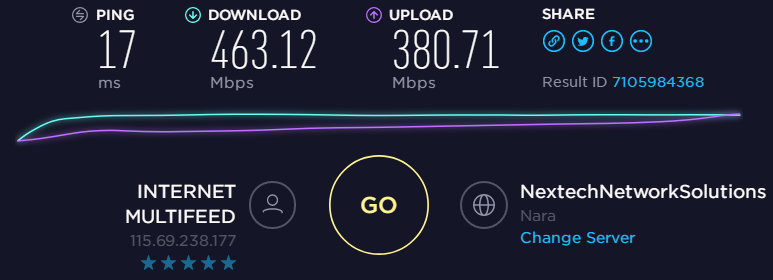
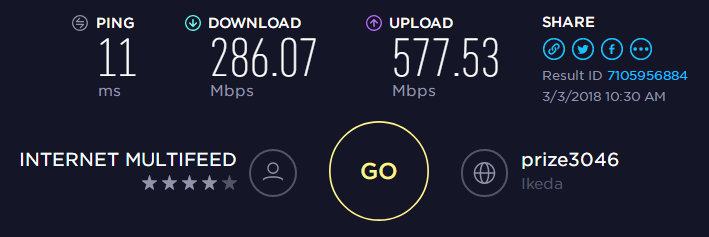
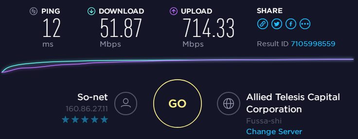
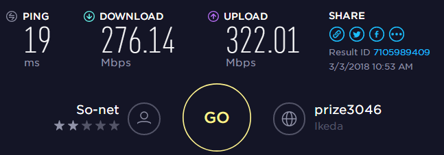
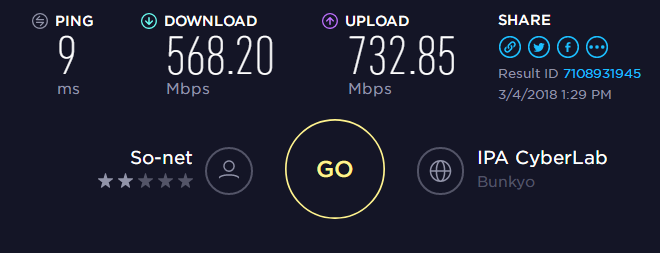

追記ありますので注意。  

東海エリアでもNUROが使えるようになったということで早速申し込みを行い、今日屋外工事が終わって無事接続を確認することができました。  

NURO光G2V(戸建)プランなので、ONUまでは2Gbps、ONUからは1Gbpsのベストエフォートになります。  

これまでのフレッツはDS-LITE接続でIPv6を経由したIPv4接続になっており、大体速度はこんな感じ。  
 
 
[http://www.speedtest.net/result/7105984368:embed]

さて、理論的（ここ重要）にはフレッツより早いはずのNURO光。ネット上でも爆速！と評判が高いわけですが、実際に計測してみました。  

 

[http://www.speedtest.net/result/7105997398:embed]

（　＾ω＾）・・・  
50Mbps・・・。  

アップロード側の速度は爆速です。素晴らしい。  
しかし普段使われるのはダウンロード側の速度なわけで、50Mbpsってそれはないよ・・・。  

一度ONUを再起動して再度試してみたところ。  
 
276Mbpsまで上がったものの、今度はUP速度が半分に。  
どちらにしてもフレッツより遅いです。  

えろす師匠の助言のもと、サポートセンターに電話してみたところ、

<?# Twitter 969755019716079617 /?>

さいですか。。  
NURO光公式の通信速度チェックツールってのがこちらのサイトです。  

[http://www.nuro.jp/speedup/nuroCheck.html:embed]

今どきJavaアプレットを使った測定って・・・と思いつつJavaをインストールして試してみたところ。  

<?# Twitter 969757167363346433 /?>

あー、うん、やっぱ変わらないよね・・・。  

もう一度サポートセンターに問い合わせてみるものの、  
「ベストエフォートですので仕方がありません。200Mbpsでていれば利用される分には全く問題ございませんので。」  
とやんわり言われてしまいました。（しってた）  

まぁ最初の50Mbpsとかならともかく200Mbpsでていれば確かに普段使う分には問題がないのは事実。ベストエフォートだってこともよくわかってます。    
とはいえ速度向上を期待して乗り換えたので、なんとも残念な結果でした。  

追記（2018/03/04）  
先ほど測ったところ、
 

[http://www.speedtest.net/result/7108931945:embed]

こんな感じに。  
この速度なら乗り換えた甲斐がありますね。ほっ・・・。  
コンスタントにこの値が出てくれたら最高なんですが。  

追記(2018/03/05)  

<?# Twitter 970594906765848576 /?>

追記(2018/03/06）  

[http://www.speedtest.net/result/7115520545:embed]

初日だけ遅かったけど、それ以降は遅くないですね。  
これなら安心して継続契約できそうです。  
