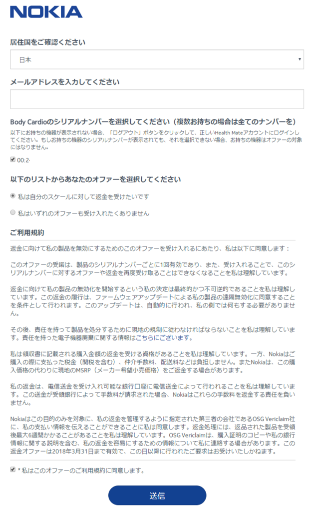
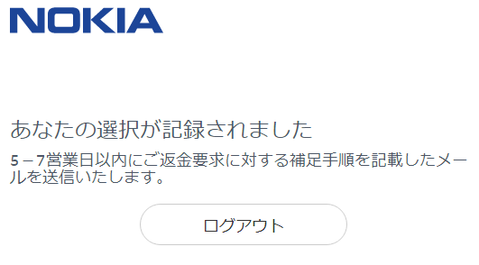

昨年三月に購入したWithings Body Cardio(買収されて<a class="keyword" href="http://d.hatena.ne.jp/keyword/Nokia">Nokia</a> Body Cardioになった）ですが、売りの一つだった脈波伝播速度が、「異なるレベルの規制上の承認を必要」とやらで無効化されてしまいました。

<iframe src="https://hatenablog-parts.com/embed?url=https%3A%2F%2Fsupport.health.nokia.com%2Fhc%2Fja%2Farticles%2F360000004227-Nokia-Body-Cardio-%25E8%2584%2588%25E6%25B3%25A2%25E9%2580%259F%25E5%25BA%25A6%25E6%25B8%25AC%25E5%25AE%259A%25E6%25A9%259F%25E8%2583%25BD%25E3%2581%25AE%25E5%2581%259C%25E6%25AD%25A2%25E3%2581%25AB%25E9%2596%25A2%25E3%2581%2597%25E3%2581%25A6-%25E3%2582%2588%25E3%2581%258F%25E3%2581%2582%25E3%2582%258B%25E3%2581%2594%25E8%25B3%25AA%25E5%2595%258F" title="Nokia Body Cardio - 脈波速度測定機能の停止に関して、よくあるご質問" class="embed-card embed-webcard" scrolling="no" frameborder="0" style="display: block; width: 100%; height: 155px; max-width: 500px; margin: 10px 0px;"></iframe>

これが無くなると下位製品との差が

<ul>
<li>心拍数を測れるか否か</li>
<li>体重を0.1kg単位で測れるか</li>
<li>充電式かどうか 
の3点になってしまいます。 
心拍数は体重を測る時だけ計測してもあまり意味がないし、私の場合体重が0.1tレベルなので、0.1kg単位で測れなくてもあまり影響なし。 
バッテリーもそうすぐに無くなってしまうわけでもないので、充電式でなくても問題なし。</li>
</ul>

というわけで、別の製品に乗り換えるべく、返金をお願いすることにしました。 
(2018年3月31日まで受け付けています。)

<a href="https://account.health.nokia.com/bodycardio/product_form">こちら</a>のページを開いて、<a class="keyword" href="http://d.hatena.ne.jp/keyword/Nokia">Nokia</a> アカウントでログインすると下記のようなページが表示されます。

すでにアカウントと紐づけている場合はシリアルナンバーが表示されているので、チェックを入れ、規約を確認して送信ボタンを押せば完了。

7営業日程度で連絡が来るみたいです。

気になるのは、返金は購入時の金額になるのかということ。 
私は<a class="keyword" href="http://d.hatena.ne.jp/keyword/Amazon">Amazon</a>で買ったので領収書を<a class="keyword" href="http://d.hatena.ne.jp/keyword/Amazon">Amazon</a>から取得できますが、量販店で買った場合は捨ててしまっていることもあるわけで。
そのあたりがどうなっているのか気になります。

***