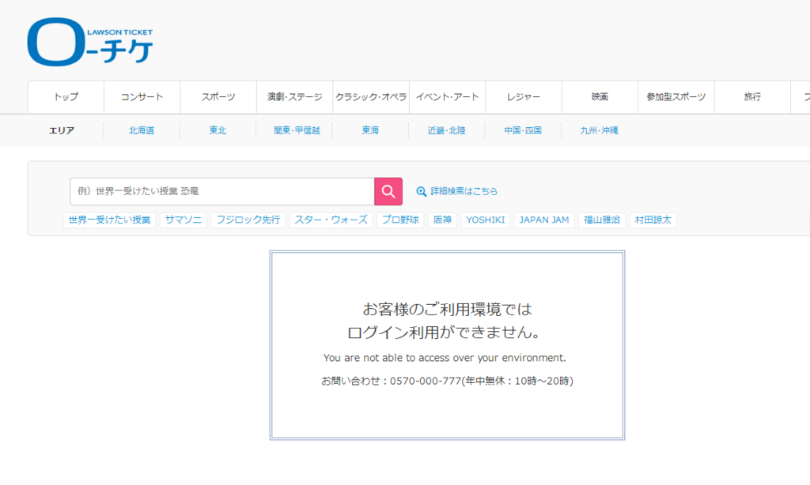
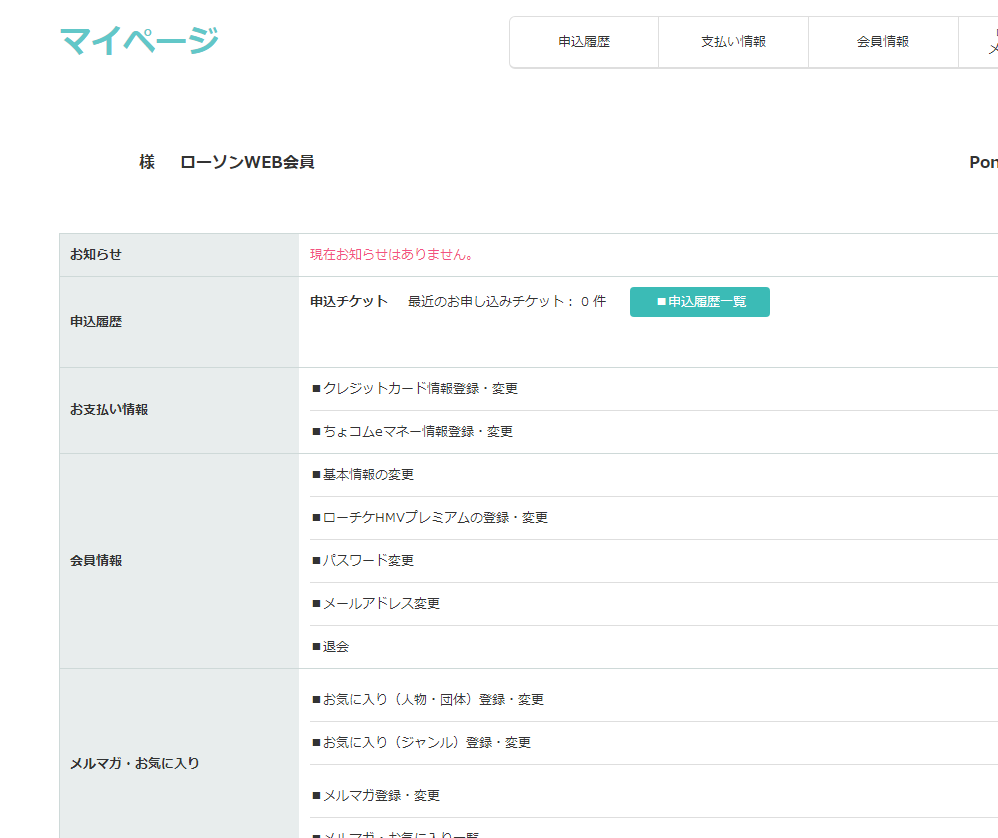

<a class="keyword" href="http://d.hatena.ne.jp/keyword/angela">angela</a>のファンクラブの継続申し込みを行おうと<a class="keyword" href="http://d.hatena.ne.jp/keyword/%A5%ED%A1%BC%A5%BD%A5%F3%A5%C1%A5%B1%A5%C3%A5%C8">ローソンチケット</a>にログインしようとしたところ、

「お客様のご利用環境ではログイン利用ができません。」

おおう・・・そうですか。

***

パスワード管理ソフトに保存して、過去ログインできているのでパスワード違いという線もなく、そもそも全く見当違いのパスワードを入力してもこの表示に。

仕方がないのでサポートに電話してみたんですが<a href="#f-d2ec98e9" name="fn-d2ec98e9" title="繋がらないナビダイヤル糞">*1</a>、このメッセージは海外からログインしようとしたときに表示されるものとのことでした。

いや愛知県で日本国内のプロバイダでネット使ってるんですが・・・と思い、その旨伝えたところ、「実は<a class="keyword" href="http://d.hatena.ne.jp/keyword/So-net">So-net</a>さんのNURO光を利用されている方は、海外と判定されてしまって利用できないことが・・・。」との回答が。 
ドンピシャでNURO光を使ってますね。

というわけで、NURO光から降られる<a class="keyword" href="http://d.hatena.ne.jp/keyword/IP%A5%A2%A5%C9%A5%EC%A5%B9">IPアドレス</a>だと、<a class="keyword" href="http://d.hatena.ne.jp/keyword/%A5%ED%A1%BC%A5%BD%A5%F3%A5%C1%A5%B1%A5%C3%A5%C8">ローソンチケット</a>にログインできないようです。 
わたしはあきらめて<a class="keyword" href="http://d.hatena.ne.jp/keyword/%A5%B9%A5%DE%A5%DB">スマホ</a>の<a class="keyword" href="http://d.hatena.ne.jp/keyword/%A5%C6%A5%B6%A5%EA%A5%F3%A5%B0">テザリング</a>機能でログインしました。

はい、無事ログインできました。

本件については<a class="keyword" href="http://d.hatena.ne.jp/keyword/So-net">So-net</a>側で対応する話なのか、<a class="keyword" href="http://d.hatena.ne.jp/keyword/%A5%ED%A1%BC%A5%BD%A5%F3%A5%C1%A5%B1%A5%C3%A5%C8">ローソンチケット</a>または<a class="keyword" href="http://d.hatena.ne.jp/keyword/%A5%ED%A1%BC%A5%BD%A5%F3%A5%C1%A5%B1%A5%C3%A5%C8">ローソンチケット</a>が利用している地域判定システム提供業者が対応する話なのかわからないですが、エンドユーザーとしてはどうにもならない(<a class="keyword" href="http://d.hatena.ne.jp/keyword/ONU">ONU</a>電源落として<a class="keyword" href="http://d.hatena.ne.jp/keyword/IP%A5%A2%A5%C9%A5%EC%A5%B9">IPアドレス</a>を振りなおしたら行けるのかもしれませんが）問題なので、どうにか解決してほしいものです。

<a href="#fn-d2ec98e9" name="f-d2ec98e9" class="footnote-number">*1</a>:繋がらない<a class="keyword" href="http://d.hatena.ne.jp/keyword/%A5%CA%A5%D3%A5%C0%A5%A4%A5%E4%A5%EB">ナビダイヤル</a>糞

