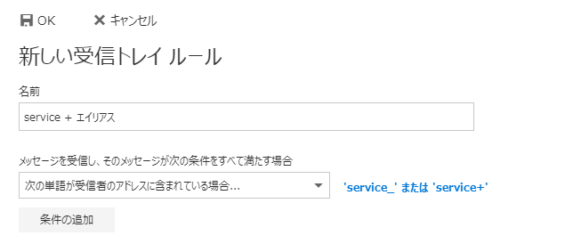

独自ドメインのメールアドレスを持つのに、昔はHotmailやGmailの無償サービスを利用できたものの、最近は有料化してしまいましたね・・・。  

thty.netのドメインからhitsujin.jpのドメインに移行する際、メールアドレスも移行したのですが、Hotmailが受付停止しているため、やむなくZOHOメールを利用してました。  

ただ使い勝手があまり良くなかったのと、アドレス帳やカレンダーを同期できるExchangeが利用したくてOffice 365を契約することにしたのでした。  

ただ、Office 365ってGmailやOutlook.comでは利用できる「+」を利用したメールアドレスのエイリアスに対応してないんです。  
完全に失念していたので、数日間メールを取りこぼしました・・・。  

Microsoft Office 365 MVPのかずあきさん(id:kazuakix)に相談したところ、代替案をまとめてくださいました。  

[http://blog.kazuakix.jp/entry/2018/04/09/213959:embed]  

さすがOffice 365~~(日リモート)~~MVPですね！！助かります！ありがとうございます！  

この方法だと  
 

こんな感じで設定すれば、「+」だけじゃなくて「_」などの別の文字でエイリアスを切ることができますね。  
ウェブサービスによっては「+」を許してくれないところもありますが、これなら突破可能！  

設定自体は面倒臭いけど、きちんと設定さえできれば柔軟な運用ができて素敵。  