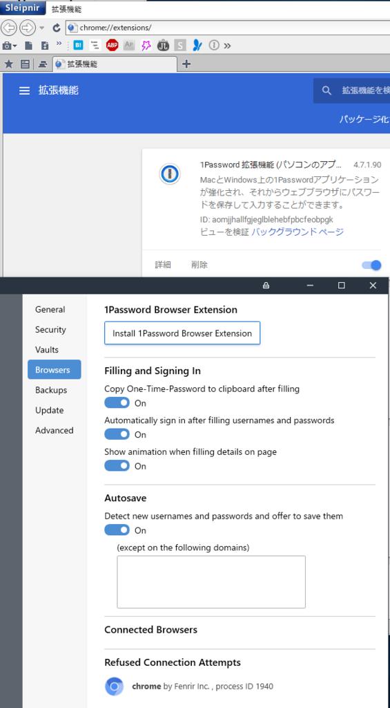

<a class="keyword" href="http://d.hatena.ne.jp/keyword/Windows">Windows</a> Helloに対応した1Password7が発売されたと聞いて早速インストールしました。 
が、愛用の<a class="keyword" href="http://d.hatena.ne.jp/keyword/Sleipnir">Sleipnir</a>にインストールされたブラウザ<a class="keyword" href="http://d.hatena.ne.jp/keyword/%B3%C8%C4%A5%B5%A1%C7%BD">拡張機能</a>がうんともすんとも言わず。

1Passwordの設定画面を見たところ、どうやらブロックされているようです。

***

以前のバージョンでは<a class="keyword" href="http://d.hatena.ne.jp/keyword/%A5%B7%A5%B0%A5%CD%A5%C1%A5%E3">シグネチャ</a>を無効にするオプションがあったため、そちらの設定を変更することで対応できていたのですが、今回のバージョンではその機能がまだない様子。

1Passwordの<a class="keyword" href="http://d.hatena.ne.jp/keyword/Twitter">Twitter</a>アカウントに<a class="keyword" href="http://d.hatena.ne.jp/keyword/Google%CB%DD%CC%F5">Google翻訳</a>を駆使して聞いてみたのですが、

<blockquote class="twitter-tweet" data-lang="HASH(0xb159048)">
I see. Thanks! 1Password only supports signed browsers, so I recommend using <a class="keyword" href="http://d.hatena.ne.jp/keyword/Chrome">Chrome</a>, <a class="keyword" href="http://d.hatena.ne.jp/keyword/Opera">Opera</a>, or <a class="keyword" href="http://d.hatena.ne.jp/keyword/Vivaldi">Vivaldi</a> on your device.
&mdash; 1Password (@1Password) <a href="https://twitter.com/1Password/status/1003424991336189952?ref_src=twsrc%5Etfw">June 3, 2018</a></blockquote>

<a class="keyword" href="http://d.hatena.ne.jp/keyword/Chrome">Chrome</a>、<a class="keyword" href="http://d.hatena.ne.jp/keyword/Opera">Opera</a>、<a class="keyword" href="http://d.hatena.ne.jp/keyword/Vivaldi">Vivaldi</a>以外のブラウザをサポートしていないといわれてしまいました。

今後対応予定はないかと聞いてみたものの、

<blockquote class="twitter-tweet" data-lang="HASH(0xc8eec60)">
I recommend <a class="keyword" href="http://d.hatena.ne.jp/keyword/Chrome">Chrome</a>, <a class="keyword" href="http://d.hatena.ne.jp/keyword/Opera">Opera</a>, or <a class="keyword" href="http://d.hatena.ne.jp/keyword/Vivaldi">Vivaldi</a> on your device. ❤️🔐
&mdash; 1Password (@1Password) <a href="https://twitter.com/1Password/status/1003972104369426433?ref_src=twsrc%5Etfw">June 5, 2018</a></blockquote>

というわけで1Password7では「<a class="keyword" href="http://d.hatena.ne.jp/keyword/Chrome">Chrome</a>、<a class="keyword" href="http://d.hatena.ne.jp/keyword/Opera">Opera</a>、<a class="keyword" href="http://d.hatena.ne.jp/keyword/Vivaldi">Vivaldi</a>」以外のブラウザでは使えないという話でした。

辛い・・・。 
ところで<a class="keyword" href="http://d.hatena.ne.jp/keyword/Firefox">Firefox</a>とEdgeは・・・。

