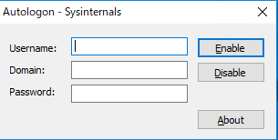
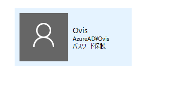
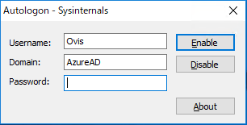

<blockquote class="twitter-tweet" data-lang="ja">
昨日から録画ができてなくてﾌｧｯ!?となったら<a class="keyword" href="http://d.hatena.ne.jp/keyword/Windows%20Update">Windows Update</a>で録画マシンが<a class="keyword" href="http://d.hatena.ne.jp/keyword/%BA%C6%B5%A2">再帰</a>動し、自動ログイン設定し忘れてたせいで録画プログラムが起動してなかったからだった辛い。。。
&mdash; Ovis＠ひつじのひと🐑 (@Pandora_Ovis) <a href="https://twitter.com/Pandora_Ovis/status/1007962572476186624?ref_src=twsrc%5Etfw">2018年6月16日</a></blockquote>

Office 365を契約してから、そちらで作ったアカウントを用いて<a class="keyword" href="http://d.hatena.ne.jp/keyword/Windows">Windows</a>のユーザーを作成してたんですが、そのユーザーで<a class="keyword" href="http://d.hatena.ne.jp/keyword/Windows">Windows</a>の自動ログインをしようとしてはまったのでメモ。

***

<h4>ローカルアカウントや<a class="keyword" href="http://d.hatena.ne.jp/keyword/Microsoft">Microsoft</a>アカウントの場合</h4>

<blockquote>
control userpasswords2
</blockquote>

もしくは

<blockquote>
netplwiz
</blockquote>

でユーザーアカウントダイアログを表示して、ユーザー一覧から自動ログインさせたいアカウントを選んで「ユーザーがこのコンピューターを使うには、ユーザー名とパスワードの入力が必要」のチェックを外してOKボタンを押し、パスワードを入力、OKボタンを押せば設定完了。

<h4>企業アカウントの場合</h4>

Office 365で作成したメールアドレスは<a class="keyword" href="http://d.hatena.ne.jp/keyword/Microsoft">Microsoft</a>アカウントではなく、企業アカウント扱いなので、上記の方法が使えないらしいです。 
<a class="keyword" href="http://d.hatena.ne.jp/keyword/%A5%C9%A5%E1%A5%A4%A5%F3">ドメイン</a>に参加してる状態と同じってことみたいです。

<iframe src="https://hatenablog-parts.com/embed?url=http%3A%2F%2Fwww.atmarkit.co.jp%2Fait%2Farticles%2F1306%2F17%2Fnews054.html" title="システムに自動サインインする（Windows 8／Windows Server 2012編）" class="embed-card embed-webcard" scrolling="no" frameborder="0" style="display: block; width: 100%; height: 155px; max-width: 500px; margin: 10px 0px;"></iframe>

上記サイトを参考に、<a class="keyword" href="http://d.hatena.ne.jp/keyword/Microsoft">Microsoft</a>のサイトからAutologonのツールをダウンロードします。

<iframe src="https://hatenablog-parts.com/embed?url=http%3A%2F%2Ftechnet.microsoft.com%2Fja-jp%2Fsysinternals%2Fbb963905.aspx" title="Autologon" class="embed-card embed-webcard" scrolling="no" frameborder="0" style="display: block; width: 100%; height: 155px; max-width: 500px; margin: 10px 0px;"></iframe>

起動するとこんな画面が出てきます。 

UserNameには多分メールアドレスが自動的に入力されているかと。 
ここで悩んだのがDomainの項目。

Office 365ユーザーってだけで<a class="keyword" href="http://d.hatena.ne.jp/keyword/%A5%C9%A5%E1%A5%A4%A5%F3">ドメイン</a>に参加してるわけではないような・・・。 
実際コン<a class="keyword" href="http://d.hatena.ne.jp/keyword/%A5%C8%A5%ED%A1%BC%A5%EB">トロール</a>パネルのシステムを見ても、ワークグループ：WORKGROUPと出ていて、<a class="keyword" href="http://d.hatena.ne.jp/keyword/%A5%C9%A5%E1%A5%A4%A5%F3">ドメイン</a>に参加しているとはなってない。

で悩んだのですが、ユーザーアカウントの設定画面開いたらわかりました。

なるほど「AzureAD」が<a class="keyword" href="http://d.hatena.ne.jp/keyword/%A5%C9%A5%E1%A5%A4%A5%F3">ドメイン</a>となるのか。

というわけで下記のように入力します。 

入力したら「Enable」ボタンを押してやれば、パスワードが間違ってない限り成功とダイアログが表示されるはずです。

