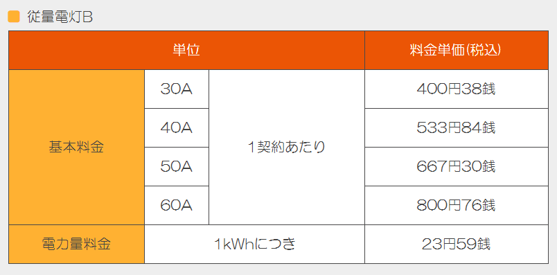
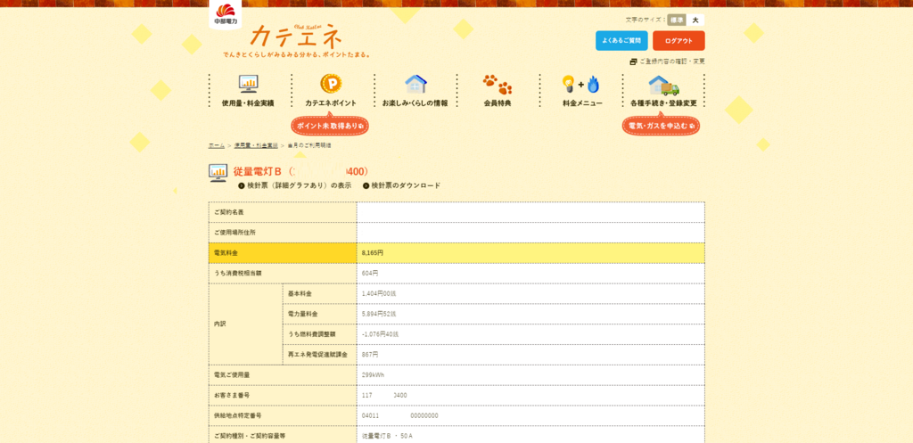
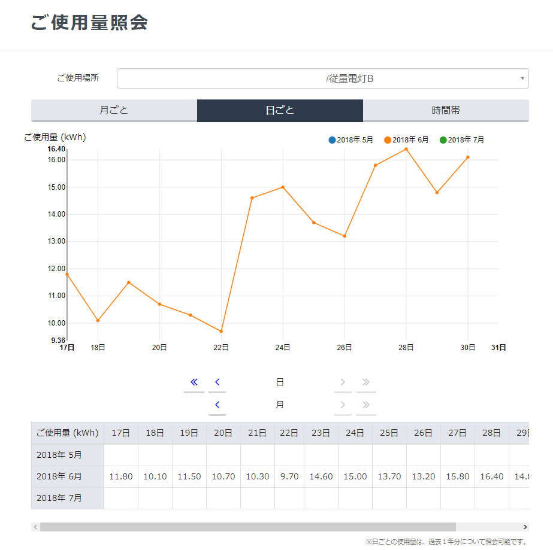
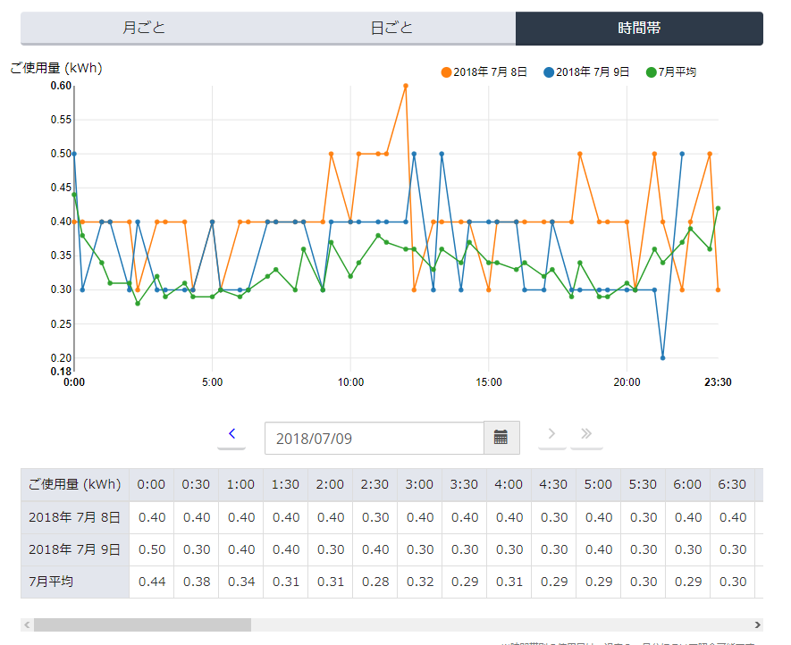

PCが常時2台稼働し、<a class="keyword" href="http://d.hatena.ne.jp/keyword/NAS">NAS</a>も2台稼働させ、夏冬はエアコンをかけっぱなしという生活を続けているので、一人暮らしなのに毎月300kWhくらい使っています。 
大体月8000円程度電気代に使っているわけで、少しは削減したいなと。

というわけで、電力会社を<a class="keyword" href="http://d.hatena.ne.jp/keyword/%C3%E6%C9%F4%C5%C5%CE%CF">中部電力</a>から別の事業者に乗り換えることにしました。

***

当初は<a class="keyword" href="http://d.hatena.ne.jp/keyword/%C5%EC%CB%AE%A5%AC%A5%B9">東邦ガス</a>のプランにしようかと思ったんですが、思っていたより安くもならなかったため、ほかに安い事業者はないか調べたところ、中部圏では「きらめきでんき」が一番安いようで。

<iframe src="https://hatenablog-parts.com/embed?url=http%3A%2F%2Fwww.kiramekidenki.jp%2F" title="きらめきでんき" class="embed-card embed-webcard" scrolling="no" frameborder="0" style="display: block; width: 100%; height: 155px; max-width: 500px; margin: 10px 0px;"></iframe>

安かろう悪かろうでは困りますが、まぁ事業者によって電力の質が変わるわけでもないので、問題ないかなぁと。

中部圏での電気料金は下記の通り。

大体10%ほど安くなりそうな感じです。

切り替えにあたり、供給地点特定番号が必要なんですが、いったいどこに書いてあるのかわからなくて困りました。

<a class="keyword" href="http://d.hatena.ne.jp/keyword/%A5%AB%A5%C6%A5%A8">カテエ</a>ネだと、当日のご利用明細に記載されているようです。

契約自体はネットですべて完結します。

申し込みをしたらいつから供給が切り替わるかを通知するメールが届きます。

「F-Power電気」から届くので「え？っ」となりましたが、

<blockquote>
2016年4月、電力の小売全面自由化を受け、株式会社F-Power（小売電気事業者登録 No.A0001）と販売代理店契約を締結し、2017年4月1日から、「きらめきでんき」の名称で、一般家庭や商店などの50kW未満の低圧電力を対象に電力の販売を開始しました。
</blockquote>

ということなので間違ってません。

供給が開始されると、マイページから利用量を参照可能になります。

正直使い勝手は微妙ですが・・・。

実際の電気料金も、確認した感じでは想定通り10%程度安くなっています。

これからエアコンをバンバン使う時期になるので、10%は大きいですね。

