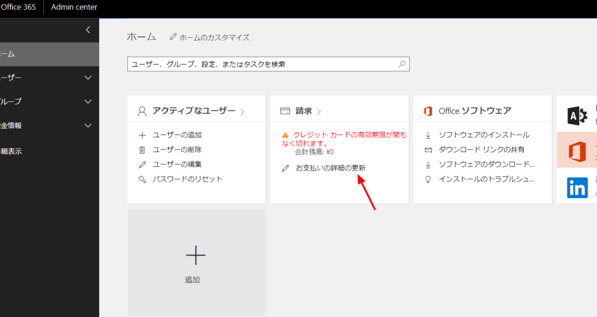
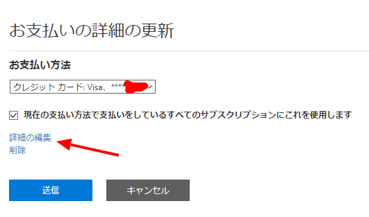
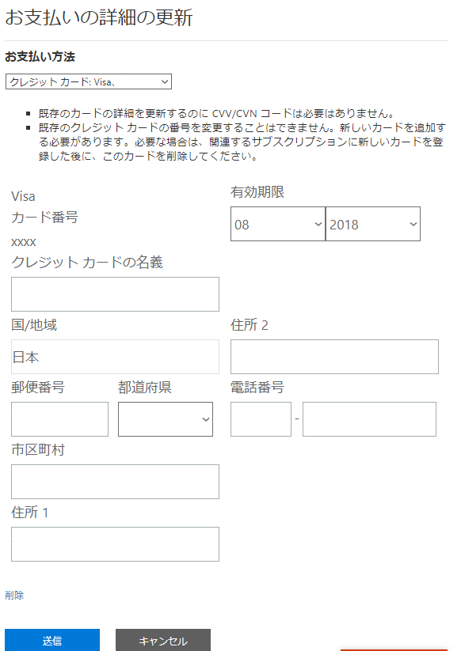
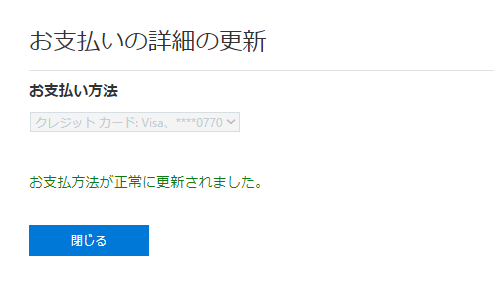

Office 365で支払い用に使っているクレジットカードが有効期限切れ間近だったので、更新しました。  

更新方法は下記の通り。  

#### 管理ポータルにログイン  
管理ポータルにログインします。  
[Admin Portal](https://portal.office.com/adminportal/)  

#### 支払い情報更新  
お支払いの詳細の更新をクリック。  
 

#### 支払い詳細の更新  
詳細の編集をクリック
   

該当クレジットカードの情報が表示されるので、有効期限だけ最新の期限に修正。  

   

おしまい。  
 