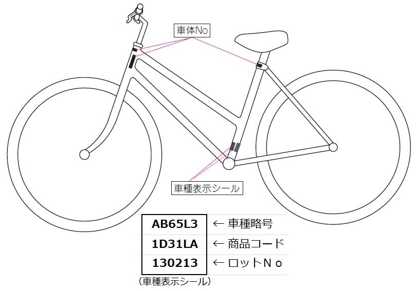

普段買い物に行く際は自転車を利用しています。 
昨日もいつも通り自転車で買い物に行こうとしたのですが、自転車のカギがない。

さんざん探して、前回自転車を利用したときにはいていたズボンのポケットの中(洗濯してしまってあった）にあるのを見つけて事なきを得ましたが、いざって時に探し回るのは辛い(ちゃんとしまっておけって) 。
引っ越した時に<a class="keyword" href="http://d.hatena.ne.jp/keyword/%A5%B9%A5%DA%A5%A2%A5%AD%A1%BC">スペアキー</a>をなくしてしまったのですが、本当になくしてしまうと自転車に乗れなくなってしまうので、<a class="keyword" href="http://d.hatena.ne.jp/keyword/%A5%B9%A5%DA%A5%A2%A5%AD%A1%BC">スペアキー</a>を注文することにしました。

***

私の自転車はショップブランドの<a class="keyword" href="http://d.hatena.ne.jp/keyword/%A5%D6%A5%EA%A5%C2%A5%B9%A5%C8%A5%F3">ブリヂストン</a>製自転車なので、<a class="keyword" href="http://d.hatena.ne.jp/keyword/%A5%D6%A5%EA%A5%C2%A5%B9%A5%C8%A5%F3">ブリヂストン</a>のサイトから<a class="keyword" href="http://d.hatena.ne.jp/keyword/%A5%B9%A5%DA%A5%A2%A5%AD%A1%BC">スペアキー</a>の注文方法を確認したところ、

<iframe src="https://hatenablog-parts.com/embed?url=http%3A%2F%2Ffaq.bscycle.co.jp%2Fcontent%2F1094.html" title="ブリヂストンサイクル株式会社" class="embed-card embed-webcard" scrolling="no" frameborder="0" style="display: block; width: 100%; height: 155px; max-width: 500px; margin: 10px 0px;"></iframe>

<blockquote>
お買い上げ販<a class="keyword" href="http://d.hatena.ne.jp/keyword/%C7%E4%C5%B9">売店</a>、または弊社製品取扱店でご注文を承ります。 
品質保証書（<a class="keyword" href="http://d.hatena.ne.jp/keyword/%A5%ED%A5%D3%A5%F3%A5%D5%A5%C3%A5%C9">ロビンフッド</a>手帳）をご持参の上、キーに刻印のあるキーNo.および品質保証書（<a class="keyword" href="http://d.hatena.ne.jp/keyword/%A5%ED%A5%D3%A5%F3%A5%D5%A5%C3%A5%C9">ロビンフッド</a>手帳）に記載されている商品コード、車種略号（型式）をお申し出ください。
</blockquote>

あ、詰んだ・・・。<a class="keyword" href="http://d.hatena.ne.jp/keyword/%A5%ED%A5%D3%A5%F3%A5%D5%A5%C3%A5%C9">ロビンフッド</a>手帳もない・・・。

注文できないじゃん・・・と思ったのですが、どうもキーNo、商品コード、車種の型式が分かれば<a class="keyword" href="http://d.hatena.ne.jp/keyword/%A5%ED%A5%D3%A5%F3%A5%D5%A5%C3%A5%C9">ロビンフッド</a>手帳がなくても行けるようです。 
また、通販でも注文できるんですね。

<iframe src="https://hatenablog-parts.com/embed?url=https%3A%2F%2Fitem.rakuten.co.jp%2Fauc-vanward%2Fspkslkb%2F" title="【楽天市場】ブリヂストン bikke ビッケ スペアキーオプションパーツ（2本）：自転車のＶＡＮＷＡＲＤ楽天市場店" class="embed-card embed-webcard" scrolling="no" frameborder="0" style="display: block; width: 100%; height: 155px; max-width: 500px; margin: 10px 0px;"></iframe>

私は<a class="keyword" href="http://d.hatena.ne.jp/keyword/%A5%D6%A5%EA%A5%C2%A5%B9%A5%C8%A5%F3">ブリヂストン</a>の購入者登録を行っていたので、サイトから商品コードなどを取得して注文しました。 
もし登録していない場合は、下記の画像(<a href="http://faq.bscycle.co.jp/content/1115.html">FAQ&#xFF08;&#x3088;&#x304F;&#x3042;&#x308B;&#x3054;&#x8CEA;&#x554F;&#xFF09;&#xFF5C;&#x304A;&#x5BA2;&#x69D8;&#x30B5;&#x30DD;&#x30FC;&#x30C8;&#xFF5C;&#x30D6;&#x30EA;&#x30C2;&#x30B9;&#x30C8;&#x30F3;&#x30B5;&#x30A4;&#x30AF;&#x30EB;&#x682A;&#x5F0F;&#x4F1A;&#x793E;</a>  より引用)の場所にある記載をメモる必要がありますね。

受注生産で大体10日～<a class="keyword" href="http://d.hatena.ne.jp/keyword/20%C6%FC">20日</a>くらいみたいです。 
今度はなくさないようにキーホルダーかなんかつけておかないと・・・。

