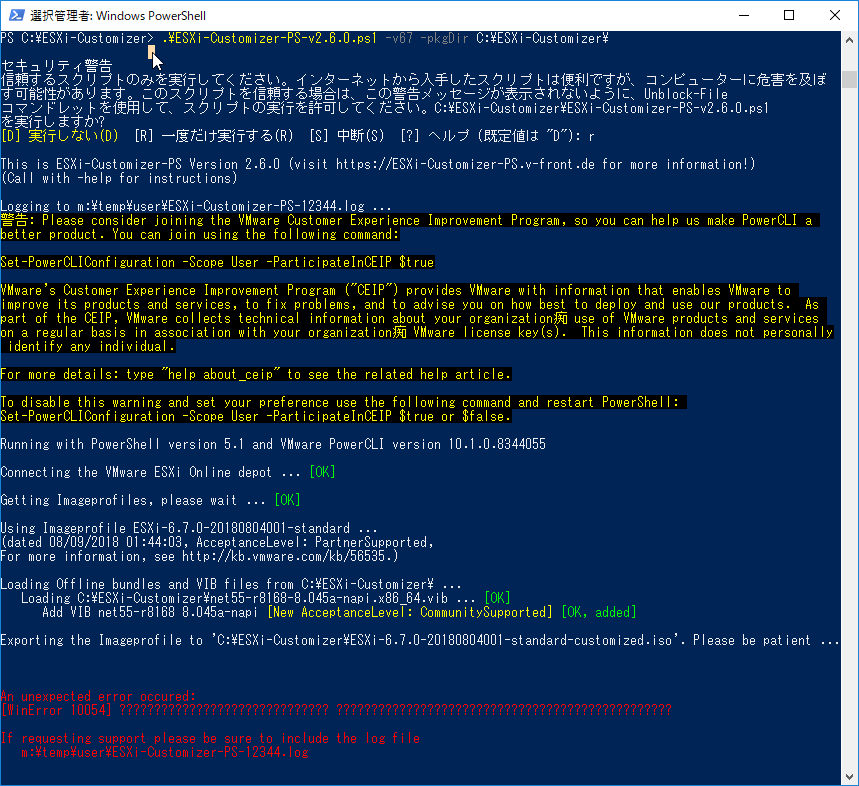
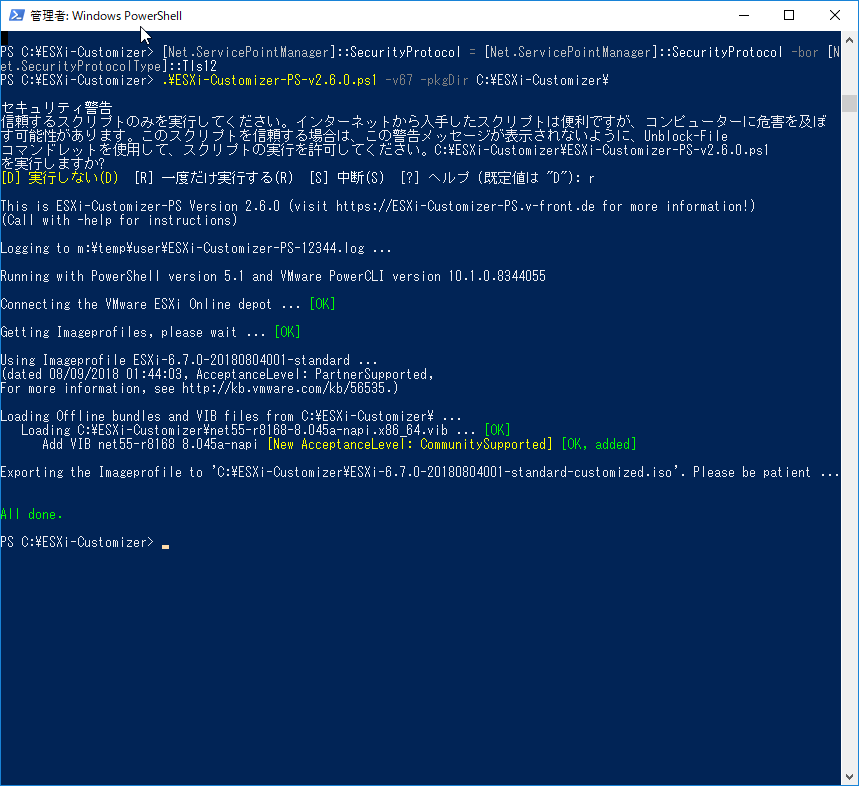

録画マシンを新たに作って一台マシンがあいたので、久しぶりにESXiをインストールして遊ぼうかなと。 
<a class="keyword" href="http://d.hatena.ne.jp/keyword/Realtek">Realtek</a>製<a class="keyword" href="http://d.hatena.ne.jp/keyword/NIC">NIC</a>しかないマシンなので、ドライバを組み込んだカスタムイメージを作成するために下記のブログをもとに作業に入ったのですが、ESXi-Customizer-PS の作業ではまったので覚書。

<iframe src="https://hatenablog-parts.com/embed?url=https%3A%2F%2Ftech-mmmm.blogspot.com%2F2018%2F05%2Frealteknicesxi-67.html" title="RealtekのNICのドライバーを組み込んだESXi 6.7のカスタムイメージを作成する" class="embed-card embed-webcard" scrolling="no" frameborder="0" style="display: block; width: 100%; height: 155px; max-width: 500px; margin: 10px 0px;"></iframe>

***

まずPowerCLIなんですが、これ今は<a class="keyword" href="http://d.hatena.ne.jp/keyword/PowerShell">PowerShell</a> Gallery経由でインストールするんですね。

<blockquote>
Install-Module -Name <a class="keyword" href="http://d.hatena.ne.jp/keyword/VMware">VMware</a>.PowerCLI
</blockquote>

管理者権限で起動した<a class="keyword" href="http://d.hatena.ne.jp/keyword/PowerShell">PowerShell</a>に上記のコマンドをぶち込むだけでインストール完了。なんて便利。

カスタムイメージを作成するために必要なESXi-Customizer-PS は下記のサイトからダウンロード。

<a href="https://www.v-front.de/p/esxi-customizer-ps.html">VMware Front Experience: ESXi-Customizer-PS</a>

実行する前に

<blockquote>
Set-ExecutionPolicy Unrestricted
</blockquote>

を実行しておくことを忘れずに。 
デジタル署名されていない<a class="keyword" href="http://d.hatena.ne.jp/keyword/%A5%B9%A5%AF%A5%EA%A5%D7%A5%C8">スクリプト</a>としてはじかれてしまいました。

<a class="keyword" href="http://d.hatena.ne.jp/keyword/NIC">NIC</a>ドライバと<a class="keyword" href="http://d.hatena.ne.jp/keyword/%A5%B9%A5%AF%A5%EA%A5%D7%A5%C8">スクリプト</a>を用意し、上記ブログ記事にある通り

<blockquote>
.\ESXi-Customizer-PS-v2.6.0.ps1 -v67 -pkgDir C:\ESXi-Customizer\
</blockquote>

と実行したのですが、私の環境だと下記のようなエラーが発生しました。

<blockquote>
An unexpected error occured: 
[WinError 10054] ?????????????????????????????? ????????????????????????????????????????????????

If requesting support please be sure to include the log file 
C:\temp\user\ESXi-Customizer-PS-12344.log
</blockquote>

ザクっと調べたところ、下記のツイートを発見。

<blockquote class="twitter-tweet" data-lang="HASH(0xc761648)">
If you get a [WinError 10054] with my <a href="https://twitter.com/hashtag/ESXi?src=hash&amp;ref_src=twsrc%5Etfw">#ESXi</a>-Customizer-PS script or other <a href="https://twitter.com/hashtag/PowerCLI?src=hash&amp;ref_src=twsrc%5Etfw">#PowerCLI</a> <a href="https://twitter.com/hashtag/Imagebuilder?src=hash&amp;ref_src=twsrc%5Etfw">#Imagebuilder</a> scripts this can be caused by recent <a href="https://twitter.com/hashtag/SSL?src=hash&amp;ref_src=twsrc%5Etfw">#SSL</a> changes (requirement of <a href="https://twitter.com/hashtag/TLS?src=hash&amp;ref_src=twsrc%5Etfw">#TLS</a> 1.2) at <a href="https://twitter.com/hashtag/VMware?src=hash&amp;ref_src=twsrc%5Etfw">#VMware</a>. To fix that enable enable strong crypto as per <a href="https://t.co/15nyxyKbrW">https://t.co/15nyxyKbrW</a>
&mdash; Andreas Peetz⭕ (@VFrontDe) <a href="https://twitter.com/VFrontDe/status/998868087586934785?ref_src=twsrc%5Etfw">May 22, 2018</a></blockquote>

<a class="keyword" href="http://d.hatena.ne.jp/keyword/VMware">VMware</a>のサイトでTLS1.2が強制化されたことによる影響らしいです。

<a class="keyword" href="http://d.hatena.ne.jp/keyword/%A5%EC%A5%B8%A5%B9%A5%C8%A5%EA">レジストリ</a>をいじって恒久対応させてもいいんですが、手っ取り早い方法として、

<blockquote>
[Net.ServicePointManager]::SecurityProtocol = [Net.ServicePointManager]::SecurityProtocol -bor [Net.SecurityProtocolType]::Tls12
</blockquote>

のコマンドを先に実行しましょう。(一行コマンドです。改行されてますが。。） 
これでTLS1.2が有効になります。

<iframe src="https://hatenablog-parts.com/embed?url=https%3A%2F%2Fblog.shibata.tech%2Fentry%2F2018%2F04%2F30%2F184744" title="Windows PowerShellとTLS 1.2 - しばたテックブログ" class="embed-card embed-blogcard" scrolling="no" frameborder="0" style="display: block; width: 100%; height: 190px; max-width: 500px; margin: 10px 0px;"></iframe>

今度はエラーも出ず、ちゃんとカスタムイメージが作成されました。

