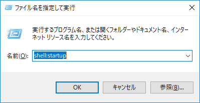
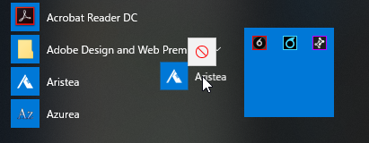
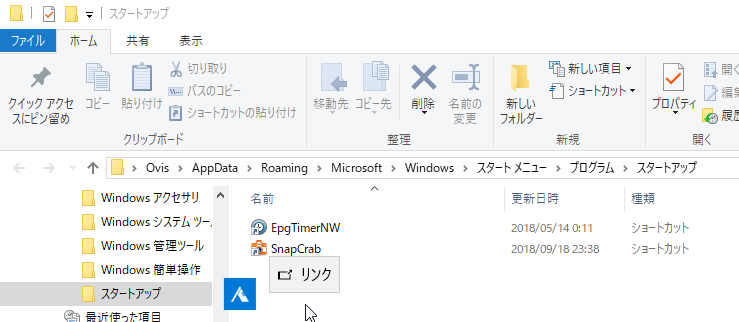
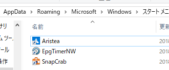
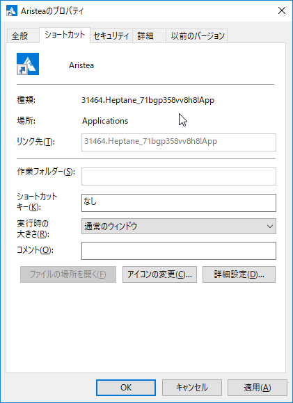

<a class="keyword" href="http://d.hatena.ne.jp/keyword/Mastodon">Mastodon</a>クライアントとして使っているAristeaを、PC起動時に起動させたいと思ったものの、<a class="keyword" href="http://d.hatena.ne.jp/keyword/Windows">Windows</a>ストアアプリでショートカットを作成する方法がよくわからなかったので備忘録。

***

<h4>1. スタートアップフォルダを開く</h4>

Win+Rで「ファイル名を指定して実行」を起動し、

<blockquote>
shell:startup
</blockquote>

を実行してスタートアップフォルダを開く。

<h4>2. <a class="keyword" href="http://d.hatena.ne.jp/keyword/%A5%C9%A5%E9%A5%C3%A5%B0%A5%A2%A5%F3%A5%C9%A5%C9%A5%ED%A5%C3%A5%D7">ドラッグアンドドロップ</a></h4>

スタートから対象のストアアプリを選んでスタートアップフォルダに<a class="keyword" href="http://d.hatena.ne.jp/keyword/%A5%C9%A5%E9%A5%C3%A5%B0%A5%A2%A5%F3%A5%C9%A5%C9%A5%ED%A5%C3%A5%D7">ドラッグアンドドロップ</a>。 

おしまい。

Desktop Bridgeのストアアプリも同様に登録可能。

<h4>おまけ</h4>

こんな感じで特殊(?)なショートカットが作成されるみたいですね。 

