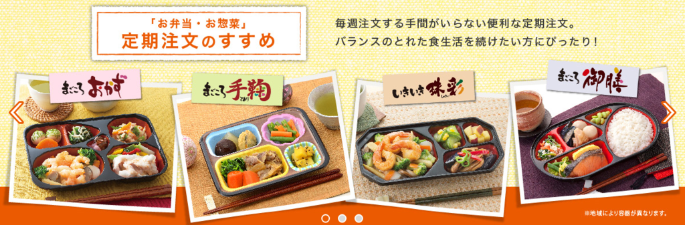
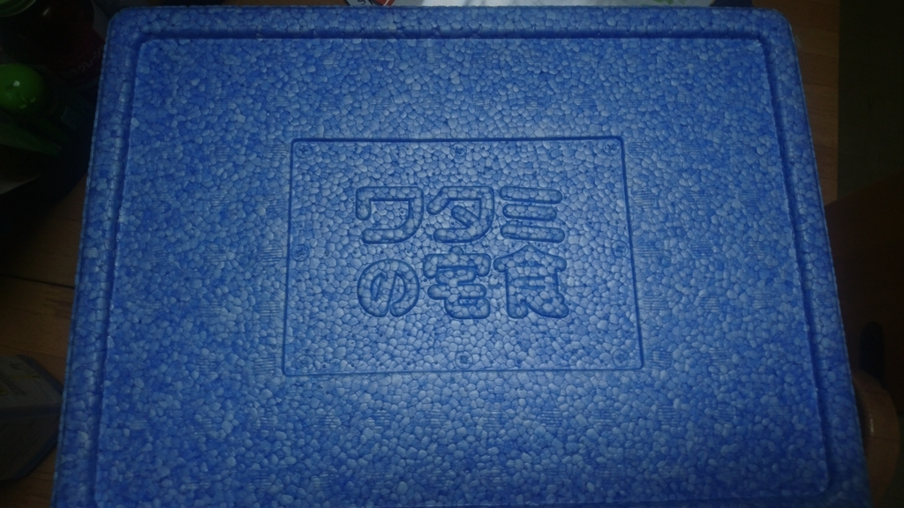
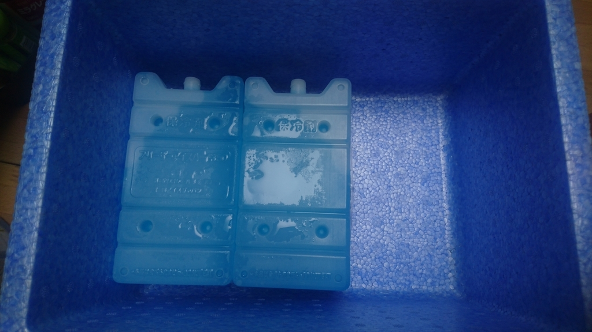
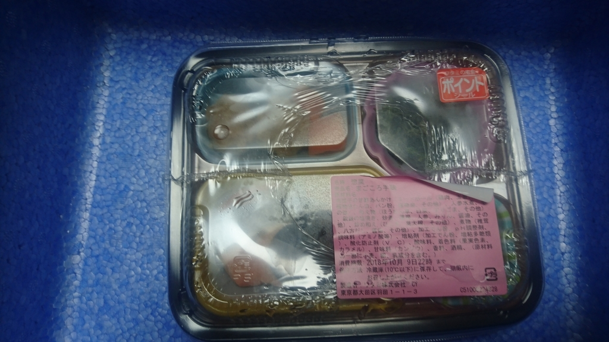
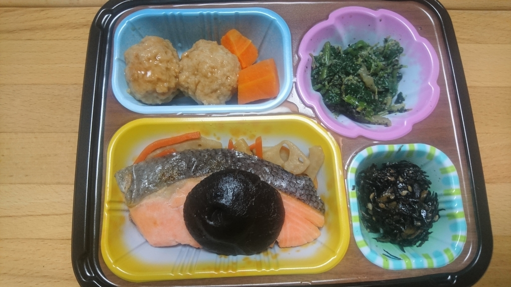
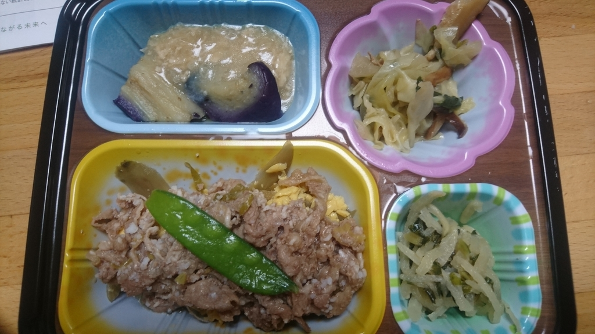
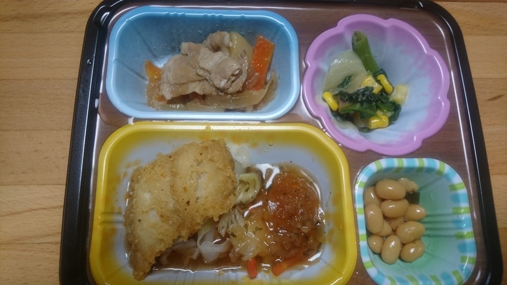
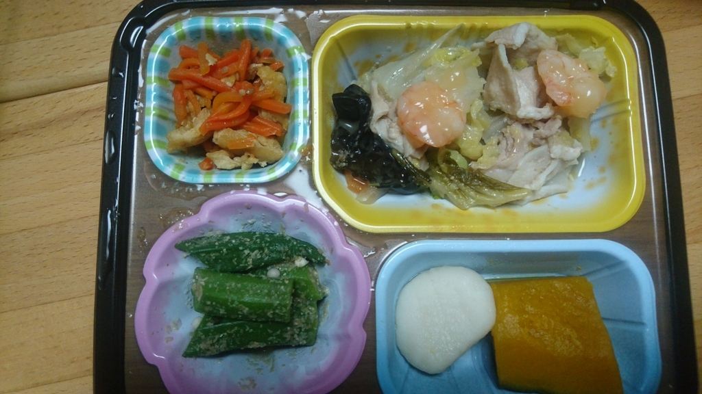

割とおいしいです、これ。 

<iframe src="https://hatenablog-parts.com/embed?url=https%3A%2F%2Fwww.watami-takushoku.co.jp%2Fcategory%2Fbento" title="【公式】ワタミの宅食のお弁当・お惣菜 | ワタミの宅食" class="embed-card embed-webcard" scrolling="no" frameborder="0" style="display: block; width: 100%; height: 155px; max-width: 500px; margin: 10px 0px;"></iframe>

***

平日ってなかなか家に帰ってからご飯を作るのがだるいので、帰宅中にお惣菜を買って帰っていたんですが、お惣菜って大体油ものが多くて、しかも安い時間帯だとうっかり（？）たくさん買ってはそのまま食べてしまうので太るという残念な生活・・・。

というわけで、健康的な食事をしないとなと考えて、<a class="keyword" href="http://d.hatena.ne.jp/keyword/%A5%EF%A5%BF%A5%DF">ワタミ</a>の宅食を利用し始めました。

いろいろ宅配系のサービスを調べてみたんですが、大体のサービスが冷凍したものを一週間分送ってくるケースで、冷凍庫がいっぱいな私はちと厳しい。 
<a class="keyword" href="http://d.hatena.ne.jp/keyword/%A5%EF%A5%BF%A5%DF">ワタミ</a>の宅食の場合、毎日配達のおばさんが届けてくれるんですが、手渡しができなくとも保冷ボックスに入れて玄関先に置いておいてくれるので問題なし。

また、注文してるまごころ手毬プランだと、一食490円と割とお安いのもよいかなと。これ送料無料なのが地味に良い。 
また、カロリーが大体250kcal程度に抑えられているため、ダイエット面でもよさげです。

以下一週間(祝日だった月曜日を除く)の記録 

元来ご老人向けのサービスなので、味が薄いと聞いてたんですが、思っていたよりしっかり味がしていておいしい。 
塩分も2.5g以下らしいので、高血圧な人にはもってこいなんじゃないですかね。

残念ながら私が頼んでいるまごころ手毬プランは平日のみ宅配なんですが、それ以外のプランだと一週間のプランも選べるらしいです。 
また、一週間単位(まごころ手毬プランは平日のみ)での注文になるので、週のこの日だけってできないのが残念。 
まぁ安く抑えるためには必要な措置ですね。

