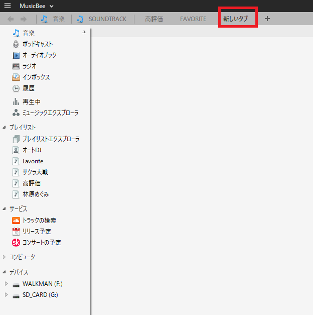
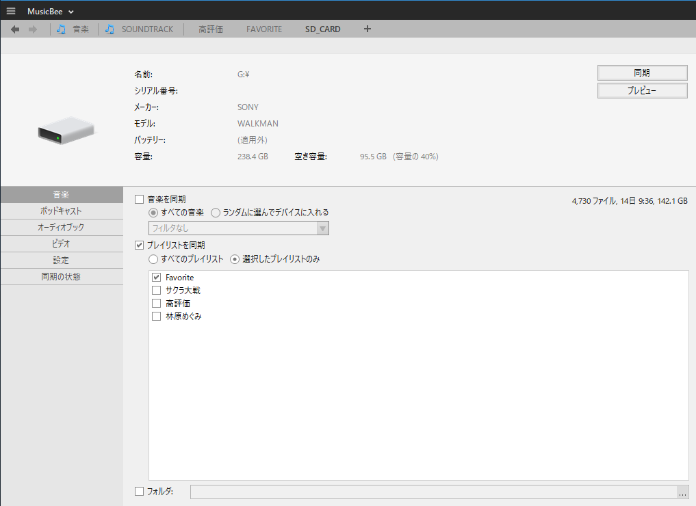
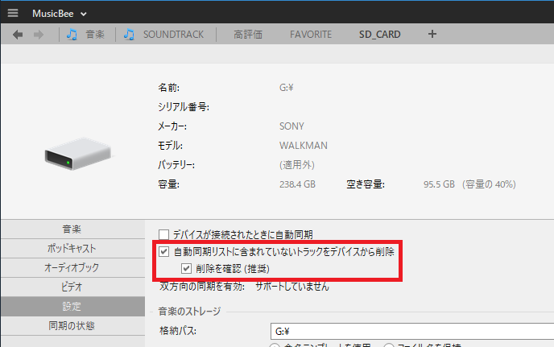
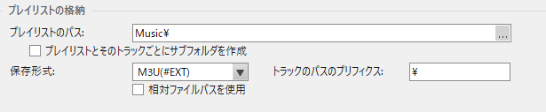
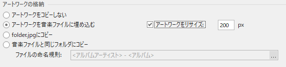

以前<a class="keyword" href="http://d.hatena.ne.jp/keyword/Android">Android</a>端末に音楽を同期するときに使っていた「MediaGo」が<a class="keyword" href="http://d.hatena.ne.jp/keyword/SONY">SONY</a>の手によって葬られ、新たに提供されるようになった「Media Center for PC」がどうにも使いにくい。

できれば曲再生用ソフトとしても使っていたMediaGoを使い続けたいんですが、さすがにサポートが終了したソフトウェアを使い続けるのはセキュリティ面でもあまり宜しいものではない。

というわけで、MusicBeeに乗り換えました。

***

<iframe src="https://hatenablog-parts.com/embed?url=https%3A%2F%2Fgetmusicbee.com%2F" title="MusicBee - The Ultimate Music Manager and Player" class="embed-card embed-webcard" scrolling="no" frameborder="0" style="display: block; width: 100%; height: 155px; max-width: 500px; margin: 10px 0px;"></iframe>

MusicBeeはMediaGo同様、曲再生用ソフトであると同時に音楽ファイルを同期する機能も持っています。 
また、DesktopBridgeで<a class="keyword" href="http://d.hatena.ne.jp/keyword/Microsoft">Microsoft</a>ストアにて公開されているので、公式サイトからダウンロードしなくてもストアからさくっとインストール可能なのもなかなか便利。

MediaGoだとプレイリストから消した音楽ファイルも残るんですが、MusicBeeは設定さえすればプレイリストから除外したファイルを削除することも可能。

以下設定備忘録です。

<h4>音楽同期方法</h4>

<ol>
<li>
上タブの「プラス」表示をクリックして新しいタブを作成してから、「新しいタブ」をクリックし、左のメニューから同期を行うデ<a class="keyword" href="http://d.hatena.ne.jp/keyword/%A5%D0%A5%A4%A5%B9">バイス</a>を選択 

</li>
<li>
同期を行いたい プレイリストを選択し、右上の同期ボタンを押すと同期が開始される 

</li>
</ol>

(プレビューボタンを押すと、どのファイルが同期されるかが表示される。削除されるファイルも確認できる。）

<h4>プレイリストに登録されていない、デ<a class="keyword" href="http://d.hatena.ne.jp/keyword/%A5%D0%A5%A4%A5%B9">バイス</a>に存在する音楽ファイルを削除したい</h4>

設定メニューの「自動同期リストに含まれていないトラックをデ<a class="keyword" href="http://d.hatena.ne.jp/keyword/%A5%D0%A5%A4%A5%B9">バイス</a>から削除」を選択する。 

<h4><a class="keyword" href="http://d.hatena.ne.jp/keyword/%A5%A6%A5%A9%A1%BC%A5%AF%A5%DE%A5%F3">ウォークマン</a>が認識できるプレイリストを同期させたい</h4>

プレイリストのパスは

<blockquote>
MUSIC\
</blockquote>

にして、保存形式を「M3U(#EXT)」に変更、トラックパスのプリフィクスは「\」とする。 
相対ファイルパスを使用にチェックを入れると<a class="keyword" href="http://d.hatena.ne.jp/keyword/%A5%A6%A5%A9%A1%BC%A5%AF%A5%DE%A5%F3">ウォークマン</a>が認識できないので外しておく。

<h4>アルバムアートが表示されないことがある</h4>

下記のサイトによると、<a class="keyword" href="http://d.hatena.ne.jp/keyword/%A5%A6%A5%A9%A1%BC%A5%AF%A5%DE%A5%F3">ウォークマン</a>は大きなアルバムアートが表示できないらしい。 
<a href="http://www.nslabs.jp/softlink-media.rhtml">&#x304A;&#x3059;&#x3059;&#x3081;Windows&#x30A2;&#x30D7;&#x30EA; (&#x97F3;&#x697D;&#x30FB;&#x52D5;&#x753B;&#x30FB;&#x30D3;&#x30E5;&#x30FC;&#x30A2;) | Netsphere Laboratories</a>
アートワークの格納欄で「アートワークをリサイズ」にチェックを入れておくと、自動的にアルバムアートのサイズが変更されて同期される。

