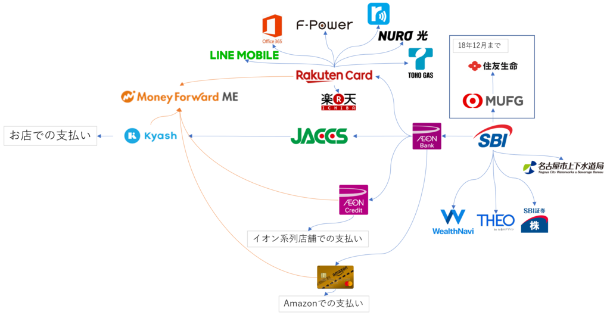
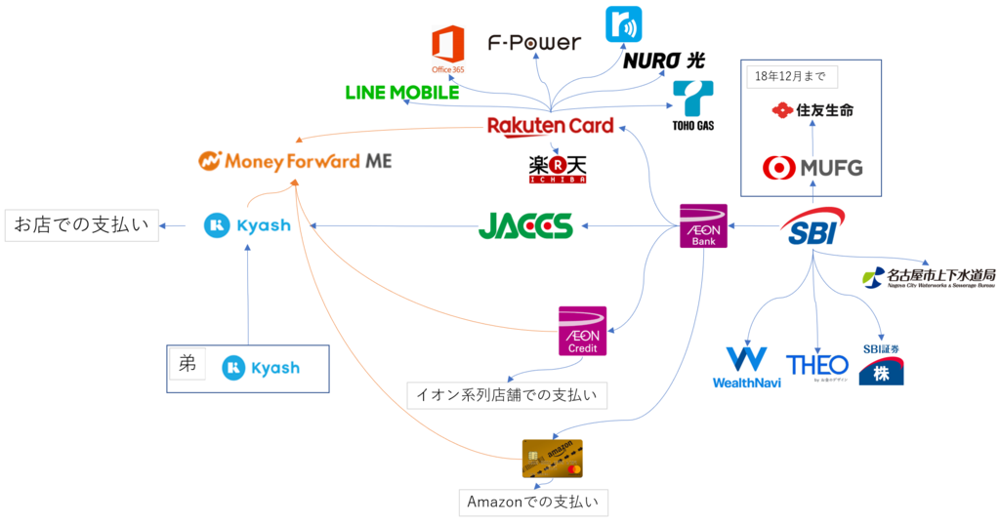

前回の記事を投稿したところ、酢酸先生(<a href="http://blog.hatena.ne.jp/ch3cooh393/">id:ch3cooh393</a>)から金回りについて書いてよと要望がありまして。

<blockquote class="twitter-tweet" data-lang="ja">
次のエントリで、金回りどうやってるか書いて！インフラ屋さんが好きそうな図で！！ <a class="keyword" href="http://d.hatena.ne.jp/keyword/suica">suica</a>→kyash→<a class="keyword" href="http://d.hatena.ne.jp/keyword/%B3%DA%C5%B7%A5%AB%A1%BC%A5%C9">楽天カード</a>、スタバカード→kyash→<a class="keyword" href="http://d.hatena.ne.jp/keyword/%B3%DA%C5%B7%A5%AB%A1%BC%A5%C9">楽天カード</a> みたいなのをまとめて！
&mdash; さくさん (@ch3cooh) <a href="https://twitter.com/ch3cooh/status/1082645361875972096?ref_src=twsrc%5Etfw">2019年1月8日</a></blockquote>

その時は面倒くさかったので酢酸先生に任せたのですが（おい）、酢酸先生が記事を書かれたのでやっぱり書いておきます。

<iframe src="https://hatenablog-parts.com/embed?url=https%3A%2F%2Fblog.ch3cooh.jp%2Fentry%2F20190109%2F1547040600" title="KyashとMoneyForwardで金回りを整理した - 酢ろぐ！" class="embed-card embed-blogcard" scrolling="no" frameborder="0" style="display: block; width: 100%; height: 190px; max-width: 500px; margin: 10px 0px;"></iframe>

***

<h4>前提</h4>

我が家は私と弟の二人暮らしです。 
光熱費とネット料金は私が出したうえで、弟が家にいる日数で案分したうえで弟から徴収しています。(仕事の都合上、数週間数か月家にいないこともありうる) 
また、家賃に関しては、今住んでいる一軒家が叔母の持ち家であり、私が管理維持することを条件にタダで住まわせてもらって居るためかかっていません。

<h4>カードでの支払い</h4>

私はカードで払えるものは極力カードで支払うようにしています。

これはカード支払いによるポイント還元を狙う他、一体何に金を使ったのか分からなくならないようにするためです。

普段使っているカードはREXカードです。
還元率が下がってしまいましたが、それでも1.25%と業界最高水準クラスかつ、ポイントで引き落とし金額を相殺できるのでそのまま利用しています。 
家電量販店の現金値引きのように場合によっては現金のほうが割引率が高いことがあったりしますが、基本的にはカード払いのほうが現金払いよりお得になります。 
また、決済情報が上がってくるので、いつ何時にどこのお店で金を使ったかが後から把握しやすいのも重要なポイントになります。 
現金払いでもレシートをちゃんと管理していれば良いわけですが、レシートでお財布がいっぱいになるのが嫌で普段はレジで捨ててもらったり、家帰ってすぐに捨ててしまうので・・・。 
なお、決済情報が上がってくるのが遅いのは前回の記事に書いた通りKyashを利用することで何とかなっています。

<iframe src="https://hatenablog-parts.com/embed?url=https%3A%2F%2Fblog.hitsujin.jp%2Fentry%2F2019%2F01%2F08%2F232322" title="KyashとMoneyForwardを組み合わせると捗る - Pandora Pocket" class="embed-card embed-blogcard" scrolling="no" frameborder="0" style="display: block; width: 100%; height: 190px; max-width: 500px; margin: 10px 0px;"></iframe>

上記の通り普段利用するカードはREXカードなのですが、別のカードを利用することもあります。 
例えば普段食材を購入する際に寄っている<a class="keyword" href="http://d.hatena.ne.jp/keyword/%A5%DE%A5%C3%A5%AF%A5%B9%A5%D0%A5%EA%A5%E5">マックスバリュ</a>ーやイオンでは<a class="keyword" href="http://d.hatena.ne.jp/keyword/WAON">WAON</a>を利用するためイオンカードを利用しています。

<ul>
<li><a class="keyword" href="http://d.hatena.ne.jp/keyword/WAON">WAON</a><a class="keyword" href="http://d.hatena.ne.jp/keyword/%A5%AA%A1%BC%A5%C8%A5%C1%A5%E3%A1%BC%A5%B8">オートチャージ</a>による0.5%(イオンカードセレクトのみ)、<a class="keyword" href="http://d.hatena.ne.jp/keyword/WAON">WAON</a>支払いでの0.5%の合計1%還元</li>
<li><a class="keyword" href="http://d.hatena.ne.jp/keyword/WAON">WAON</a>支払い限定の固定ポイント還元のある商品がある</li>
<li>イオン<a class="keyword" href="http://d.hatena.ne.jp/keyword/%B3%F4%BC%E7%CD%A5%C2%D4">株主優待</a>による3%還元</li>
<li><a class="keyword" href="http://d.hatena.ne.jp/keyword/20%C6%FC">20日</a>30日の5%オフキャンペーンはイオンカードか<a class="keyword" href="http://d.hatena.ne.jp/keyword/WAON">WAON</a>決済に限る</li>
<li>イオンお買い物アプリのクーポンはイオンカードを持っている場合のみ利用可能</li>
</ul>

といった理由のためです。

同じように<a class="keyword" href="http://d.hatena.ne.jp/keyword/%B3%DA%C5%B7%BB%D4%BE%EC">楽天市場</a>で買い物をするときはREXカードではなく<a class="keyword" href="http://d.hatena.ne.jp/keyword/%B3%DA%C5%B7%A5%AB%A1%BC%A5%C9">楽天カード</a>を、<a class="keyword" href="http://d.hatena.ne.jp/keyword/Amazon">Amazon</a>で買い物をするときは<a class="keyword" href="http://d.hatena.ne.jp/keyword/Amazon">Amazon</a>ゴールドカードを利用するようにしています。

REXカード+Kyashの3.25%還元でも良い気がするのですが、<a class="keyword" href="http://d.hatena.ne.jp/keyword/%B3%DA%C5%B7%A5%AB%A1%BC%A5%C9">楽天カード</a>は時折あるセールの際に<a class="keyword" href="http://d.hatena.ne.jp/keyword/%B3%DA%C5%B7%A5%AB%A1%BC%A5%C9">楽天カード</a>を持っているとポイント還元率が上がるほか、<a class="keyword" href="http://d.hatena.ne.jp/keyword/ETC%A5%AB%A1%BC%A5%C9">ETCカード</a>が(プラチナ会員以上だけみたいですが）年会費無料であること、<a class="keyword" href="http://d.hatena.ne.jp/keyword/Amazon">Amazon</a>ゴールドカードは<a class="keyword" href="http://d.hatena.ne.jp/keyword/Amazon%A5%D7%A5%E9%A5%A4%A5%E0">Amazonプライム</a>会員に自動的になるため、実質420円で使えること、Kyashも合計100万円までしかリ<a class="keyword" href="http://d.hatena.ne.jp/keyword/%A5%A2%A5%EB%A5%AB%A1%BC%A5%C9">アルカード</a>が使えないことを鑑みてこういう構成にしています。

また、光熱費やプロバイダ料金といった公共料金の支払いは<a class="keyword" href="http://d.hatena.ne.jp/keyword/%B3%DA%C5%B7%A5%AB%A1%BC%A5%C9">楽天カード</a>に集約しています。 
普段持ち歩いているREXカードで定期的に支払うものを決済していると、万が一カードを紛失したり、情報が流出した際に大変な目に合うので・・・。

昔<a class="keyword" href="http://d.hatena.ne.jp/keyword/2%A4%C1%A4%E3%A4%F3%A4%CD%A4%EB%A5%D3%A5%E5%A1%BC%A5%A2">2ちゃんねるビューア</a>というサービスを契約していたころ、カードナンバー、有効期限、カードのセキュリティコード、パスワードに至るまで丸っと流出したことがあり、会社を休んでカードの再発行やら引き落としカード変更の対応に追われたことがあったので、それ以来変更手続きが面倒な公共料金系の支払いに関してはメインのカードとは違うカードで決済するようにしています。

<a class="keyword" href="http://d.hatena.ne.jp/keyword/%B3%DA%C5%B7%A5%AB%A1%BC%A5%C9">楽天カード</a>は<a class="keyword" href="http://d.hatena.ne.jp/keyword/%B3%DA%C5%B7%BB%D4%BE%EC">楽天市場</a>でしか使わないので、まぁそうそう漏れることはないでしょう。(フラグ)

<iframe src="https://hatenablog-parts.com/embed?url=https%3A%2F%2Fdic.nicovideo.jp%2Fa%2F2%E3%81%A1%E3%82%83%E3%82%93%E3%81%AD%E3%82%8B%E5%80%8B%E4%BA%BA%E6%83%85%E5%A0%B1%E6%B5%81%E5%87%BA%E4%BA%8B%E4%BB%B6" title="2ちゃんねる個人情報流出事件とは (ニチャンネルコジンジョウホウリュウシュツジケンとは) [単語記事] - ニコニコ大百科" class="embed-card embed-webcard" scrolling="no" frameborder="0" style="display: block; width: 100%; height: 155px; max-width: 500px; margin: 10px 0px;"></iframe>

<h4>現金を使う場合</h4>

カード決済で全部済ませられるならそれに越したことはないんですが、まったく現金を使わないでいられるわけでもありません。 
働いていたころはお昼に外でご飯を食べていましたが、そこそこの規模のチェーン店でもない限りクレジットカード払いって対応していないことが多いので、昼飯代はだいたい現金払いです。 
また、近所の業務用食品スーパーなど、まだまだ対応していない(というより決済手数料がかかるカード払いに対応しないことでその分を消費者に還元する）ところもありますので、こういったそもそもカード払いができないところでは当然現金での支払いとなります。

<h4><a class="keyword" href="http://d.hatena.ne.jp/keyword/%B8%FD%BA%C2%BF%B6%C2%D8">口座振替</a></h4>

私が住んでいる<a class="keyword" href="http://d.hatena.ne.jp/keyword/%CC%BE%B8%C5%B2%B0%BB%D4">名古屋市</a>の水道局は残念ながらカード決済に対応していないため、必然的に<a class="keyword" href="http://d.hatena.ne.jp/keyword/%B8%FD%BA%C2%BF%B6%C2%D8">口座振替</a>となります。 
<a class="keyword" href="http://d.hatena.ne.jp/keyword/%C5%EA%BB%F1%BF%AE%C2%F7">投資信託</a>のWealthNaviやTHEOも<a class="keyword" href="http://d.hatena.ne.jp/keyword/%B8%FD%BA%C2%BF%B6%C2%D8">口座振替</a>で毎月積み立てられています。(無職中は止めてますが) 
また、12月まで契約していた生命保険(<a class="keyword" href="http://d.hatena.ne.jp/keyword/%BD%BB%CD%A7%C0%B8%CC%BF">住友生命</a>)も<a class="keyword" href="http://d.hatena.ne.jp/keyword/%B8%FD%BA%C2%BF%B6%C2%D8">口座振替</a>しかなかったのですが、退職するにあたって別の<a class="keyword" href="http://d.hatena.ne.jp/keyword/%B0%E5%CE%C5%CA%DD%B8%B1">医療保険</a>(<a class="keyword" href="http://d.hatena.ne.jp/keyword/%A5%E1%A5%C3%A5%C8%A5%E9%A5%A4%A5%D5">メットライフ</a>生命)に切り替えまして、こちらはカード決済対応だったので、今後は<a class="keyword" href="http://d.hatena.ne.jp/keyword/%B8%FD%BA%C2%BF%B6%C2%D8">口座振替</a>しているものは水道代と<a class="keyword" href="http://d.hatena.ne.jp/keyword/%C5%EA%BB%F1%BF%AE%C2%F7">投資信託</a>のみとなるはず。

<h4>図解</h4>

というわけで我が家のお金の流れ。

定期決済分も載せたのでわちゃわちゃしてますが、おおむねこんな感じ。 
定期決済分は確定報が落ちてくるのが遅くても判断が付きますし、イオンでの買い物は食品なら<a class="keyword" href="http://d.hatena.ne.jp/keyword/WAON">WAON</a>、そうでなければイオンカードでの決済と分けることで判断を付けられるようにしているのでこちらも問題なし。 
これでMoneyForwardでの家計簿がより正確な分類分けをできるようになりました。

今後は弟から徴収する生活費もKyashで送金してもらうようにできれば、生活費を渡したこともちゃんと明確化できそうです。

