ATNDがちと特殊なので覚書。  

ATNDやConnpassといったイベント告知サイトで勉強会などに参加申し込みする人は多いと思います。  
が、登録だけしておいてカレンダーに登録してなかったせいでうっかり忘れたり、ダブルブッキングさせてしまうなんてことないですかね。  
(メールで開催日をリマインドしてくれるなど、告知サイト側でフォローしてくれるサービスもありますが)  

大体のイベント告知サイトはGoogleカレンダーに予定を登録させるボタンやリンクがあるのですが、残念ながらOutlook.comやOffice365のカレンダーに直接追加してくれる機能を提供してくれるサービスは見た記憶がありません。(Googleの強さを感じる)

とはいえ直接登録できないだけでちゃんと方法はあります。  

Outlook.comやEchange OnlineのカレンダーはiCal形式のデータインポートやWebCalに対応しています。  
Googleカレンダーに追加するボタンも
>http://www.google.com/calendar/render?cid=webcal://URL/calendar.ics  

のようにWebCalURLを渡しているだけです。  

一般的に利用されているATND、Connpass、DoorkeeperはWebCalが提供されています。  

### WebCalURLを取得する
WebCalURLを取得する方法は下記の通り。   

#### ATNDの場合

1. ATNDにログインし、マイページを開いたら、URLの  

> https://atnd.org/users/*****  

の※部をメモ  

2.下記URLの[ATNDのユーザーID]を先ほどメモしたIDに置き換える  

> webcal://api.atnd.org/events/?user_id=[ATNDのユーザーID]&count=100&format=ics

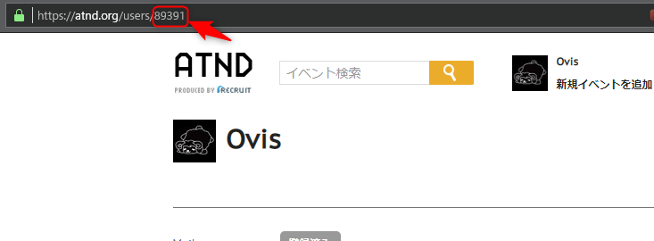 

なお、ユーザーIDでなく下記のようにユーザー名でもいけるようですが、ユーザーIDは変更可能なので、変わることのないユーザーIDを利用したほうが良いと思われます。  

> webcal://api.atnd.org/events/?nickname=[ATNDのユーザー名]&count=100&format=ics

#### Doorkeeperの場合

1.[Doorkeeper](https://www.doorkeeper.jp/)にログインし、「あなたが参加者」のリンクをクリック  
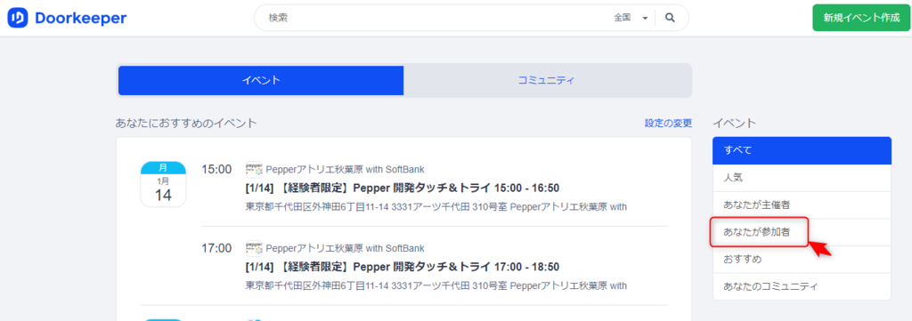 

2. 追加ボタンをクリックすると「カレンダー」、「Googleカレンダー」の項目が表示されるので、「カレンダー」を右クリックしてURLをコピー
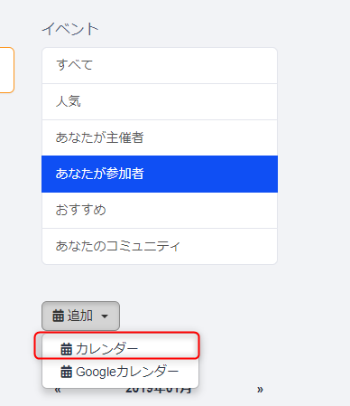 

> webcal://manage.doorkeeper.jp/user/*************/events/attending.ics  

#### Connpassの場合  

1.Connpassにログインし、自身のアイコンをクリックするとメニューが表示されるので、「利用設定」をクリック  

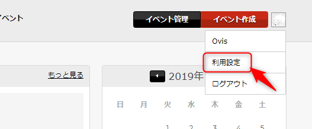 

2.ページ中央のカレンダー連携の項目にある「その他のiCalendar形式対応カレンダー」のURLをコピー  

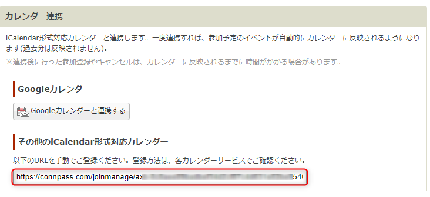 

> https://connpass.com/joinmanage/axb-**********************************.ics  

URLのスキームがWebCalでなく、httpsですが問題ないです。  

### カレンダーに登録
#### Outlook.comの場合  
1.Outlook.comにログインし、画面左下のカレンダーの項目をクリック  
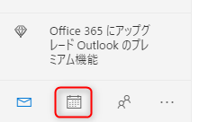 

2.カレンダー画面に遷移したら、左メニューの「予定表を見つける」をクリック  
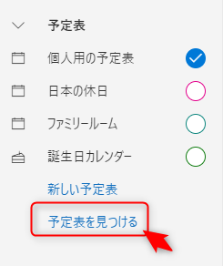 

3.左下の「Webから」のリンクをクリック  
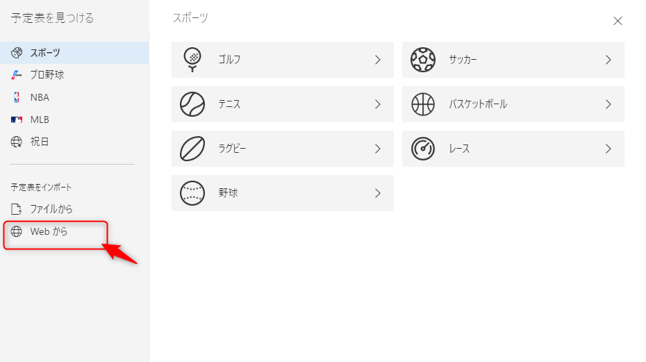 

4.  予定表へのリンク欄にコピーしておいたWebCalURLを、予定表の名前には告知サイトの名前などわかりやすいものを入力し、インポートボタンを押下  
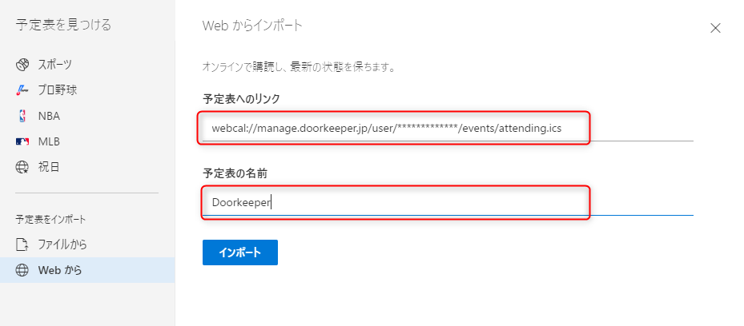 

5. 追加されました  
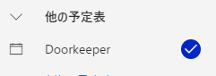 

#### Office 365(Exchange Online)の場合  
1.Office 365にログインし、画面左下のカレンダーの項目をクリック  
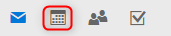 

2.カレンダー画面に遷移したら、上部メニューの「予定表の追加」をクリックして、「インターネットから」のリンクをクリック
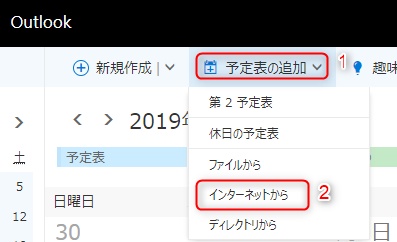 

3.予定表へのリンク欄にコピーしておいたWebCalURLを、予定表の名前には告知サイトの名前などわかりやすいものを入力し、保存ボタンを押下  
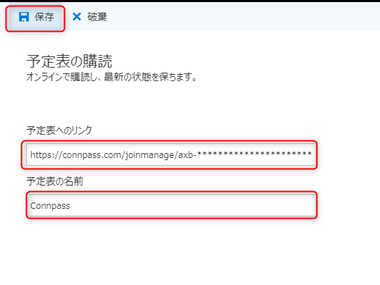 

4.追加されました  
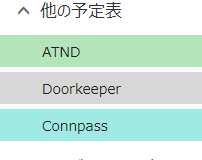 

##### 参考サイト  
<?# EmbedLink "https://qiita.com/awm-kaeruko/items/9795997248b9d67068a5" /?>

