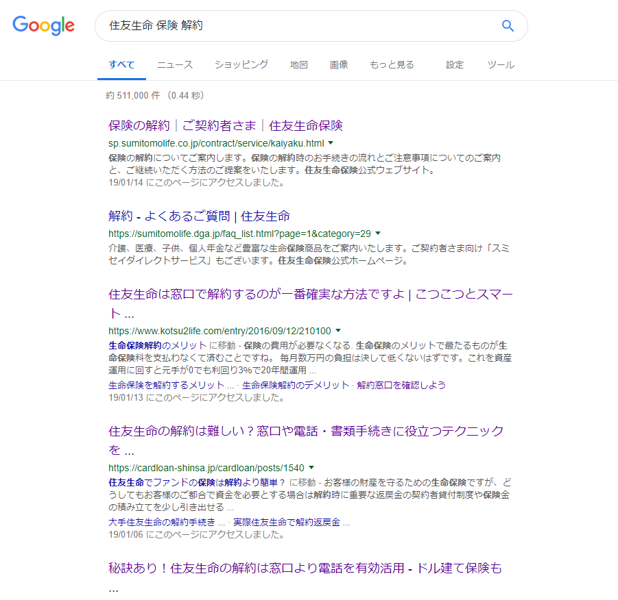
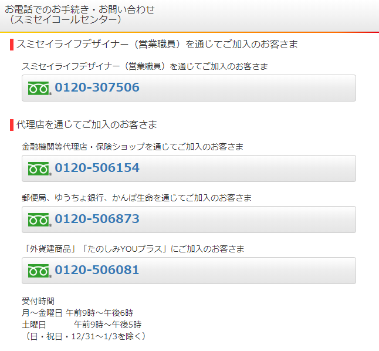

12月末で退職して無職の今、かかるお金はできうるだけ減らしたいものです。

入社直後に会社に来ていた生保レディー(スミセイライフデザイナー)のおばさんに取っ捕まって（？）入ることにした<a class="keyword" href="http://d.hatena.ne.jp/keyword/%BD%BB%CD%A7%C0%B8%CC%BF">住友生命</a>のライブワンですが、正直独り身でここまで掛け金をかける必要はないなと思いつつ、手続きが面倒で放置していました。 
とはいえ退職した今、収入がないのに毎月2万円の出費(当然積立なので後である程度帰ってくるわけですが)は非常に厳しいので、別の<a class="keyword" href="http://d.hatena.ne.jp/keyword/%B0%E5%CE%C5%CA%DD%B8%B1">医療保険</a>に加入して、こちらは解約することにしました。

***

<h4><a class="keyword" href="http://d.hatena.ne.jp/keyword/%BD%BB%CD%A7%C0%B8%CC%BF">住友生命</a>は解約しにくい・・・？</h4>

「<a class="keyword" href="http://d.hatena.ne.jp/keyword/%BD%BB%CD%A7%C0%B8%CC%BF">住友生命</a> 保険 解約」で<a class="keyword" href="http://d.hatena.ne.jp/keyword/%A5%B0%A5%B0%A4%EB">ググる</a>と、検索結果はこんな感じ。   

生命保険の解約は難しいという記事が並んでいます。 
生保レディーの成績に絡んでくることもあって、引き留められるということらしいです。

<h4>窓口であっさり解約</h4>

私としても担当の方と直接解約手続きをするのはあまりしたくなかったので、別の方法をとることにしました。

ネットで検索してみると、窓口に行ったほうが良いという意見といやいやコールセンターに電話するほうが良いという意見があって迷ったのですが、私は一度コールセンターに電話をして、必要資料を確認したうえで窓口に行くことにしました。

私は生保レディーの方を通じて加入したので、一番上の「0120-307-506」に電話をしています。 
電話が繋がったら解約したいこと、窓口で解約したいことを伝えます。証券番号を求められるので証券番号を口頭で連絡すると、あちらで必要なものを教えてくれます。

私の場合

<ul>
<li>保険証券</li>
<li>本人確認書類(保険証、<a class="keyword" href="http://d.hatena.ne.jp/keyword/%A5%DE%A5%A4%A5%CA%A5%F3">マイナン</a>バーカード、運転免許証等)</li>
<li>払戻先の口座番号がわかるもの(通帳でなくても、支店名や口座番号がわかるものであれば問題ないようです)</li>
</ul>

を求められました。 
ほかのブログ記事を見ると保険を契約したときの印鑑も必要だった方がいるようですが、私の場合は何も言われませんでした。

さて、必要なものをもって窓口へ。 
私の場合は<a class="keyword" href="http://d.hatena.ne.jp/keyword/%CC%BE%B8%C5%B2%B0%B1%D8">名古屋駅</a>南の名古屋支社に向かいました。

窓口の方に解約したい旨を伝え、保険証券を手渡します。

担当の方から解約書類を受け取り、記載。 
この書類に払い戻し先の口座番号を記載する必要があるのですが、私の場合は別途契約している<a class="keyword" href="http://d.hatena.ne.jp/keyword/%B8%C4%BF%CD%C7%AF%B6%E2">個人年金</a>(こちらは解約しない)を<a class="keyword" href="http://d.hatena.ne.jp/keyword/%B8%FD%BA%C2%BF%B6%C2%D8">口座振替</a>で対応しているからか、すでに資料に記載されていました。 
もし別の口座に入金したい場合はその口座番号を記載する必要があります。

解約の理由について口頭で尋ねられたので、退職したため保険の整理をしていること、別途身の丈に合った保険に加入したことを伝えると、すんなりと解約手続きが完了しました。だいたい10分くらいでした。

<h4>生保レディーの担当の方から電話</h4>

帰宅中、携帯が鳴ったので相手を確認したところ、生保レディーの担当の方からでした。 
もともと退職する前に保険の見直しを考えていることは伝えていたので、別の保険に加入したことを伝え、これまでのお礼の言葉を伝えて電話終了。 
まだ<a class="keyword" href="http://d.hatena.ne.jp/keyword/%B8%C4%BF%CD%C7%AF%B6%E2">個人年金</a>の契約はしているため、今後も付き合いがあるので・・・。

本当は退職前に解約予定だったものの、足を怪我したために完治するまで新しい<a class="keyword" href="http://d.hatena.ne.jp/keyword/%B0%E5%CE%C5%CA%DD%B8%B1">医療保険</a>に入ることができず、またその怪我の給付金が保険からでるため、入金されるまで解約できなかったのですが、これで保険周りの対応は完了。

思っていたよりさくっと解約できてほっとしました。

