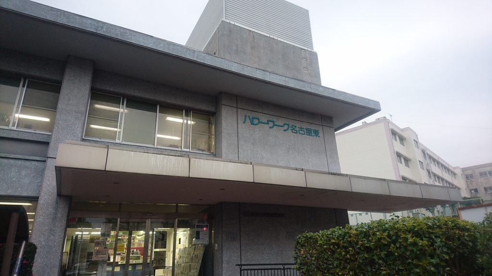
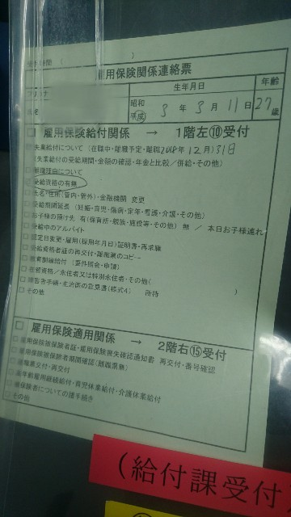
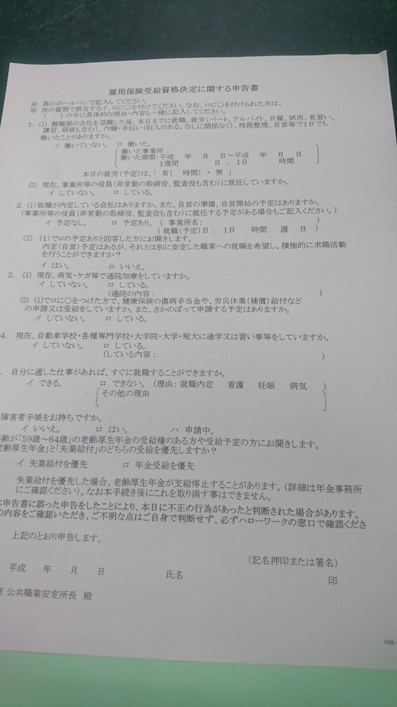
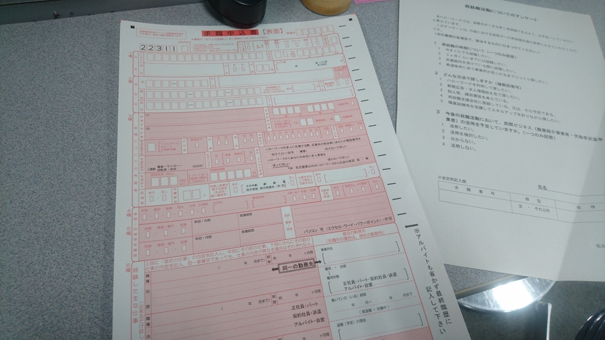

12月31日をもって退職したわけですが、<a class="keyword" href="http://d.hatena.ne.jp/keyword/%CE%A5%BF%A6%C9%BC">離職票</a>がまだ手元に届いておりません。

<iframe src="https://hatenablog-parts.com/embed?url=https%3A%2F%2Fboxil.jp%2Fbeyond%2Fa5341%2F" title="離職票とは？書き方・記入方法や発行手続きの注意事項 | 退職証明書との違い | ビヨンド（Beyond）" class="embed-card embed-webcard" scrolling="no" frameborder="0" style="display: block; width: 100%; height: 155px; max-width: 500px; margin: 10px 0px;"></iframe>

***

<a class="keyword" href="http://d.hatena.ne.jp/keyword/%CE%A5%BF%A6%C9%BC">離職票</a>がないと<a class="keyword" href="http://d.hatena.ne.jp/keyword/%A5%CF%A5%ED%A1%BC%A5%EF%A1%BC%A5%AF">ハローワーク</a>での手続きができないのですが、年末年始の休暇もあってまだ手続きが完了していないとかで、そもそもまだ<a class="keyword" href="http://d.hatena.ne.jp/keyword/%A5%CF%A5%ED%A1%BC%A5%EF%A1%BC%A5%AF">ハローワーク</a>から会社に<a class="keyword" href="http://d.hatena.ne.jp/keyword/%CE%A5%BF%A6%C9%BC">離職票</a>が届いてないんだとか。 
これ会社経由しないで直接<a class="keyword" href="http://d.hatena.ne.jp/keyword/%A5%CF%A5%ED%A1%BC%A5%EF%A1%BC%A5%AF">ハローワーク</a>から退職者に送付するなりしたらいいのでは・・・？と思うのですが。

とはいえ届かないと手続きが進まなくて困るな・・・と思っていたところ、「仮手続き」というものを知りました。

<iframe src="https://hatenablog-parts.com/embed?url=https%3A%2F%2Fwww.knoki.net%2Fqa%2Frisyokuhyou%2F" title="離職票が送られてこなくても、失業保険の仮手続ができます！ - 知らないと損する雇用保険（失業保険）" class="embed-card embed-webcard" scrolling="no" frameborder="0" style="display: block; width: 100%; height: 155px; max-width: 500px; margin: 10px 0px;"></iframe>

あくまで「仮」なので、最終的には<a class="keyword" href="http://d.hatena.ne.jp/keyword/%CE%A5%BF%A6%C9%BC">離職票</a>が必要になるのですが、この仮手続きを行っておけば失業給付金の給付日がその分早くなります。

調べたところ、仮手続きができる<a class="keyword" href="http://d.hatena.ne.jp/keyword/%A5%CF%A5%ED%A1%BC%A5%EF%A1%BC%A5%AF">ハローワーク</a>とできない<a class="keyword" href="http://d.hatena.ne.jp/keyword/%A5%CF%A5%ED%A1%BC%A5%EF%A1%BC%A5%AF">ハローワーク</a>があるそうです。

私の住んでいる地域の<a class="keyword" href="http://d.hatena.ne.jp/keyword/%A5%CF%A5%ED%A1%BC%A5%EF%A1%BC%A5%AF">ハローワーク</a>は「<a class="keyword" href="http://d.hatena.ne.jp/keyword/%A5%CF%A5%ED%A1%BC%A5%EF%A1%BC%A5%AF">ハローワーク</a>名古屋東」なのですが、電話をして確認したところ、仮手続きができるということなのでさっそく向かいました。

<h4>仮手続きの条件</h4>

仮手続きをするための条件として、退職日から2週間経過している必要があるようです。 
電話でも受付でも2週間経過していることを確認されました。 
退職日から10日以内に会社から<a class="keyword" href="http://d.hatena.ne.jp/keyword/%A5%CF%A5%ED%A1%BC%A5%EF%A1%BC%A5%AF">ハローワーク</a>に資料が送付され、<a class="keyword" href="http://d.hatena.ne.jp/keyword/%A5%CF%A5%ED%A1%BC%A5%EF%A1%BC%A5%AF">ハローワーク</a>から会社に<a class="keyword" href="http://d.hatena.ne.jp/keyword/%CE%A5%BF%A6%C9%BC">離職票</a>が送られてから会社がこちらに送付するという流れなので、2週間というのも納得。

<h4>仮手続きに必要なもの</h4>

電話で確認したところ

<ul>
<li>本人確認書類</li>
<li>通帳など振込先がわかるもの</li>
</ul>

この二点が必要と伺いました。 
(できれば履歴書に貼るサイズの写真2枚をもっていったほうが良い)

<h4>いざ<a class="keyword" href="http://d.hatena.ne.jp/keyword/%A5%CF%A5%ED%A1%BC%A5%EF%A1%BC%A5%AF">ハローワーク</a>へ</h4>

<a class="keyword" href="http://d.hatena.ne.jp/keyword/%A5%CF%A5%ED%A1%BC%A5%EF%A1%BC%A5%AF">ハローワーク</a>に入ってすぐに受付があったので、仮手続きをしたい旨を伝えたところ、次の書類を記載したうえで給付課で受付をするように言われました。 

給付課ではこちらの書類に記載を行います。 
 
このタイミングで認定日についてレクチャーをいただきました。

レクチャー後、今度は求職申込書に記載します。 

この申込書を窓口に提出することで手続きは完了。 
電話で伺ってなかったこともあって忘れてましたが、履歴書に貼るサイズの証明写真も必要になります。 
早めに持ってくるよう言われたので、早く写真を撮って持っていかないと・・・。

