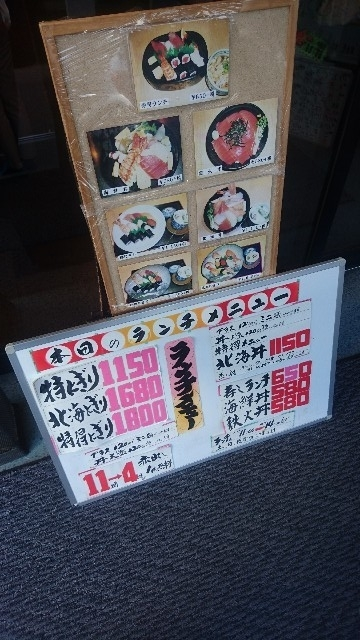
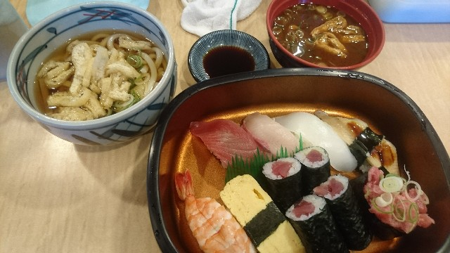
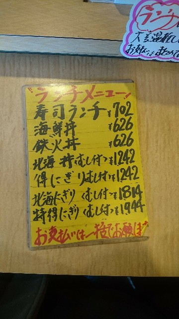

<a class="keyword" href="http://d.hatena.ne.jp/keyword/%C2%E7%C1%BE%BA%AC%B1%D8">大曽根駅</a>から北に1km弱行ったところにある「すし市場 正」の平日ランチを食べてきました。

<iframe src="https://hatenablog-parts.com/embed?url=https%3A%2F%2Fgoo.gl%2Fmaps%2F9hX5fSyZP2M2" title="すし市場正大曽根店" class="embed-card embed-webcard" scrolling="no" frameborder="0" style="display: block; width: 100%; height: 155px; max-width: 500px; margin: 10px 0px;"></iframe>

***

  

ここは回転ずしなのですが、ネタが非常に大きく、非常に美味しい。また割とリーズナブルなのが非常にうれしい（高いものはあまり頼まないってのもありますが）。 
一人で食べに来てとても気に入り、以降家族が名古屋に来た時にはちょくちょくここを利用してます。

ここはランチが非常にお値打ちだということは知っていたのですが、平日限定なので一度も食べたことがなく、今回<a class="keyword" href="http://d.hatena.ne.jp/keyword/%C2%E7%C1%BE%BA%AC">大曽根</a>の<a class="keyword" href="http://d.hatena.ne.jp/keyword/%C7%AF%B6%E2%BB%F6%CC%B3%BD%EA">年金事務所</a>に行く用事があったのでついでに食べに行くことに。

本日のランチメニュー。 

入店すると座席カウンターともに満席かつ、席が空くのを待つお客さんでいっぱい。 
正直こんなに混んでるとは思ってませんでした。 
とはいえ一人で行ったこともあって10分もしないうちにカウンター席に座れました。

今回食べたのは寿司ランチ。税抜き650円。税込みでも702円也。 
ミニうどんもついて炭水化物ばかりですね（（ 
<a class="keyword" href="http://d.hatena.ne.jp/keyword/%C0%D6%CC%A3%C1%B9">赤味噌</a>のお味噌汁はセルフサービスです。

今回のネタはエビ、卵、まぐろ、かんぱち、いか、アナゴ、<a class="keyword" href="http://d.hatena.ne.jp/keyword/%C5%B4%B2%D0%B4%AC">鉄火巻</a>、ネギトロ。 
中でもアナゴは口に入れたらトロっと溶ける感じで本当に美味しいです。 
ネギトロは普通に頼むよりはちょっとネタが少なかったかな。普段はもっと載っているというか、皿の上に零れ落ちてます。

ランチメニューだけでなく、当然レーンには（夜より流れている量が少ないですが）ネタが流れていますし、注文も可能です。 
個人的には170円のネギトロ、220円のサーモン、並<a class="keyword" href="http://d.hatena.ne.jp/keyword/%B7%EA%BB%D2">穴子</a>がおすすめ。

以下<a class="keyword" href="http://d.hatena.ne.jp/keyword/%BF%A9%A4%D9%A5%ED%A5%B0">食べログ</a>のメニュー。

<iframe src="https://hatenablog-parts.com/embed?url=https%3A%2F%2Ftabelog.com%2Faichi%2FA2301%2FA230110%2F23002167%2Fdtlmenu%2Fphoto%2F" title="すし市場　正 大曽根店 (大曽根/回転寿司)" class="embed-card embed-webcard" scrolling="no" frameborder="0" style="display: block; width: 100%; height: 155px; max-width: 500px; margin: 10px 0px;"></iframe>

夜はだいたいしっかり食べて2000円くらい？

ちょっと板前さんが不愛想だったりして、接客面に難があったりするみたいなんですが、美味しくて比較的安くて遅くまでやってる（朝11時から翌朝5時まで）ので、おすすめのお店です。

もっとおすすめのお店知ってるぞ！って方。是非食べてみたいので教えてください奢ってください（おい）

