
伊勢さん(<a href="http://blog.hatena.ne.jp/iseebi/">id:iseebi</a>)の<a class="keyword" href="http://d.hatena.ne.jp/keyword/Twitter">Twitter</a>での投稿を見て初めて知ったのですが、<a class="keyword" href="http://d.hatena.ne.jp/keyword/Google">Google</a> Compute Engineって無償枠ってのがあったんですね。

<a class="keyword" href="http://d.hatena.ne.jp/keyword/Google">Google</a> Compute EngineはいわゆるIaaS。 <a class="keyword" href="http://d.hatena.ne.jp/keyword/AWS">AWS</a> の EC2やAzure <a class="keyword" href="http://d.hatena.ne.jp/keyword/VM">VM</a>と同じく、時間単位での<a class="keyword" href="http://d.hatena.ne.jp/keyword/%B2%BE%C1%DB%A5%DE%A5%B7%A5%F3">仮想マシン</a>リソースを提供するサービスになります。 
<a class="keyword" href="http://d.hatena.ne.jp/keyword/Google">Google</a> Cloud Platformの一サービスですね。

無償枠の上限は下記の通り。

<ul>
<li>1 つの非プリエンプティブ f1-micro <a class="keyword" href="http://d.hatena.ne.jp/keyword/VM">VM</a> <a class="keyword" href="http://d.hatena.ne.jp/keyword/%A5%A4%A5%F3%A5%B9%A5%BF%A5%F3%A5%B9">インスタンス</a>（米国リージョン(<a class="keyword" href="http://d.hatena.ne.jp/keyword/%A5%AA%A5%EC%A5%B4%A5%F3%BD%A3">オレゴン州</a>(us-west1)、<a class="keyword" href="http://d.hatena.ne.jp/keyword/%A5%A2%A5%A4%A5%AA%A5%EF%BD%A3">アイオワ州</a>(us-central1)、<a class="keyword" href="http://d.hatena.ne.jp/keyword/%A5%B5%A5%A6%A5%B9%A5%AB%A5%ED%A5%E9%A5%A4%A5%CA%BD%A3">サウスカロライナ州</a>(us-east1))</li>
<li>30 GB の標準永続ディスク ストレージ（1 か月あたり）</li>
<li>5 GB のスナップショット ストレージ（1 か月あたり）</li>
<li><a class="keyword" href="http://d.hatena.ne.jp/keyword/%A5%C8%A5%E9%A5%D5%A5%A3%A5%C3%A5%AF">トラフィック</a>は北米の <a class="keyword" href="http://d.hatena.ne.jp/keyword/GCP">GCP</a> リージョンから送信する必要がある</li>
<li>まとめて送信できる下り<a class="keyword" href="http://d.hatena.ne.jp/keyword/%A5%C8%A5%E9%A5%D5%A5%A3%A5%C3%A5%AF">トラフィック</a>は 1 GB まで</li>
</ul>

<iframe src="https://hatenablog-parts.com/embed?url=https%3A%2F%2Fcloud.google.com%2Ffree%2Fdocs%2Falways-free-usage-limits" title="GCP Free Tier  |  Google Cloud Platform Free Tier
|  Google Cloud" class="embed-card embed-webcard" scrolling="no" frameborder="0" style="display: block; width: 100%; height: 155px; max-width: 500px; margin: 10px 0px;"></iframe>

メ<a class="keyword" href="http://d.hatena.ne.jp/keyword/%A5%E2%A5%EA%A1%BC">モリー</a>は600MBと小さな<a class="keyword" href="http://d.hatena.ne.jp/keyword/%B2%BE%C1%DB%A5%DE%A5%B7%A5%F3">仮想マシン</a>ですが、ただで使えるのは良いですね。

早速登録しました。

***

<h4><a class="keyword" href="http://d.hatena.ne.jp/keyword/Google">Google</a> Cloud Platform の利用登録</h4>

まずページに飛んで、「無料トライアル」のボタンをクリック。

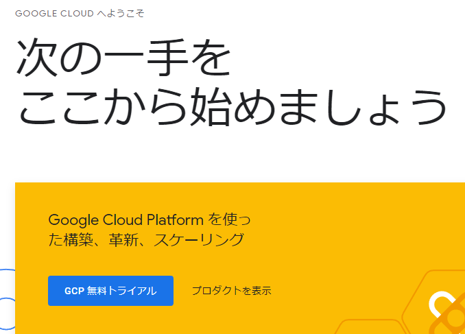

<a class="keyword" href="http://d.hatena.ne.jp/keyword/%CD%F8%CD%D1%B5%AC%CC%F3">利用規約</a>の確認にチェックを入れて、「AGREE AND CONTINUE」をクリック。   
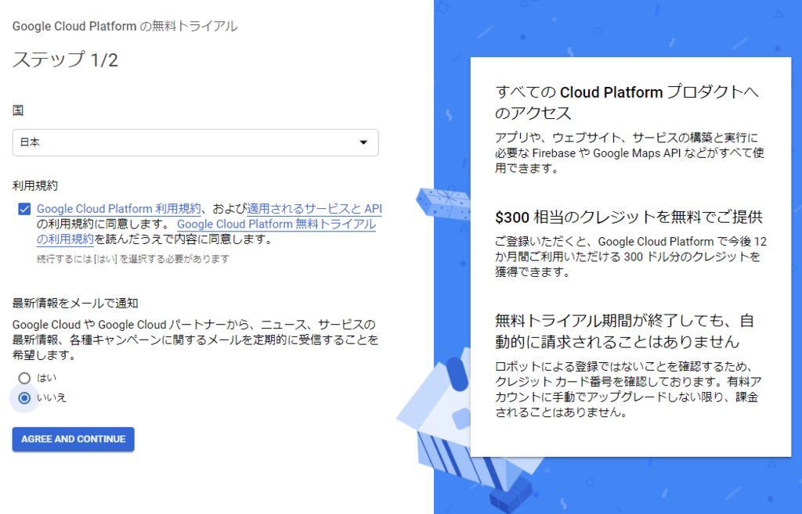

支払い方法などを入力して「START MY FREE TRIAL」をクリック。 
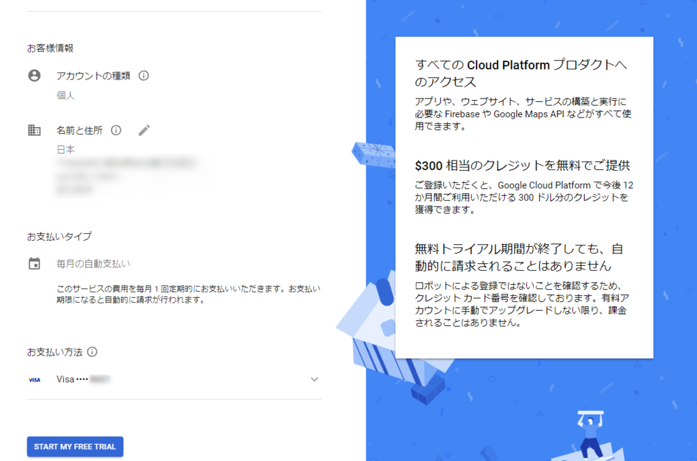

登録完了。 
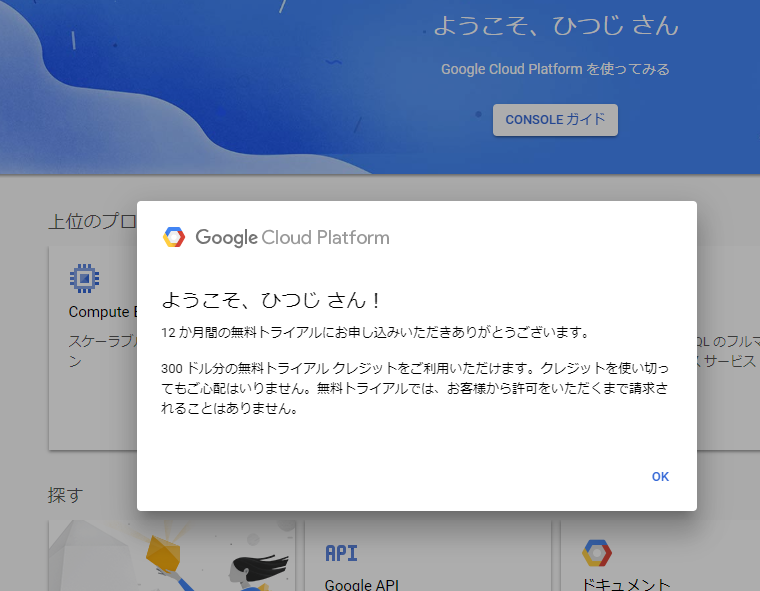

<h4><a class="keyword" href="http://d.hatena.ne.jp/keyword/%A5%A4%A5%F3%A5%B9%A5%BF%A5%F3%A5%B9">インスタンス</a>の作成</h4>

左メニューからCompute Engineにマウスカーソルを充てるとメニューが表示されるので、一番上の<a class="keyword" href="http://d.hatena.ne.jp/keyword/VM">VM</a><a class="keyword" href="http://d.hatena.ne.jp/keyword/%A5%A4%A5%F3%A5%B9%A5%BF%A5%F3%A5%B9">インスタンス</a>をクリック。 
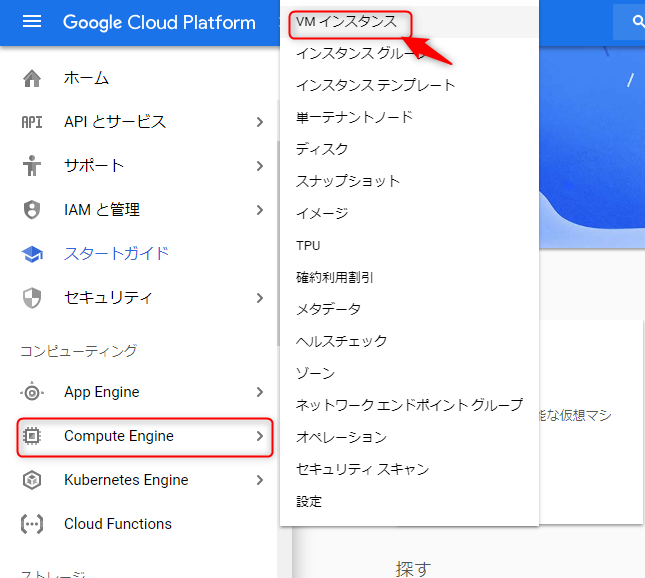

「課金を有効にする」をクリック。 
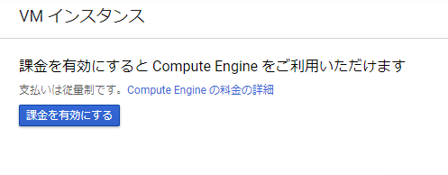

作成ボタンをクリック。 
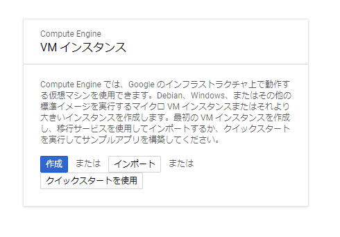

<a class="keyword" href="http://d.hatena.ne.jp/keyword/%A5%A4%A5%F3%A5%B9%A5%BF%A5%F3%A5%B9">インスタンス</a>の作成画面が表示されます。

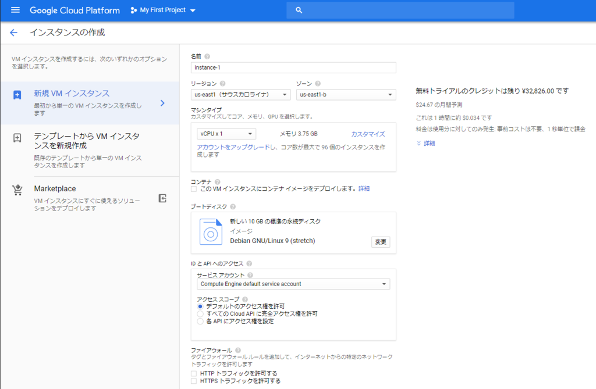

<h5>名前</h5>

名前は適当に。わかりやすいものにしました。   
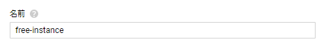

<h5>リージョン、リビジョン</h5>

リージョンは下記のいずれかにしないと課金対象になってしまうので注意。 
* <a class="keyword" href="http://d.hatena.ne.jp/keyword/%A5%AA%A5%EC%A5%B4%A5%F3%BD%A3">オレゴン州</a>(us-west1) 
* <a class="keyword" href="http://d.hatena.ne.jp/keyword/%A5%A2%A5%A4%A5%AA%A5%EF%BD%A3">アイオワ州</a>(us-central1) 
* <a class="keyword" href="http://d.hatena.ne.jp/keyword/%A5%B5%A5%A6%A5%B9%A5%AB%A5%ED%A5%E9%A5%A4%A5%CA%BD%A3">サウスカロライナ州</a>(us-east1)

今回は日本に近い<a class="keyword" href="http://d.hatena.ne.jp/keyword/%A5%AA%A5%EC%A5%B4%A5%F3">オレゴン</a>にしました。 
リビジョンは特に変えてません。 
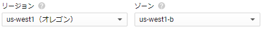

<h5>マシンタイプ</h5>

マシンタイプはmicroにする必要があります。 
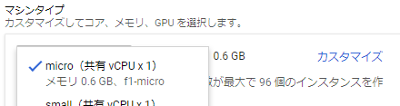

<h5>コンテナ</h5>

今回はコンテナを使うつもりがないのでチェックは入れません。 
そもそもこのスペックでコンテナ使っても微妙な気がする・・・。  
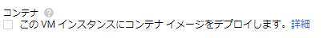

<h5>ブートディスク</h5>

標準の10GBの永続ディスクでもいいんですが、30GBまで使えるので変更しておきました。 
OSは標準の<a class="keyword" href="http://d.hatena.ne.jp/keyword/Debian">Debian</a>から<a class="keyword" href="http://d.hatena.ne.jp/keyword/Ubuntu">Ubuntu</a> LTSに。ここはよく使ってるOSにしただけで他意はなし。 
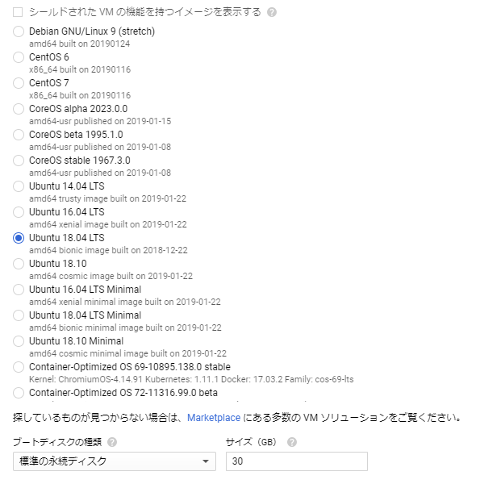
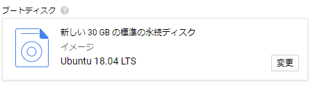

<h5>ID と <a class="keyword" href="http://d.hatena.ne.jp/keyword/API">API</a> へのアクセス</h5>

今回特に<a class="keyword" href="http://d.hatena.ne.jp/keyword/API">API</a>を使うつもりもないのでデフォルトのまま。 
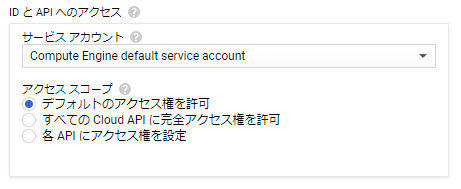

<h5>ファイアーウォール</h5>

後でも設定できますが、とりあえず両方とも開けておきました。 
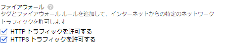

<h5>ネットワーキング</h5>

外部<a class="keyword" href="http://d.hatena.ne.jp/keyword/IP%A5%A2%A5%C9%A5%EC%A5%B9">IPアドレス</a>の設定。

ネットワーク インターフェースの鉛筆マークをクリック。 
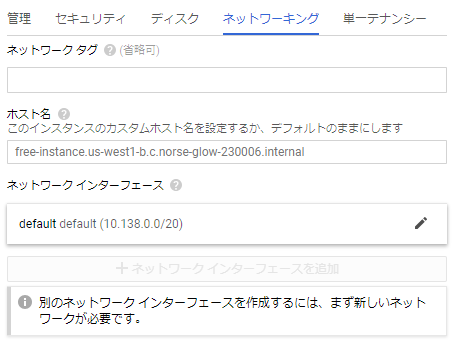

外部IPをクリックして、<a class="keyword" href="http://d.hatena.ne.jp/keyword/IP%A5%A2%A5%C9%A5%EC%A5%B9">IPアドレス</a>を作成をクリック  
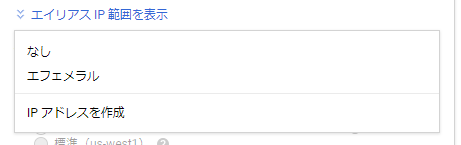

名前は適当に。 
予約ボタンをクリックすると、<a class="keyword" href="http://d.hatena.ne.jp/keyword/IP%A5%A2%A5%C9%A5%EC%A5%B9">IPアドレス</a>が予約されます。 
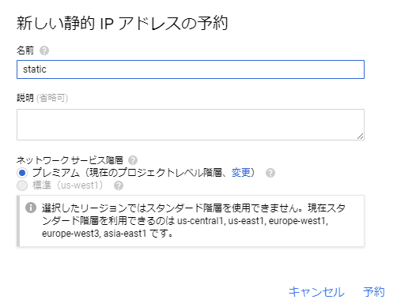

元の画面に戻ったら完了ボタンをクリック。 
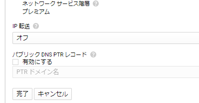

ここまで終わったら作成ボタンをクリック。 
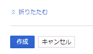

これで<a class="keyword" href="http://d.hatena.ne.jp/keyword/%B2%BE%C1%DB%A5%DE%A5%B7%A5%F3">仮想マシン</a><a class="keyword" href="http://d.hatena.ne.jp/keyword/%A5%A4%A5%F3%A5%B9%A5%BF%A5%F3%A5%B9">インスタンス</a>が作成されました。

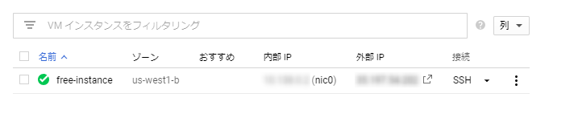

<h4><a class="keyword" href="http://d.hatena.ne.jp/keyword/SSH">SSH</a>での接続</h4>

作成した<a class="keyword" href="http://d.hatena.ne.jp/keyword/%B2%BE%C1%DB%A5%DE%A5%B7%A5%F3">仮想マシン</a>へ<a class="keyword" href="http://d.hatena.ne.jp/keyword/SSH">SSH</a>で接続してみます。

まずは<a class="keyword" href="http://d.hatena.ne.jp/keyword/SSH">SSH</a>接続用に公開鍵認証の設定を。

左メニューの<a class="keyword" href="http://d.hatena.ne.jp/keyword/%A5%E1%A5%BF%A5%C7%A1%BC%A5%BF">メタデータ</a>をクリック。

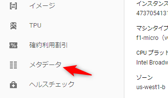

<a class="keyword" href="http://d.hatena.ne.jp/keyword/SSH">SSH</a>認証鍵をクリック。 
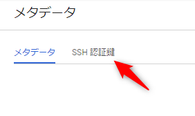

<a class="keyword" href="http://d.hatena.ne.jp/keyword/SSH">SSH</a>認証鍵を追加をクリック。 
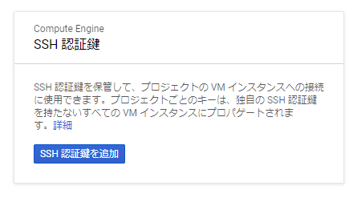

あらかじめ作成しておいた公開鍵を記載して、登録ボタンをクリック。   
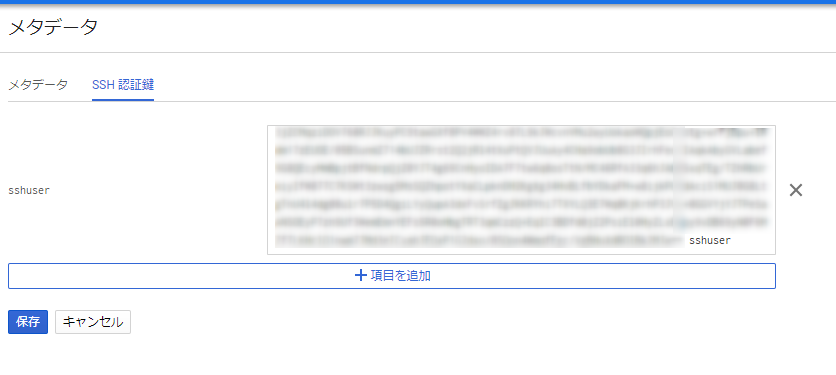

これで<a class="keyword" href="http://d.hatena.ne.jp/keyword/SSH">SSH</a>認証鍵の登録は完了。

ターミナルで<a class="keyword" href="http://d.hatena.ne.jp/keyword/%C8%EB%CC%A9%B8%B0">秘密鍵</a>を使ってログインしてみたところ。 
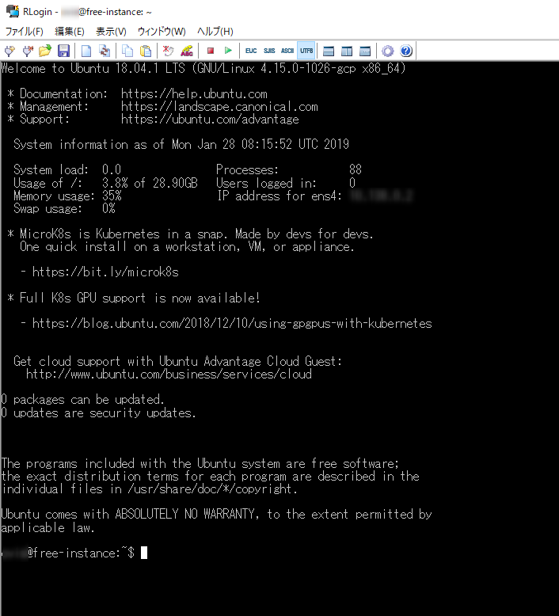

標準だと<a class="keyword" href="http://d.hatena.ne.jp/keyword/%A5%BF%A5%A4%A5%E0%A5%BE%A1%BC%A5%F3">タイムゾーン</a>が<a class="keyword" href="http://d.hatena.ne.jp/keyword/%B6%A8%C4%EA%C0%A4%B3%A6%BB%FE">協定世界時</a>になっているので、<a class="keyword" href="http://d.hatena.ne.jp/keyword/JST">JST</a>に変えておく場合は下記のコマンドを実行。

<blockquote>
$ sudo timedatectl set-timezone Asia/Tokyo
</blockquote>

実行すると<a class="keyword" href="http://d.hatena.ne.jp/keyword/JST">JST</a>に切り替わります。 

多分これをしておかないと、Cronで設定するときに<a class="keyword" href="http://d.hatena.ne.jp/keyword/UTC">UTC</a>で記載する必要が出てくるはず。

あとは本当は<a class="keyword" href="http://d.hatena.ne.jp/keyword/SSH">SSH</a>が利用するポートを変更しておくべきなのだと思いますが、とりあえずはここまで。

<h4>参考にしたサイト</h4>

<iframe src="https://hatenablog-parts.com/embed?url=https%3A%2F%2Fqiita.com%2Fndxbn%2Fitems%2F7ef0a96e409a5b5837bd" title="GCE の無料枠のサーバを立るときに、初見でハマりそうなところ - Qiita" class="embed-card embed-webcard" scrolling="no" frameborder="0" style="display: block; width: 100%; height: 155px; max-width: 500px; margin: 10px 0px;"></iframe>

<iframe src="https://hatenablog-parts.com/embed?url=https%3A%2F%2Fblog.apar.jp%2Fweb%2F6966%2F" title="いつでも無料！Google Compute Engine 常時無料枠の使い方 | あぱーブログ" class="embed-card embed-webcard" scrolling="no" frameborder="0" style="display: block; width: 100%; height: 155px; max-width: 500px; margin: 10px 0px;"></iframe>

