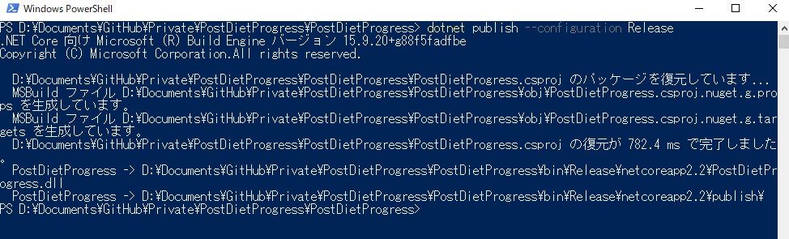
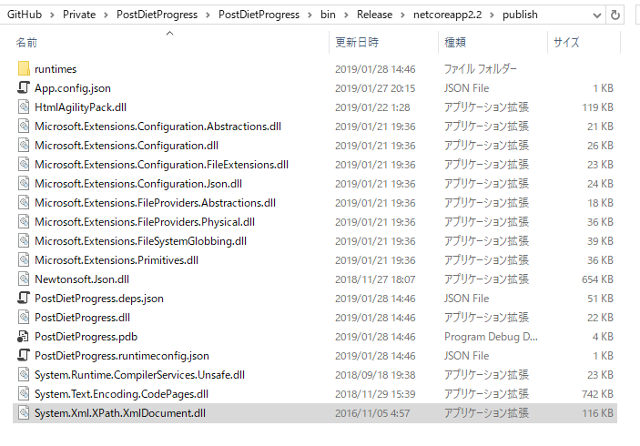
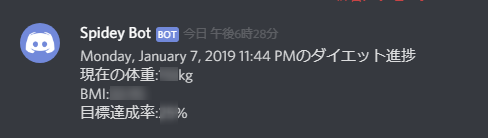

Azure Functionsで動かしていたプログラムがあるんですが、(たぶん実装が悪いのだけど)課金が結構な額となってしまい、またDBを使うとなるとそれはそれでよい金額となってしまいます。  

というわけでAzure Functions用に作っていたプログラムを.NET Coreのコンソールアプリとして置き換えて、Google Compute Engine上のLinuxで動かすことにしました。  

#### .NET Coreアプリ展開準備  

参考にしたのはid:fnyablog さんの下記の記事。  

[https://www.aruse.net/entry/2018/09/09/135210:embed]

今回動かすアプリは下記。  
.NET Core 2.2のアプリです。  

[https://github.com/Ovis/PostDietProgress:embed]

.csprojファイルがあるフォルダでコンソールを呼び出して、  

>dotnet publish --configuration Release  
を実行。  

[https://gist.github.com/Ovis/6220760b7fe84b746e721ecdcc4695d8:embed]

   

これで
> .\bin\Release\netcoreapp2.2\publish\    

のフォルダにNuGetで取得したライブラリのDLLを含めた必要なファイル類が展開されました。  

   

#### Linux側の.NET Core SDKの準備  

今回GCP側ではUbuntu 18.04LTSを用意しています。  

まずUbuntuのリポジトリにMicrosoftのリポジトリを追加  
> wget -q https://packages.microsoft.com/config/ubuntu/18.04/packages-microsoft-prod.deb  
> sudo dpkg -i packages-microsoft-prod.deb  

リポジトリが追加されたらapt-getでSDKをインストール。  
> sudo add-apt-repository universe  
> sudo apt-get install apt-transport-https  
> sudo apt-get update  
> sudo apt-get install dotnet-sdk-2.2  

最後のdonet-sdk-2.2は、GCEの無償枠だとインストールに相応の時間がかかります。  
完了後、dotnetコマンドを叩いてエラーが出なければOK。  

以下ログ。  

[https://gist.github.com/Ovis/394b656630748c00521b385db4bc0603:embed]

#### GCEへアプリケーションファイル一式を展開  

利用しているターミナルもしくはWinSCPなどを利用してGCP側へファイルをデプロイします。  

私の場合はrLoginの「SFTPファイルの転送」機能でデプロイを行いました。  
アップロードする分には課金されないはずなので、圧縮も何もせずそのままデプロイ。  
 

>dotnet デプロイしたプロジェクト名.dll  

で実行して問題なく動くか要確認。  
Windowsで動いてもLinuxで動かないことはあるので。  

 

#### Cronを利用して定期実行  

作成したアプリは一日に一度動かしたいので、Cronで定期実行させます。  
CronTabは-rオプションをうっかり使って吹っ飛ばしてしまうのが怖いので今回は利用せず。  

> sudo cp /etc/crontab /etc/cron.d/ファイル名  

でCron設定ファイルを作成し、適当なエディタで開きます(要sudo実行)。  

0時15分に起動させたい場合は  
>15 00 * * *   実行ユーザー名    dotnet DLLまでの絶対パス  

これでOK。  

あとは
>sudo service cron restart  

でCronを再起動してやれば完了。  

なお、Windowsのタスクスケジューラ同様カレントディレクトリが実行プログラムがある場所ではなくホームディレクトリとなるので、  
> Directory.GetCurrentDirectory()  

を利用している場合は要注意。  
実行プログラムの場所を参照しているつもりで全然違う場所を参照してしまいます。  

> AppDomain.CurrentDomain.BaseDirectory  

ならOK。  

#### 参考にしたサイト  

[https://dotnet.microsoft.com/download/linux-package-manager/ubuntu18-04/sdk-current:embed]

[https://www.aruse.net/entry/2018/09/09/135210:embed]