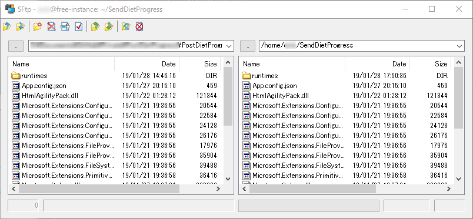

Azure Functionsで動かしていたプログラムがあるんですが、(たぶん実装が悪いのだけど)課金が結構な額となってしまい、またDBを使うとなるとそれはそれでよい金額となってしまいます。

というわけでAzure Functions用に作っていたプログラムを.NET Coreのコンソールアプリとして置き換えて、<a class="keyword" href="http://d.hatena.ne.jp/keyword/Google">Google</a> Compute Engine上の<a class="keyword" href="http://d.hatena.ne.jp/keyword/Linux">Linux</a>で動かすことにしました。

***

<h4>.NET Coreアプリ展開準備</h4>

参考にしたのは<a href="http://blog.hatena.ne.jp/fnyablog/">id:fnyablog</a> さんの下記の記事。

<iframe src="https://hatenablog-parts.com/embed?url=https%3A%2F%2Fwww.aruse.net%2Fentry%2F2018%2F09%2F09%2F135210" title=".NET CoreのアプリをLinuxのcronを使いバッチでスケジュール実行させる(CentOS7) - あるSEのつぶやき・改" class="embed-card embed-blogcard" scrolling="no" frameborder="0" style="display: block; width: 100%; height: 190px; max-width: 500px; margin: 10px 0px;"></iframe>

今回動かすアプリは下記。 
.NET Core 2.2のアプリです。

<iframe src="https://hatenablog-parts.com/embed?url=https%3A%2F%2Fgithub.com%2FOvis%2FPostDietProgress" title="Ovis/PostDietProgress" class="embed-card embed-webcard" scrolling="no" frameborder="0" style="display: block; width: 100%; height: 155px; max-width: 500px; margin: 10px 0px;"></iframe>

.csprojファイルがあるフォルダでコンソールを呼び出して、

<blockquote>
<a class="keyword" href="http://d.hatena.ne.jp/keyword/dotnet">dotnet</a> publish --configuration Release 
を実行。
</blockquote>

これで

<blockquote>
.\bin\Release\netcoreapp2.2\publish\
</blockquote>

のフォルダにNuGetで取得したライブラリのDLLを含めた必要なファイル類が展開されました。

<h4><a class="keyword" href="http://d.hatena.ne.jp/keyword/Linux">Linux</a>側の.NET Core <a class="keyword" href="http://d.hatena.ne.jp/keyword/SDK">SDK</a>の準備</h4>

今回<a class="keyword" href="http://d.hatena.ne.jp/keyword/GCP">GCP</a>側では<a class="keyword" href="http://d.hatena.ne.jp/keyword/Ubuntu">Ubuntu</a> 18.04LTSを用意しています。

まず<a class="keyword" href="http://d.hatena.ne.jp/keyword/Ubuntu">Ubuntu</a>の<a class="keyword" href="http://d.hatena.ne.jp/keyword/%A5%EA%A5%DD%A5%B8%A5%C8%A5%EA">リポジトリ</a>に<a class="keyword" href="http://d.hatena.ne.jp/keyword/Microsoft">Microsoft</a>の<a class="keyword" href="http://d.hatena.ne.jp/keyword/%A5%EA%A5%DD%A5%B8%A5%C8%A5%EA">リポジトリ</a>を追加

<blockquote>
<a class="keyword" href="http://d.hatena.ne.jp/keyword/wget">wget</a> -q <a href="https://packages.microsoft.com/config/ubuntu/18.04/packages-microsoft-prod.deb">https://packages.microsoft.com/config/ubuntu/18.04/packages-microsoft-prod.deb</a> 
sudo dpkg -i packages-<a class="keyword" href="http://d.hatena.ne.jp/keyword/microsoft">microsoft</a>-prod.<a class="keyword" href="http://d.hatena.ne.jp/keyword/deb">deb</a>
</blockquote>

<a class="keyword" href="http://d.hatena.ne.jp/keyword/%A5%EA%A5%DD%A5%B8%A5%C8%A5%EA">リポジトリ</a>が追加されたらapt-getで<a class="keyword" href="http://d.hatena.ne.jp/keyword/SDK">SDK</a>をインストール。

<blockquote>
sudo add-apt-repository <a class="keyword" href="http://d.hatena.ne.jp/keyword/universe">universe</a> 
sudo apt-get install apt-transport-<a class="keyword" href="http://d.hatena.ne.jp/keyword/https">https</a> 
sudo apt-get update 
sudo apt-get install <a class="keyword" href="http://d.hatena.ne.jp/keyword/dotnet">dotnet</a>-<a class="keyword" href="http://d.hatena.ne.jp/keyword/sdk">sdk</a>-2.2
</blockquote>

最後のdonet-<a class="keyword" href="http://d.hatena.ne.jp/keyword/sdk">sdk</a>-2.2は、GCEの無償枠だとインストールに相応の時間がかかります。 
完了後、<a class="keyword" href="http://d.hatena.ne.jp/keyword/dotnet">dotnet</a>コマンドを叩いてエラーが出なければOK。

以下ログ。

<h4>GCEへアプリケーションファイル一式を展開</h4>

利用しているターミナルもしくは<a class="keyword" href="http://d.hatena.ne.jp/keyword/WinSCP">WinSCP</a>などを利用して<a class="keyword" href="http://d.hatena.ne.jp/keyword/GCP">GCP</a>側へファイルをデプロイします。

私の場合はrLoginの「SFTPファイルの転送」機能でデプロイを行いました。 
アップロードする分には課金されないはずなので、圧縮も何もせずそのままデプロイ。 

<blockquote>
<a class="keyword" href="http://d.hatena.ne.jp/keyword/dotnet">dotnet</a> デプロイしたプロジェクト名.dll
</blockquote>

で実行して問題なく動くか要確認。 
<a class="keyword" href="http://d.hatena.ne.jp/keyword/Windows">Windows</a>で動いても<a class="keyword" href="http://d.hatena.ne.jp/keyword/Linux">Linux</a>で動かないことはあるので。

<h4>Cronを利用して定期実行</h4>

作成したアプリは一日に一度動かしたいので、Cronで定期実行させます。 
CronTabは-rオプションをうっかり使って吹っ飛ばしてしまうのが怖いので今回は利用せず。

<blockquote>
sudo cp /etc/crontab /etc/cron.d/ファイル名
</blockquote>

でCron設定ファイルを作成し、適当なエディタで開きます(要sudo実行)。

0時15分に起動させたい場合は

<blockquote>
15 00 * * *   実行ユーザー名    <a class="keyword" href="http://d.hatena.ne.jp/keyword/dotnet">dotnet</a> DLLまでの<a class="keyword" href="http://d.hatena.ne.jp/keyword/%C0%E4%C2%D0%A5%D1%A5%B9">絶対パス</a>
</blockquote>

これでOK。

あとは

<blockquote>
sudo service cron restart
</blockquote>

でCronを再起動してやれば完了。

なお、<a class="keyword" href="http://d.hatena.ne.jp/keyword/Windows">Windows</a>のタスクスケジューラ同様カレント<a class="keyword" href="http://d.hatena.ne.jp/keyword/%A5%C7%A5%A3%A5%EC%A5%AF%A5%C8">ディレクト</a>リが実行プログラムがある場所ではなくホーム<a class="keyword" href="http://d.hatena.ne.jp/keyword/%A5%C7%A5%A3%A5%EC%A5%AF%A5%C8">ディレクト</a>リとなるので、

<blockquote>
Directory.GetCurrentDirectory()
</blockquote>

を利用している場合は要注意。 
実行プログラムの場所を参照しているつもりで全然違う場所を参照してしまいます。

<blockquote>
AppDomain.CurrentDomain.BaseDirectory
</blockquote>

ならOK。

<h4>参考にしたサイト</h4>

<iframe src="https://hatenablog-parts.com/embed?url=https%3A%2F%2Fdotnet.microsoft.com%2Fdownload%2Flinux-package-manager%2Fubuntu18-04%2Fsdk-current" title="Install .NET Core SDK on Linux Ubuntu 18.04 - x64 | .NET" class="embed-card embed-webcard" scrolling="no" frameborder="0" style="display: block; width: 100%; height: 155px; max-width: 500px; margin: 10px 0px;"></iframe>

<iframe src="https://hatenablog-parts.com/embed?url=https%3A%2F%2Fwww.aruse.net%2Fentry%2F2018%2F09%2F09%2F135210" title=".NET CoreのアプリをLinuxのcronを使いバッチでスケジュール実行させる(CentOS7) - あるSEのつぶやき・改" class="embed-card embed-blogcard" scrolling="no" frameborder="0" style="display: block; width: 100%; height: 190px; max-width: 500px; margin: 10px 0px;"></iframe>

