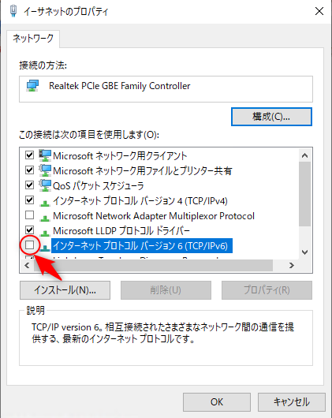

Mirakurunを動かしているマシンを初期化して再度環境を作り直した際、下記のエラーが発生した時の暫定対応メモ。

<blockquote>
Error: getaddrinfo ENOTFOUND ****::****:****:****:****%<a class="keyword" href="http://d.hatena.ne.jp/keyword/%A5%A4%A1%BC%A5%B5%A5%CD%A5%C3%A5%C8">イーサネット</a>
at GetAddrInfoReqWrap.onlookup [as oncomplete] (<a class="keyword" href="http://d.hatena.ne.jp/keyword/dns">dns</a>.js:57:26)
※*の部分は<a class="keyword" href="http://d.hatena.ne.jp/keyword/IPv6">IPv6</a>アドレス
</blockquote>

***

<h4>前提</h4>

Mirakurunを動かしているマシンは<a class="keyword" href="http://d.hatena.ne.jp/keyword/Linux">Linux</a>環境ではなく<a class="keyword" href="http://d.hatena.ne.jp/keyword/Windows">Windows</a> 10環境。 
Node.jsのバージョンは10.15.1 LTS。 
Mirakurunのバージョンは2.8.4。

<h4>対応</h4>

<a class="keyword" href="http://d.hatena.ne.jp/keyword/%A5%CD%A5%C3%A5%C8%A5%EF%A1%BC%A5%AF%A5%A2%A5%C0%A5%D7%A5%BF">ネットワークアダプタ</a>のプロパティから「<a class="keyword" href="http://d.hatena.ne.jp/keyword/%A5%A4%A5%F3%A5%BF%A1%BC%A5%CD%A5%C3%A5%C8%A5%D7%A5%ED%A5%C8%A5%B3%A5%EB">インターネットプロトコル</a>バージョン6(TCP/IPv6)」のチェックを外す。 

とりあえずこれで発生しなくなる。

あまりにやっつけな対応なので、いつか時間があったらちゃんと確認するかもしれない。(たぶんしない）

まぁメインパソコンではなく、録画専用パソコンなので、<a class="keyword" href="http://d.hatena.ne.jp/keyword/IPv4">IPv4</a>さえあれば問題ない。

