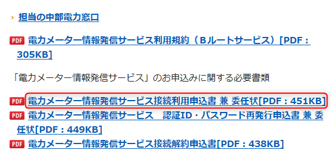

<iframe src="https://hatenablog-parts.com/embed?url=https%3A%2F%2Fblog.hitsujin.jp%2Fentry%2F2018%2F07%2F09%2F235514" title="中部電力からきらめきでんきに乗り換えた - Pandora Pocket" class="embed-card embed-blogcard" scrolling="no" frameborder="0" style="display: block; width: 100%; height: 190px; max-width: 500px; margin: 10px 0px;"></iframe>

以前<a class="keyword" href="http://d.hatena.ne.jp/keyword/%C3%E6%C9%F4%C5%C5%CE%CF">中部電力</a>から別の電力会社に切り替えるため、スマートメータを取り付けてもらったんですが、<a class="keyword" href="http://d.hatena.ne.jp/keyword/%A5%B9%A5%DE%A1%BC%A5%C8%A5%E1%A1%BC%A5%BF%A1%BC">スマートメーター</a>って電力会社との通信だけでなく、個人に対して通信もできるようになってるんですよね。（HEMSとか）

今の電力会社は電力情報を<a class="keyword" href="http://d.hatena.ne.jp/keyword/API">API</a>でくれないので（くれる電力会社あるんだろうか）、日々の電力消費量を見るためにはサイトを見る必要があるんですが、<a class="keyword" href="http://d.hatena.ne.jp/keyword/%A5%B9%A5%DE%A1%BC%A5%C8%A5%E1%A1%BC%A5%BF%A1%BC">スマートメーター</a>から取得できるならそれで確認できるなということで、試してみることにしました。

***

<iframe src="https://hatenablog-parts.com/embed?url=http%3A%2F%2Froute-b.iij.ad.jp%2Farchives%2F157" title="Bルートを利用するまでの流れについて| スマートメーターBルートブログ" class="embed-card embed-webcard" scrolling="no" frameborder="0" style="display: block; width: 100%; height: 155px; max-width: 500px; margin: 10px 0px;"></iframe>

<a class="keyword" href="http://d.hatena.ne.jp/keyword/%A5%B9%A5%DE%A1%BC%A5%C8%A5%E1%A1%BC%A5%BF%A1%BC">スマートメーター</a>と電力会社との通信をAルート、<a class="keyword" href="http://d.hatena.ne.jp/keyword/%A5%B9%A5%DE%A1%BC%A5%C8%A5%E1%A1%BC%A5%BF%A1%BC">スマートメーター</a>と個人との通信をBルートというらしいのですが、このBルートを使うためには電力会社に申請をする必要があります。 
なお、すでに新電力会社などに切り替えていたとしても、申請は<a class="keyword" href="http://d.hatena.ne.jp/keyword/%C5%EC%B5%FE%C5%C5%CE%CF">東京電力</a>、<a class="keyword" href="http://d.hatena.ne.jp/keyword/%C3%E6%C9%F4%C5%C5%CE%CF">中部電力</a>などの既存電力会社に対して申請する必要があります。 
私の場合は愛知県なので<a class="keyword" href="http://d.hatena.ne.jp/keyword/%C3%E6%C9%F4%C5%C5%CE%CF">中部電力</a>に対して申請を行います。

<a class="keyword" href="http://d.hatena.ne.jp/keyword/%C5%EC%B5%FE%C5%C5%CE%CF">東京電力</a>と<a class="keyword" href="http://d.hatena.ne.jp/keyword/%B6%E5%BD%A3%C5%C5%CE%CF">九州電力</a>はウェブから申し込みができるらしいのですが、残念ながら<a class="keyword" href="http://d.hatena.ne.jp/keyword/%C3%E6%C9%F4%C5%C5%CE%CF">中部電力</a>は書類を手書きして郵送するか窓口に直接持っていく必要があります。なんて面倒な・・・。

<iframe src="https://hatenablog-parts.com/embed?url=https%3A%2F%2Fwww.chuden.co.jp%2Fhome%2Fsmartmeter%2Fintro%2Fuse%2Findex.html" title="中部電力｜スマートメーターを活用してできること - スマートメーターの導入について" class="embed-card embed-webcard" scrolling="no" frameborder="0" style="display: block; width: 100%; height: 155px; max-width: 500px; margin: 10px 0px;"></iframe>

上記サイトから電力メーター情報発信サービス接続利用申込書をダウンロード、印刷し、必要事項を記載します。 
計量器の施設場所に関しては戸建てなので上記以外にしておきました。

この書類と本人確認書類のコピー(私は運転免許証にしました)を封筒に入れて、営業所に送付すれば手続きが行われます。 
営業所は

<iframe src="https://hatenablog-parts.com/embed?url=https%3A%2F%2Fwww.chuden.co.jp%2Fcorporate%2Fcompany%2Fofficelist%2Feigyosho%2Findex.html" title="中部電力｜営業所・サービスステーション - 所在地一覧" class="embed-card embed-webcard" scrolling="no" frameborder="0" style="display: block; width: 100%; height: 155px; max-width: 500px; margin: 10px 0px;"></iframe>

から最寄りを調べてください。

2週間ほどで接続に必要な情報が書かれたはがきが届くらしいです。

