
大学時代に使ったっきり全く使う機会のなかった<a class="keyword" href="http://d.hatena.ne.jp/keyword/Mac">Mac</a>を触れる環境が欲しいなと思いぽちりました。

<a href="http://www.amazon.co.jp/exec/obidos/ASIN/B00OLBDJZ2/ovis91-22/">APPLE Mac mini (1.4GHz Dual Core i5/4GB/500GB/Intel HD 5000) MGEM2J/A</a>
<ul><li>出版社/メーカー: アップル</li><li>発売日: 2014/10/21</li><li>メディア: Personal Computers</li><li><a href="http://d.hatena.ne.jp/asin/B00OLBDJZ2/ovis91-22" target="_blank">この商品を含むブログを見る</a></li></ul>

***

PayPayの某20%キャッシュバックのタイミングだったので、<a class="keyword" href="http://d.hatena.ne.jp/keyword/%A5%D3%A5%C3%A5%AF%A5%AB%A5%E1%A5%E9">ビックカメラ</a>に行ったところ在庫なし。 
とはいえ予約後2週間程度で在庫が復活したようで、SMSで連絡が来ていました。

<h4><a class="keyword" href="http://d.hatena.ne.jp/keyword/%B3%AB%C9%F5">開封</a>の儀</h4>

<a class="keyword" href="http://d.hatena.ne.jp/keyword/%A5%D3%A5%C3%A5%AF%A5%AB%A5%E1%A5%E9">ビックカメラ</a>で受け取った時の箱はこれ。 
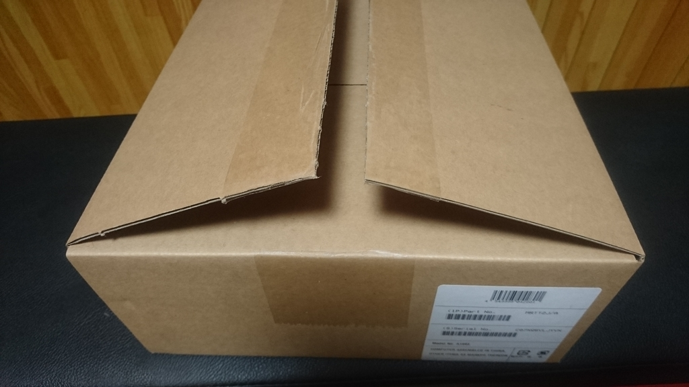   
箱を開けたら<a class="keyword" href="http://d.hatena.ne.jp/keyword/Mac%20mini">Mac mini</a>が見えたので、<a class="keyword" href="http://d.hatena.ne.jp/keyword/Apple">Apple</a>にしてはやたら武骨な箱を採用してるのな・・・と思ったのですが、 
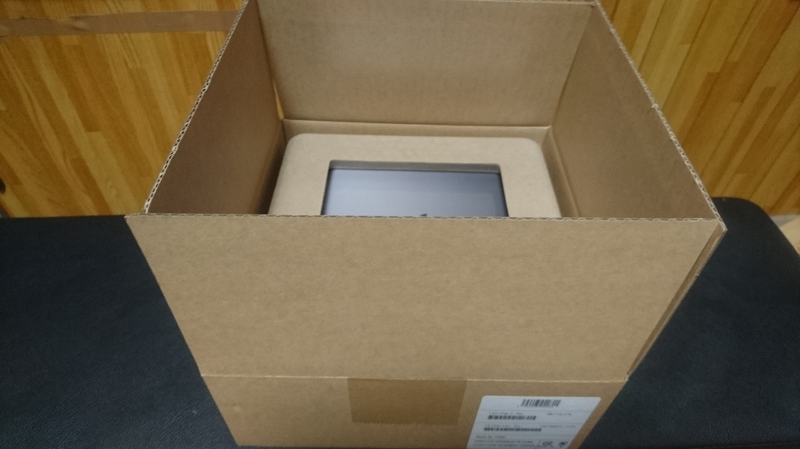 
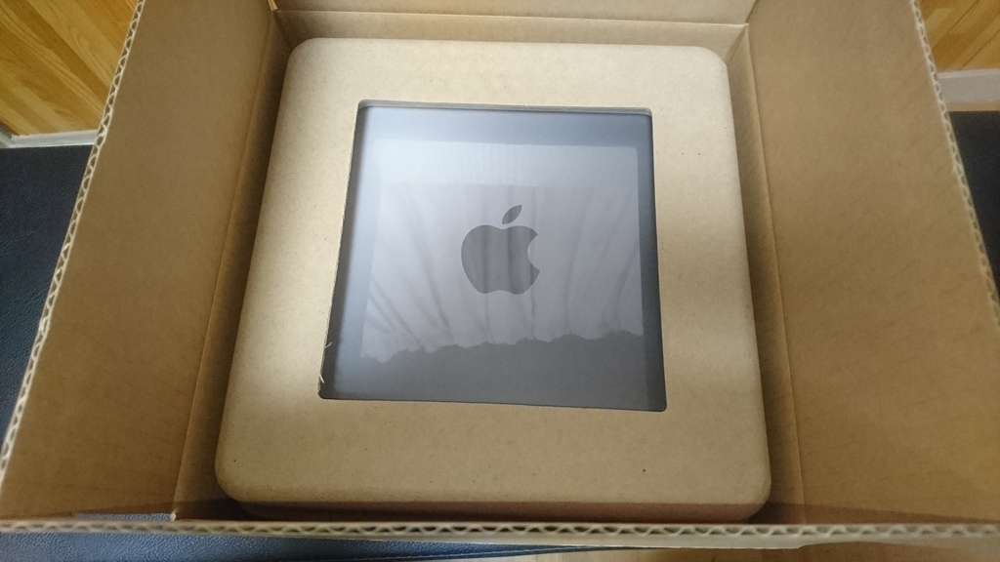

そんなわけなかった。 
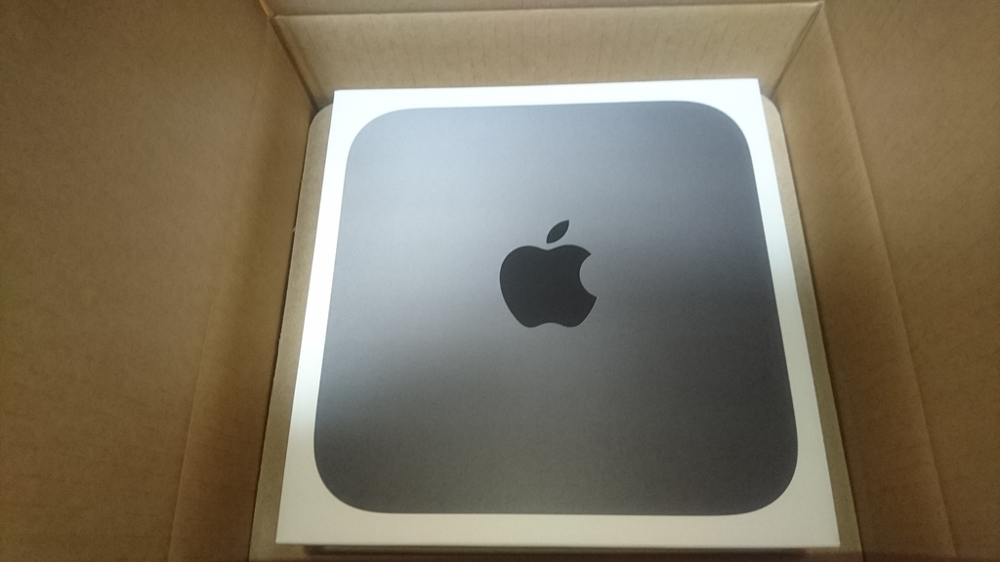

化粧箱を開けると、どーん 
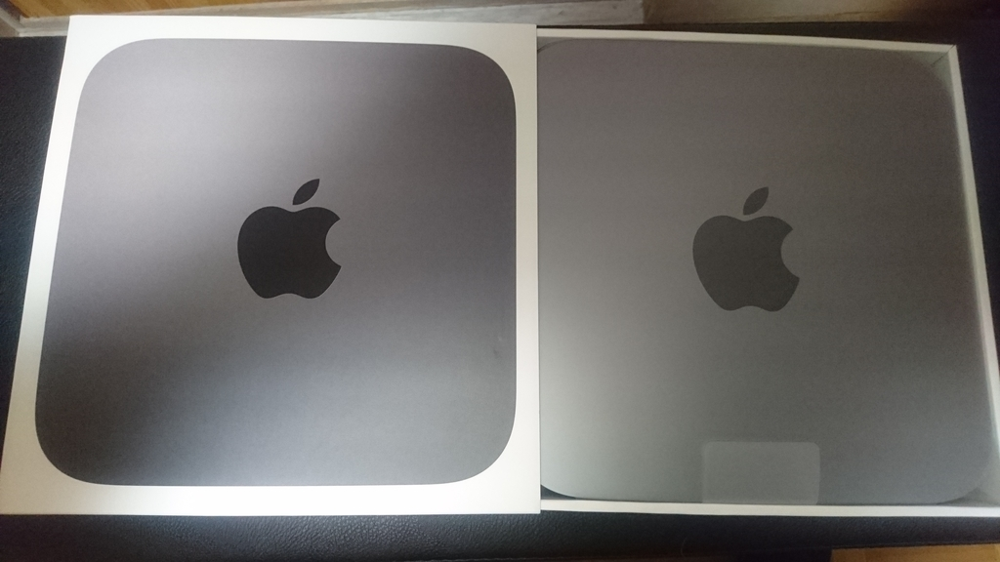

裏っ側 
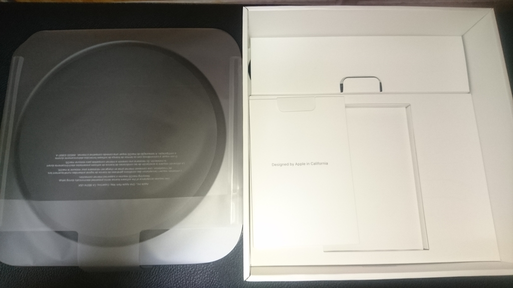

<a class="keyword" href="http://d.hatena.ne.jp/keyword/%C5%C5%B8%BB%A5%B1%A1%BC%A5%D6%A5%EB">電源ケーブル</a>はメガネタイプ。 
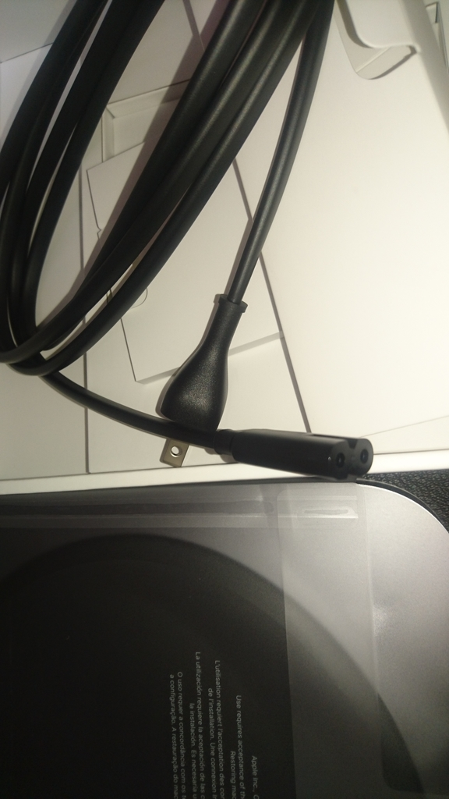

箱に入っていた資料。 
出力は<a class="keyword" href="http://d.hatena.ne.jp/keyword/HDMI">HDMI</a>。今回はCPU以外標準のままなので、<a class="keyword" href="http://d.hatena.ne.jp/keyword/Ethernet">Ethernet</a>は1Gbpsのもの。 
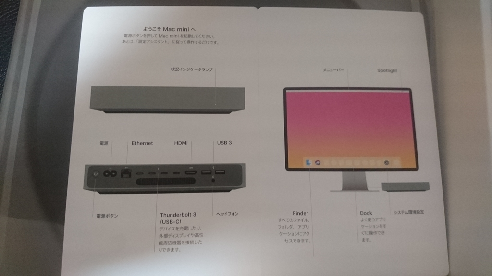

<h4>設置</h4>

今回どう設置するか考えた結果、縦置きすることにしたのでこちらを購入。 

<a href="http://www.amazon.co.jp/exec/obidos/ASIN/B07KSVBMZS/ovis91-22/">【国内正規品】NewerTech NuStand Alloy Desktop stand Mac mini Late 2010（ニューアテック デスクトップ アルミスタンド Mac mini 2010以降）</a>
<ul><li>出版社/メーカー: NewerTech</li><li>メディア: オフィス用品</li><li><a href="http://d.hatena.ne.jp/asin/B07KSVBMZS/ovis91-22" target="_blank">この商品を含むブログを見る</a></li></ul>

壁掛けにするか悩んだんですが、取り回しが楽じゃないので止めました。

届いた外箱と中身。 
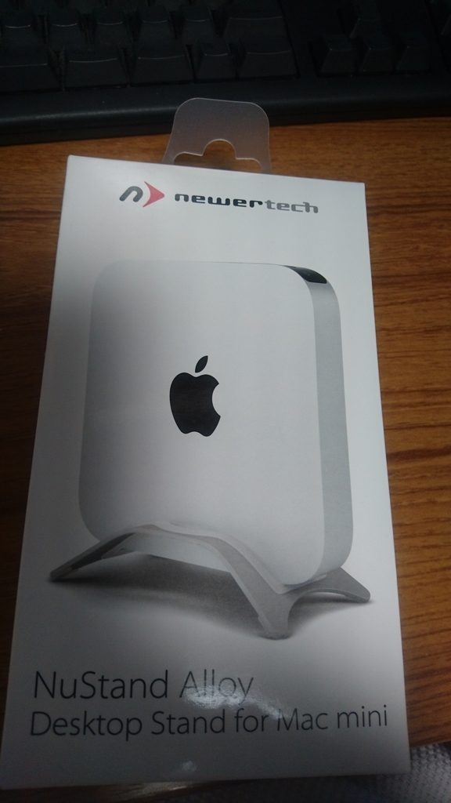
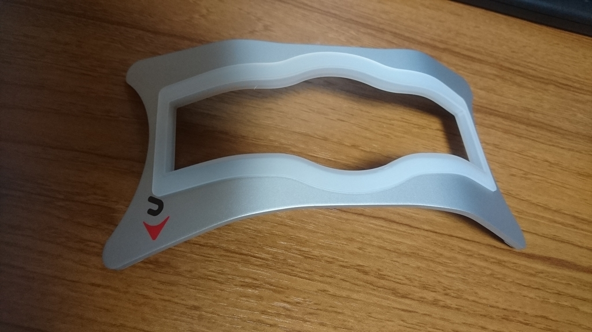

こんな感じで設置しています。 
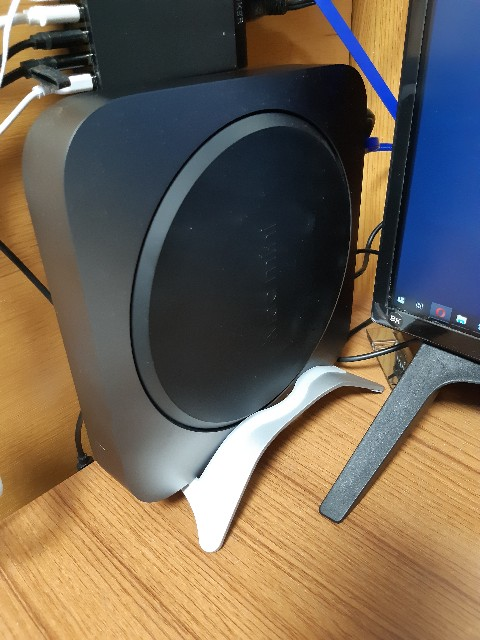

メ<a class="keyword" href="http://d.hatena.ne.jp/keyword/%A5%E2%A5%EA%A1%BC">モリー</a>は別途購入しました。 
取り付けは別の記事にまとめます。

