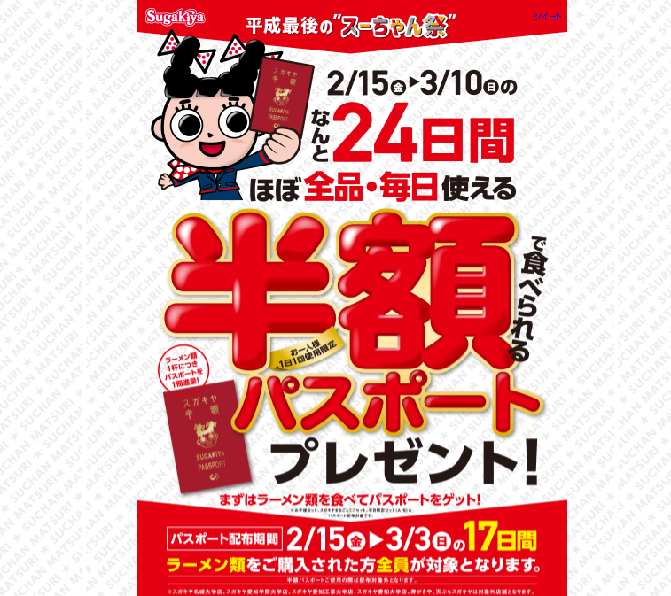
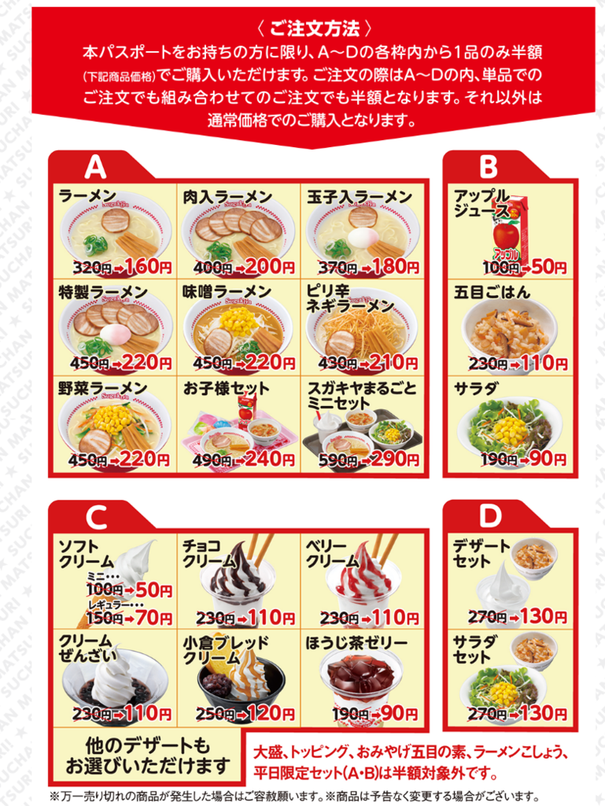

<blockquote class="twitter-tweet" data-lang="ja">
<a class="keyword" href="http://d.hatena.ne.jp/keyword/%A5%B9%A5%AC%A5%AD%A5%E4">スガキヤ</a>半額パスポート今日からか。行かねば。 <a class="keyword" href="http://d.hatena.ne.jp/keyword/%A5%B9%A5%AC%A5%AD%A5%E4">スガキヤ</a>、平成最後のスーちゃん祭り。パスポート利用で半額に【2019年】<a href="https://t.co/9CsOEHlNkf">https://t.co/9CsOEHlNkf</a>
&mdash; Ovis＠🐑のひと (@Pandora_Ovis) <a href="https://twitter.com/Pandora_Ovis/status/1096258123893854208?ref_src=twsrc%5Etfw">2019年2月15日</a></blockquote>

毎年3月初旬になると<a class="keyword" href="http://d.hatena.ne.jp/keyword/%A5%B9%A5%AC%A5%AD%A5%E4">スガキヤ</a>でスーちゃん祭という半額デー(土日の二日間)があるんですが、今年は平成最後ということで、例年以上の大盤振る舞いなキャンペーンが始まりました。

<iframe src="https://hatenablog-parts.com/embed?url=http%3A%2F%2Fwww.sugakico.co.jp%2Fcampaign%2F2019hangaku%2Fsuchanmatsuri.html" title="スガキヤ 平成最後の“スーちゃん祭”" class="embed-card embed-webcard" scrolling="no" frameborder="0" style="display: block; width: 100%; height: 155px; max-width: 500px; margin: 10px 0px;"></iframe>

***

<h4>半額パスポート</h4>

というわけで、2/15(金)～3/10(日)の24日間、ほぼ全品が半額で食べられるパスポートがもらえます。

パスポートがもらえる期間は2/15(金)～3/3(日)の15日間。 
つまり今日からです。

<h4>もらってきました</h4>

というわけでもらってきました。

<blockquote class="twitter-tweet" data-lang="ja">
<a class="keyword" href="http://d.hatena.ne.jp/keyword/%A5%B9%A5%AC%A5%AD%A5%E4">スガキヤ</a>なう。 半額パスポートゲットだぜ <a href="https://t.co/f7PS4nhpFb">pic.twitter.com/f7PS4nhpFb</a>
&mdash; Ovis＠🐑のひと (@Pandora_Ovis) <a href="https://twitter.com/Pandora_Ovis/status/1096265862909124609?ref_src=twsrc%5Etfw">2019年2月15日</a></blockquote>

もらえる条件は

<ul>
<li>ラーメン類を注文していること</li>
<li>半額パスポートを利用して注文していないこと</li>
</ul>

の二つ。 
ただし、おそらくですが半額対象外の店舗ではもらえないかと。

<h4>パスポートの範囲</h4>

今回は一日一回上の画像の通り、A,B,C,Dの各枠から一種類ずつ選んで利用できるようです。 
なので、一つのパスポートで複数のラーメンを注文したり、デザートを複数注文することはできません。 
あわよくば複数のデザートを注文したかったのに・・・（でぶ）。

また、大盛やトッピングも対象外。

平日限定のセット(500円のやつ)も対象外だそうで。

なので家族で食べるなら早いうちに家族皆で定価でラーメンを食べて、それぞれ半額パスポートを手に入れておく必要があると。

<h4>半額対象外店舗</h4>

また、上に書いたように半額対象外の店舗もあります。

大学構内の店舗(<a class="keyword" href="http://d.hatena.ne.jp/keyword/%CC%BE%BE%EB%C2%E7%B3%D8">名城大学</a>店、<a class="keyword" href="http://d.hatena.ne.jp/keyword/%B0%A6%C3%CE%B3%D8%B1%A1%C2%E7%B3%D8">愛知学院大学</a>店、<a class="keyword" href="http://d.hatena.ne.jp/keyword/%B0%A6%C3%CE%B9%A9%B6%C8%C2%E7%B3%D8">愛知工業大学</a>店、<a class="keyword" href="http://d.hatena.ne.jp/keyword/%B0%A6%C3%CE%C2%E7%B3%D8">愛知大学</a>店)、<a class="keyword" href="http://d.hatena.ne.jp/keyword/%BC%F7%A4%AC%A4%AD%A4%E4">寿がきや</a>(いわゆる高級<a class="keyword" href="http://d.hatena.ne.jp/keyword/%A5%B9%A5%AC%A5%AD%A5%E4">スガキヤ</a>)、天ぷら<a class="keyword" href="http://d.hatena.ne.jp/keyword/%A5%B9%A5%AC%A5%AD%A5%E4">スガキヤ</a>が対象外店舗です。 
ところでわが母校中部大学にあった<a class="keyword" href="http://d.hatena.ne.jp/keyword/%A5%B9%A5%AC%A5%AD%A5%E4">スガキヤ</a>潰れたのか・・・。

なお、<a class="keyword" href="http://d.hatena.ne.jp/keyword/%BC%F7%A4%AC%A4%AD%A4%E4">寿がきや</a>に関しては例年通り3/2,3の土日に半額セールをやるようです。

