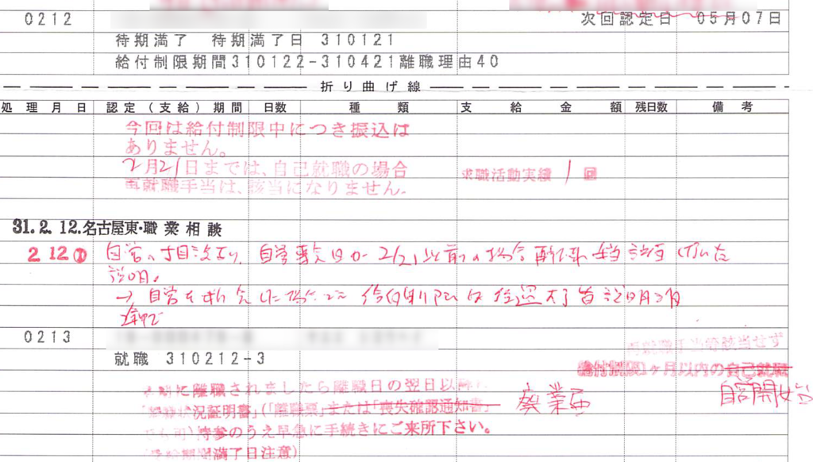

<a class="keyword" href="http://d.hatena.ne.jp/keyword/%A5%D5%A5%EA%A1%BC%A5%E9%A5%F3%A5%B9">フリーランス</a>になって早々にそんな話題かよ！！！！って言われそうなんですが、大事なことなので忘れないうちにメモっておきます。

<h4>基本的にもらえない</h4>

当たり前なのですが、失業給付金は<a class="keyword" href="http://d.hatena.ne.jp/keyword/%B8%DB%CD%D1%CA%DD%B8%B1">雇用保険</a>に入っていてかつ加入期間が通算12カ月以上ある場合にのみもらえる制度のため、<a class="keyword" href="http://d.hatena.ne.jp/keyword/%A5%D5%A5%EA%A1%BC%A5%E9%A5%F3%A5%B9">フリーランス</a>は<a class="keyword" href="http://d.hatena.ne.jp/keyword/%B8%DB%CD%D1%CA%DD%B8%B1">雇用保険</a>に加入していない以上もらえません。

<h4><a class="keyword" href="http://d.hatena.ne.jp/keyword/%A5%D5%A5%EA%A1%BC%A5%E9%A5%F3%A5%B9">フリーランス</a>以前の職を辞めた日から1年間以内なら</h4>

で、ここが本題ですが、<a class="keyword" href="http://d.hatena.ne.jp/keyword/%A5%D5%A5%EA%A1%BC%A5%E9%A5%F3%A5%B9">フリーランス</a>になる前にサラリーマンとして仕事していた場合(上記の加入期間を満たしていることが前提)、失業してから1年間(受給期間完了年月日まで)以内に<a class="keyword" href="http://d.hatena.ne.jp/keyword/%A5%D5%A5%EA%A1%BC%A5%E9%A5%F3%A5%B9">フリーランス</a>になって、受給期間完了年月日までに<a class="keyword" href="http://d.hatena.ne.jp/keyword/%A5%D5%A5%EA%A1%BC%A5%E9%A5%F3%A5%B9">フリーランス</a>をやめた(廃業届を提出した)ときだけ失業給付金をもらうことができます。 
つまりは前職の<a class="keyword" href="http://d.hatena.ne.jp/keyword/%B8%DB%CD%D1%CA%DD%B8%B1">雇用保険</a>分、受給資格が復活します。

なので、<a class="keyword" href="http://d.hatena.ne.jp/keyword/%A5%D5%A5%EA%A1%BC%A5%E9%A5%F3%A5%B9">フリーランス</a>になったもののやはり私には<a class="keyword" href="http://d.hatena.ne.jp/keyword/%A5%D5%A5%EA%A1%BC%A5%E9%A5%F3%A5%B9">フリーランス</a>は無理だった・・・！！！となった場合、前職の離職年月日から一年以内だったらもらえるわけです。

<h4>再就職手当をもらっていた場合はどうなる？</h4>

再就職時、一年以上の雇用が見込まれる場合にもらえる再就職手当をもらっていた場合、残りの3割分が失業給付金として支給されることになります。 
多分就業手当の場合も同じはず。

ここでいう3割というのは、再就職手当の計算式60%または70%分が支給されており、残り分が支給されるという意味です。

<a class="keyword" href="http://d.hatena.ne.jp/keyword/%A5%D5%A5%EA%A1%BC%A5%E9%A5%F3%A5%B9">フリーランス</a>になった段階で、まだ所定給付日数から受け取り期間を差っ引いた残日数が給付日数の2/3以上であれば、支給率70%なので残りの30%分、2/3未満なら支給率60%なので残りの40%分が失業給付金として支給されます。

<h4>必要なもの</h4>

<a class="keyword" href="http://d.hatena.ne.jp/keyword/%A5%D5%A5%EA%A1%BC%A5%E9%A5%F3%A5%B9">フリーランス</a>をやめて再度失業給付金をもらう場合、

<ul>
<li>廃業届</li>
<li><a class="keyword" href="http://d.hatena.ne.jp/keyword/%B8%DB%CD%D1%CA%DD%B8%B1">雇用保険</a>受給資格者証</li>
</ul>

の二点が必要になります。

この二つを持って<a class="keyword" href="http://d.hatena.ne.jp/keyword/%B8%DB%CD%D1%CA%DD%B8%B1">雇用保険</a>給付課で申請を行えば受給資格が復活します。

<h4>初回認定日より前に<a class="keyword" href="http://d.hatena.ne.jp/keyword/%A5%D5%A5%EA%A1%BC%A5%E9%A5%F3%A5%B9">フリーランス</a>になった場合</h4>

ちゃんと聞いたわけでなく、調べた情報なので確信持ってないのですが、自己都合退職者が初回認定日より前に開業届を出した場合、廃業届を出してもすぐには受給できません。 
というのも、初回認定日で認定されて初めて待機期間満了となるので、待機期間が満了していないとみなされるからのようです。 
この場合、自己都合退職の3か月間の給付制限期間が再度発生することになります。

初回認定された後だったら、給付制限期間を過ぎてから廃業届を出したのであればすぐに給付されるようになるようです。

<h4>余談</h4>

初回認定日を超えてすぐに<a class="keyword" href="http://d.hatena.ne.jp/keyword/%A5%D5%A5%EA%A1%BC%A5%E9%A5%F3%A5%B9">フリーランス</a>になる場合(正確には自己就職する場合)、再就職手当はもらえません。 
というのも待機期間満了後一か月間については<a class="keyword" href="http://d.hatena.ne.jp/keyword/%A5%CF%A5%ED%A1%BC%A5%EF%A1%BC%A5%AF">ハローワーク</a>等又は許可・届出のある職業紹介事業者の紹介により就職したものでない場合支給されないというルールがあるため。 
私の場合<a class="keyword" href="http://d.hatena.ne.jp/keyword/%A5%CF%A5%ED%A1%BC%A5%EF%A1%BC%A5%AF">ハローワーク</a>には2019年1月15日(火曜)に手続きをして、1/21まで待機期間だったため、2/21までは再就職手当の支給対象外扱いとなります。

***