
CPU以外標準のままの構成となっている<a class="keyword" href="http://d.hatena.ne.jp/keyword/Mac%20mini">Mac mini</a>。 
メ<a class="keyword" href="http://d.hatena.ne.jp/keyword/%A5%E2%A5%EA%A1%BC">モリー</a>だけは別途増設可能なので、自分でメ<a class="keyword" href="http://d.hatena.ne.jp/keyword/%A5%E2%A5%EA%A1%BC">モリー</a>を購入して増設することにしました。

<iframe src="https://hatenablog-parts.com/embed?url=https%3A%2F%2Fblog.hitsujin.jp%2Fentry%2F2019%2F02%2F07%2F135437" title="Mac miniをぽちるなどした - Pandora Pocket" class="embed-card embed-blogcard" scrolling="no" frameborder="0" style="display: block; width: 100%; height: 190px; max-width: 500px; margin: 10px 0px;"></iframe>

***

動画も見ながらだとわかりやすいかも。

<iframe width="480" height="270" src="https://www.youtube.com/embed/2UrSLnnMyeg?feature=oembed" frameborder="0" allow="accelerometer; autoplay; encrypted-media; gyroscope; picture-in-picture" allowfullscreen></iframe>

<h3>前準備</h3>

<h4>メ<a class="keyword" href="http://d.hatena.ne.jp/keyword/%A5%E2%A5%EA%A1%BC">モリー</a></h4>

これがなくちゃ始まらない。

購入したメ<a class="keyword" href="http://d.hatena.ne.jp/keyword/%A5%E2%A5%EA%A1%BC">モリー</a>は下記のもの。

<a href="http://www.amazon.co.jp/exec/obidos/ASIN/B01BGZEVHU/ovis91-22/">CORSAIR DDR4 SO-DIMM メモリモジュール VENGEANCE SO-DIMM シリーズ 16GB×2枚キット CMSX32GX4M2A2666C18</a>
<ul><li>出版社/メーカー: Corsair</li><li>発売日: 2016/03/10</li><li>メディア: Personal Computers</li><li><a href="http://d.hatena.ne.jp/asin/B01BGZEVHU/ovis91-22" target="_blank">この商品を含むブログを見る</a></li></ul>

最近はメ<a class="keyword" href="http://d.hatena.ne.jp/keyword/%A5%E2%A5%EA%A1%BC">モリー</a>が安くなってきて大変すばらしい。

<h4>ドライバー</h4>

<a class="keyword" href="http://d.hatena.ne.jp/keyword/Mac%20mini">Mac mini</a>はトルクスねじで中のボードなどが固定されてるんですが、一般的な<a class="keyword" href="http://d.hatena.ne.jp/keyword/%A5%C8%A5%EB%A5%AF%A5%B9%A5%C9%A5%E9%A5%A4%A5%D0%A1%BC">トルクスドライバー</a>だと開けられない可能性があります。 
というのもねじ穴の中央に突起があり、ドライバー側にも細工がないとねじを回せないのです。(<a class="keyword" href="http://d.hatena.ne.jp/keyword/Wikipedia">Wikipedia</a>によるとセキュリ<a class="keyword" href="http://d.hatena.ne.jp/keyword/%A5%C6%A5%A3%A1%BC">ティー</a>トルクス(TR)というらしい）

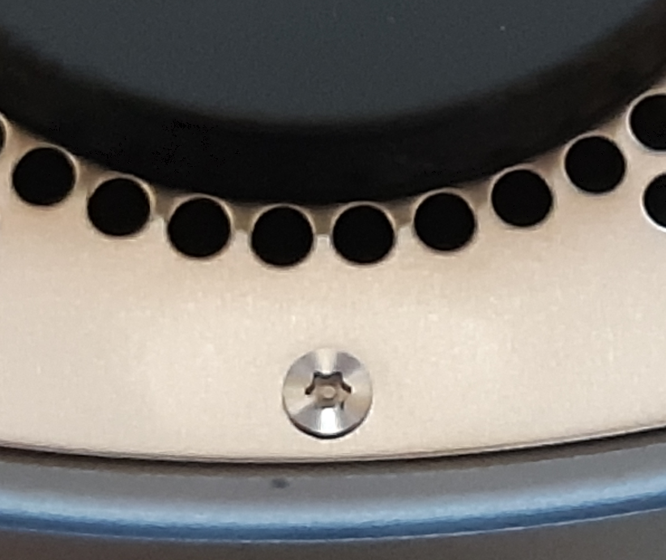

というわけで、対応したドライバーが必要になります。 
普通のホームセンターだと見当たらないようなので、通販で買うかPCショップで買いましょう。

こんなの。

<a href="http://www.amazon.co.jp/exec/obidos/ASIN/B01FU0URFW/ovis91-22/">アイネックス iPhone専用工具付き 特殊精密工具51点セット TL-016</a>
<ul><li>出版社/メーカー: <a class="keyword" href="http://d.hatena.ne.jp/keyword/AINEX">AINEX</a></li><li>発売日: 2016/05/24</li><li>メディア: Personal Computers</li><li><a href="http://d.hatena.ne.jp/asin/B01FU0URFW/ovis91-22" target="_blank">この商品を含むブログを見る</a></li></ul>

<a href="http://www.amazon.co.jp/exec/obidos/ASIN/B077MH1D84/ovis91-22/">トルクスドライバーセット T6 T8 T10 精密 ヘックスローブ レンチセット L型 いじり止めネジ対応 8本組 星型 特殊ドライバー 磁石付き Mac mini 分解用 Mac book HDD解体 ナイフ修理工具</a>
<ul><li>出版社/メーカー: Kingsdun tools</li><li>メディア: エレクトロニクス</li><li><a href="http://d.hatena.ne.jp/asin/B077MH1D84/ovis91-22" target="_blank">この商品を含むブログを見る</a></li></ul>

トルクスドライバについて、T6タイプに関してはセキュリティトルクス（TR6)になっていて、T5、T10は普通のトルクスねじになっています。

<h3>分解</h3>

<h4>黒いカバーの取り外し</h4>

黒いカバーの隙間にへらやクレジットカードなどの硬質なものを差し込んで、ぐるっと一周させながらカバーを取り外します。 
私はちょうど机の上にもう使ってない<a class="keyword" href="http://d.hatena.ne.jp/keyword/manaca">manaca</a>があったので、それを利用しました。 
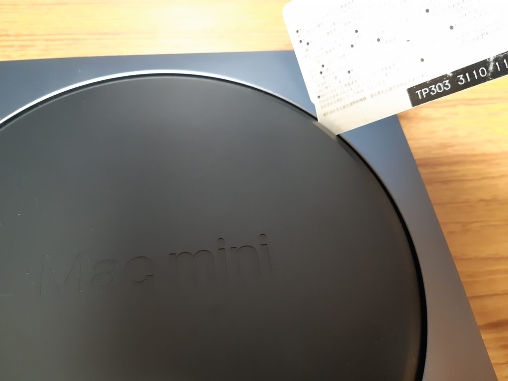

<h4>銀色のふたの取り外し</h4>

<a class="keyword" href="http://d.hatena.ne.jp/keyword/WiFi">WiFi</a>、Bluteoothのアンテナが付いている銀色のカバーを取り外すために、TR6のドライバーでねじを外します。 
写真にある通り、大きさが異なるねじ(どちらもTR6)が交互についている形です。 
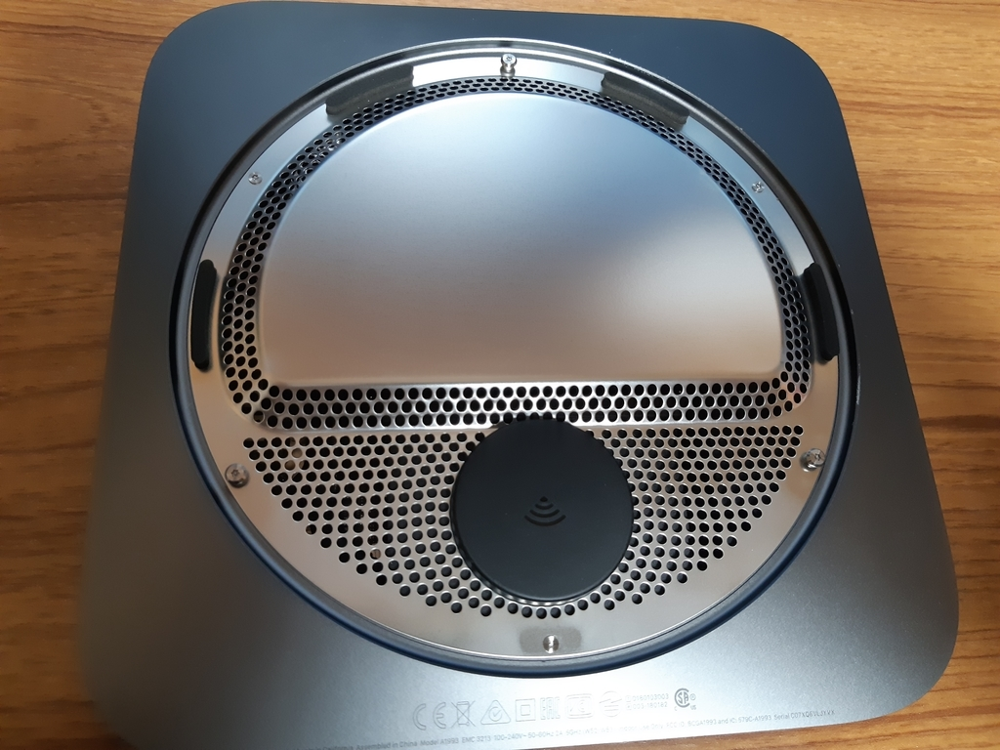

6個のねじを外すと銀色のカバーが外せるのですが、アンテナ部分と本体側とでケーブルでつながっているため、いったん横にそっとずらして、ケーブルを本体に固定するねじ(青い枠で囲った部分)を外してから、赤い枠で囲ったケーブルの端子をケーブルを上に持ち上げるようにして取り外します。

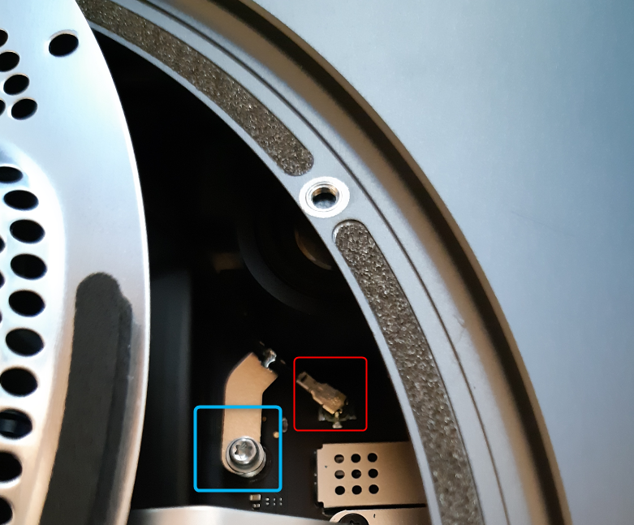

<h4>排気ファンの取り外し</h4>

排気ファンのトルクスねじを取り外します。 
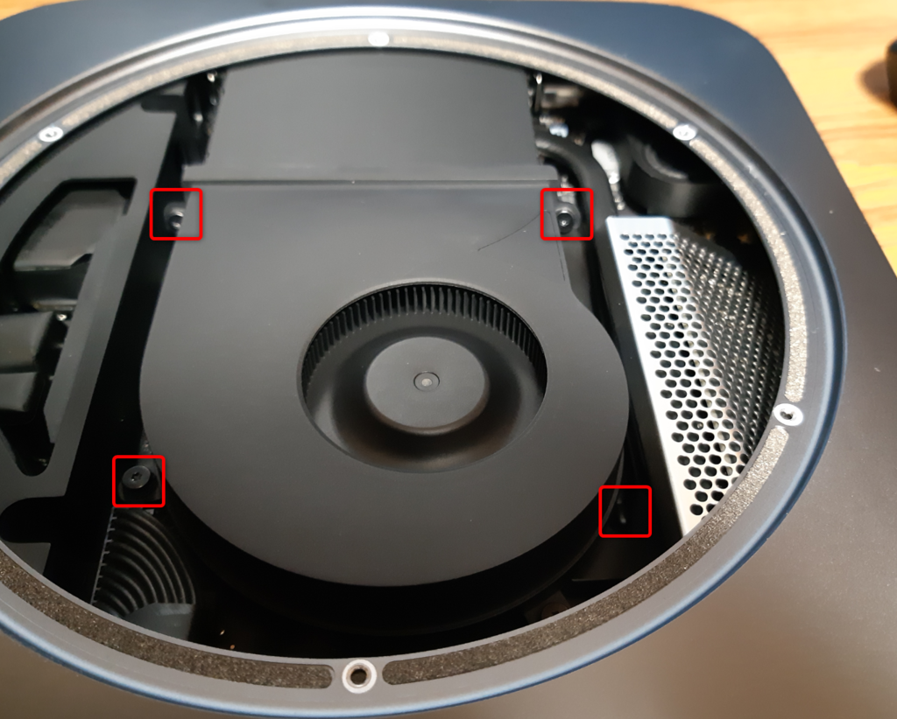

ファンをそっと持ち上げると、本体とつながっているケーブルが見えるので、上に持ち上げるようにして取り外します。

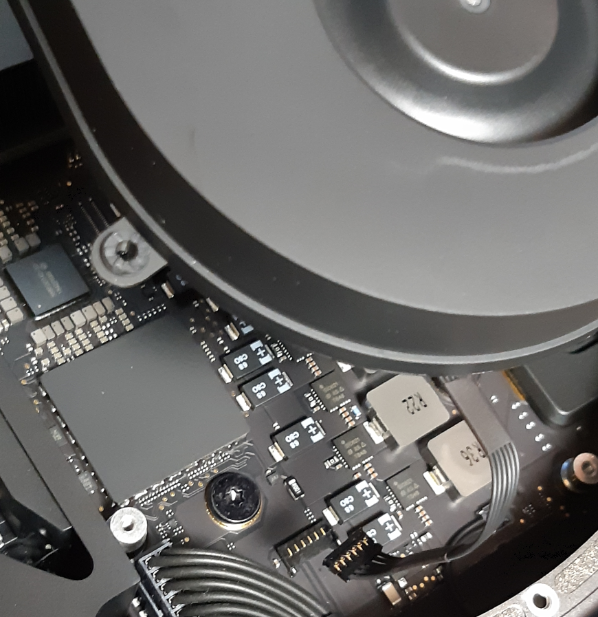

<h4><a class="keyword" href="http://d.hatena.ne.jp/keyword/%C5%C5%B8%BB%A5%B1%A1%BC%A5%D6%A5%EB">電源ケーブル</a>の取り外し</h4>

<a class="keyword" href="http://d.hatena.ne.jp/keyword/%C5%C5%B8%BB%A5%B1%A1%BC%A5%D6%A5%EB">電源ケーブル</a>とLEDケーブルを取り外します。どちらも上に持ち上げるようにして取り外します。

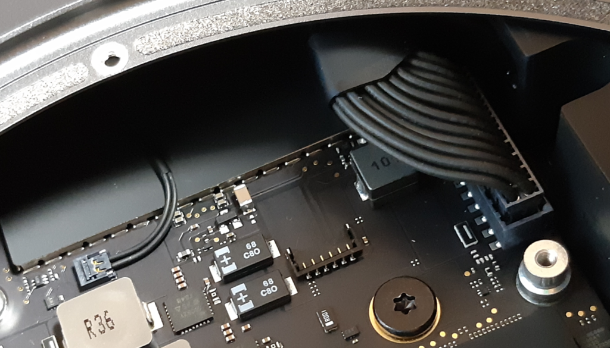

<h4>ロジックボードと本体を固定するねじの取り外し</h4>

T10のドライバーでねじを取り外します。 
これ結構固く固定されているので、細いドライバーだと力が入らなくてうまく外せないです。 
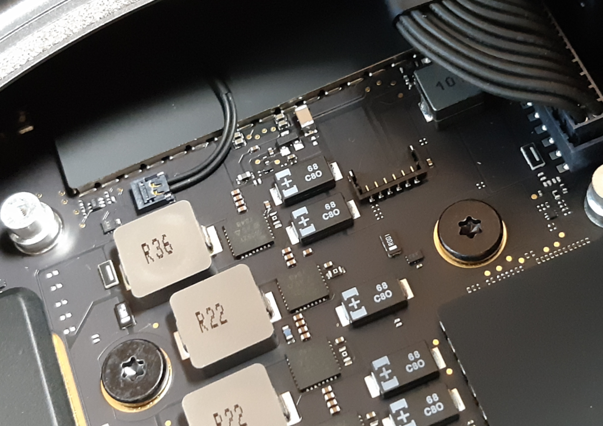

<h4>ロジックボードの取り外し</h4>

矢印の方向にロジックボードを押し出すと本体から外れます。 
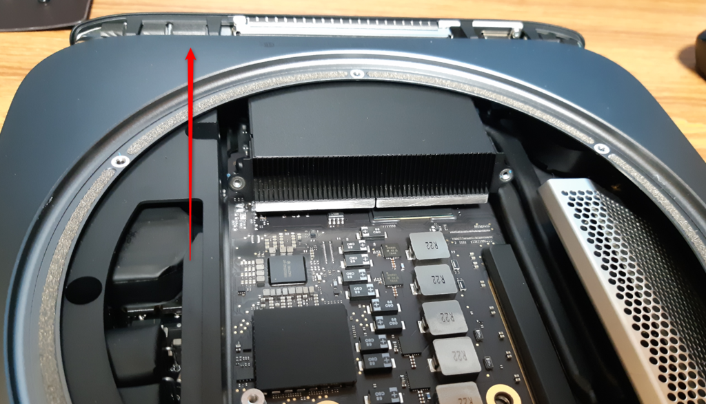

<h4>放熱シールドの取り外し</h4>

メ<a class="keyword" href="http://d.hatena.ne.jp/keyword/%A5%E2%A5%EA%A1%BC">モリー</a>が放熱シールドでおおわれているので、T5ドライバーでねじを外し、シールドを取り外します。 
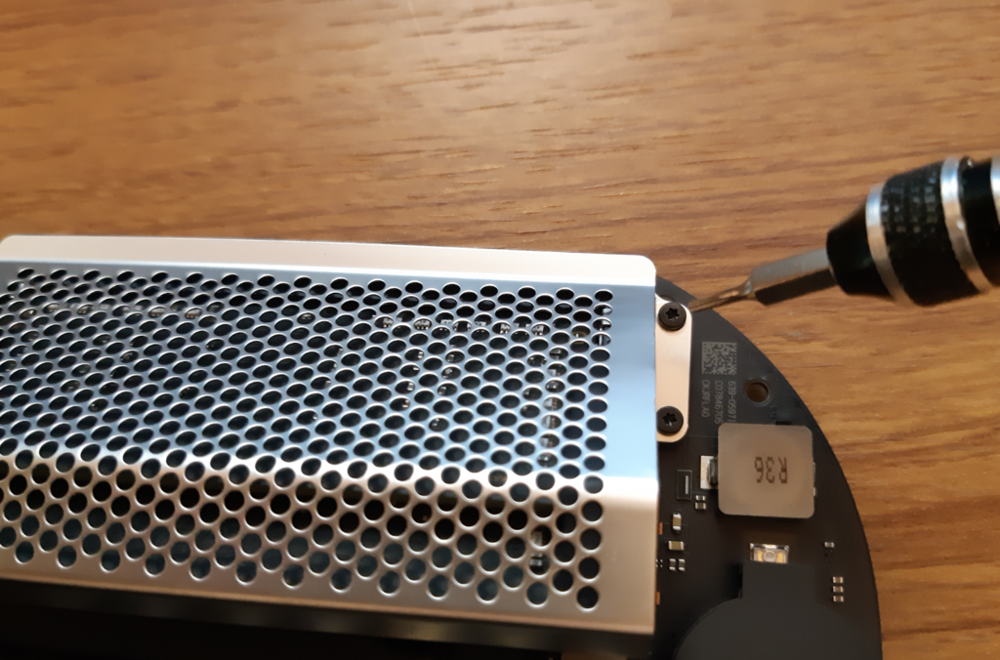

<h4>メ<a class="keyword" href="http://d.hatena.ne.jp/keyword/%A5%E2%A5%EA%A1%BC">モリー</a>の取り外し</h4>

メ<a class="keyword" href="http://d.hatena.ne.jp/keyword/%A5%E2%A5%EA%A1%BC">モリー</a>横のクリップを横にずらすとメ<a class="keyword" href="http://d.hatena.ne.jp/keyword/%A5%E2%A5%EA%A1%BC">モリー</a>が外れます。 
8GBのモデルだと4GBのメ<a class="keyword" href="http://d.hatena.ne.jp/keyword/%A5%E2%A5%EA%A1%BC">モリー</a>が2枚刺さっているようです。 
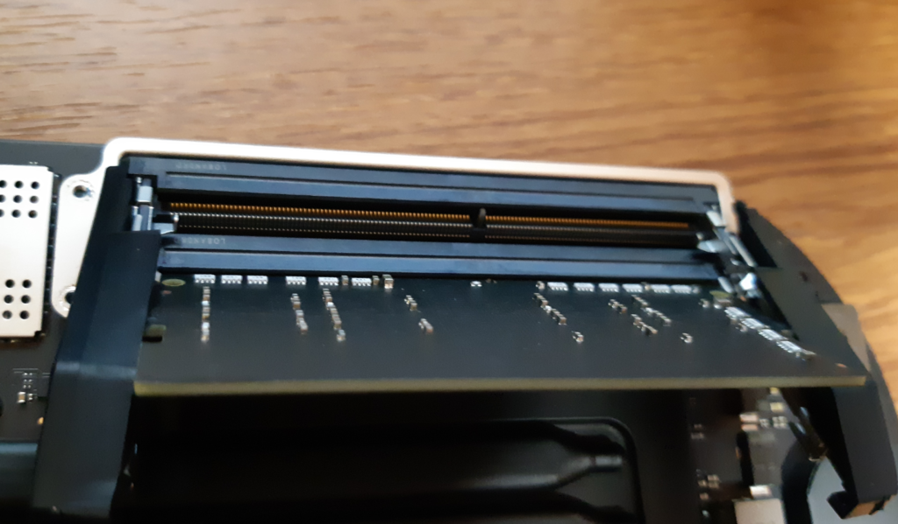

<h4>メ<a class="keyword" href="http://d.hatena.ne.jp/keyword/%A5%E2%A5%EA%A1%BC">モリー</a>の取り付け</h4>

(写真撮り忘れた・・・） 
メ<a class="keyword" href="http://d.hatena.ne.jp/keyword/%A5%E2%A5%EA%A1%BC">モリー</a>の溝と本体側の溝の位置があっていることを確認し、押し込みます。 
押し込んだら横のクリップが止まるはず。

<h4>あとは逆の工程</h4>

あとはシールドを取り付け、ロジックボードを本体に差し込んでねじやケーブルを取り付け、ファンのケーブルを取り付けてファンを固定して、アンテナケーブルを取り付けて銀色カバーを取り付け、黒いカバーをはめ込めば終了。 
ただ、アンテナケーブルに関してはピンセットがないとなかなか端子を本体に固定できないかと思います。 
先にねじでケーブルを固定したうえでやるとうまくいくかと。

<h3>増設後</h3>

もともとは4GBが2枚刺さった8GB搭載マシンだったのが、 
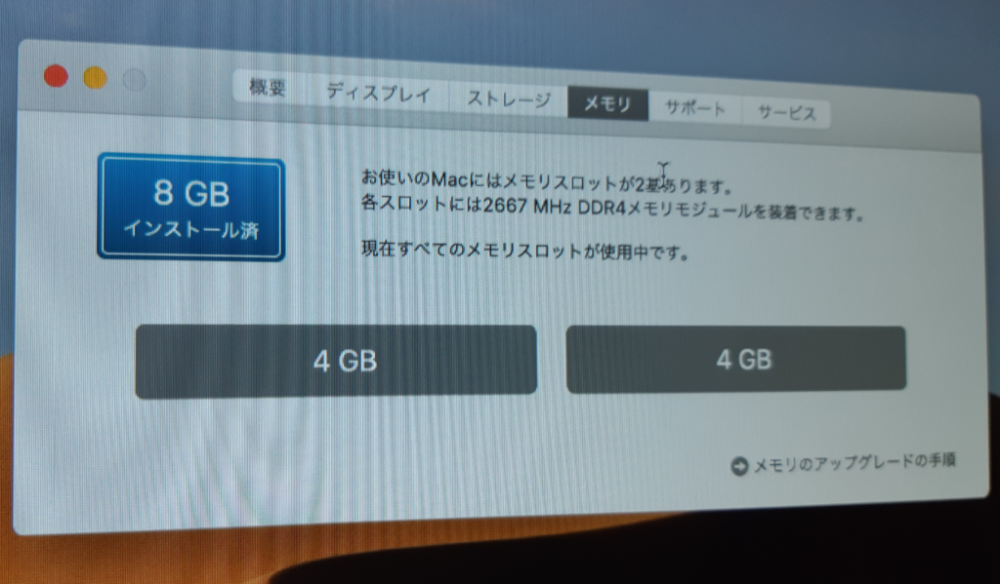

こんな感じで16GBx2の32GB搭載マシンになりました。 
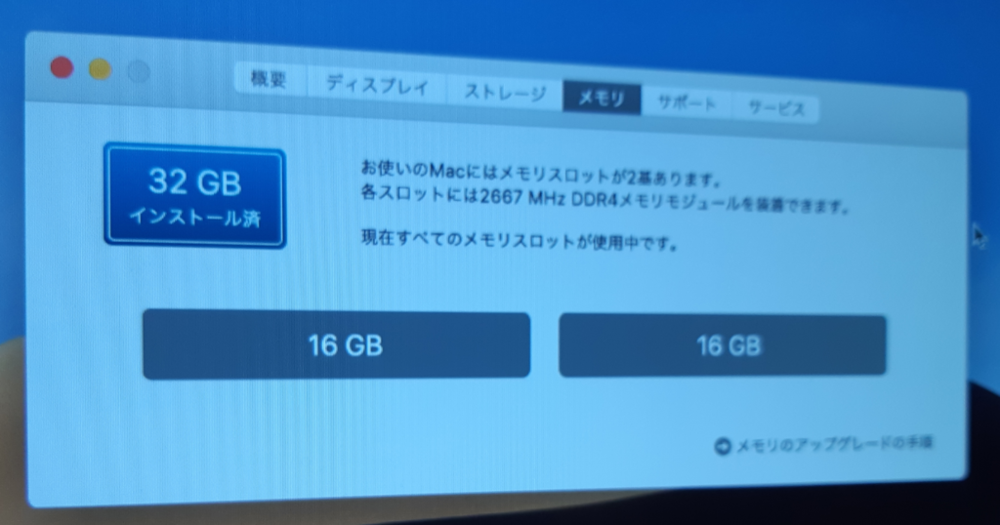

<h4>参考にしたサイト</h4>

<iframe src="https://hatenablog-parts.com/embed?url=https%3A%2F%2Fpcmanabu.com%2Fmac-mini-2018-memory-replacement%2F" title="Mac mini 2018のメモリを変更する方法" class="embed-card embed-webcard" scrolling="no" frameborder="0" style="display: block; width: 100%; height: 155px; max-width: 500px; margin: 10px 0px;"></iframe>

<iframe src="https://hatenablog-parts.com/embed?url=https%3A%2F%2Fsyobon.jp%2Fblog%2F2018%2F11%2F09%2Fhow-to-upgrade-ram-mac-mini-2018%2F" title="Mac mini 2018年モデルのメモリを換装する方法" class="embed-card embed-webcard" scrolling="no" frameborder="0" style="display: block; width: 100%; height: 155px; max-width: 500px; margin: 10px 0px;"></iframe>

